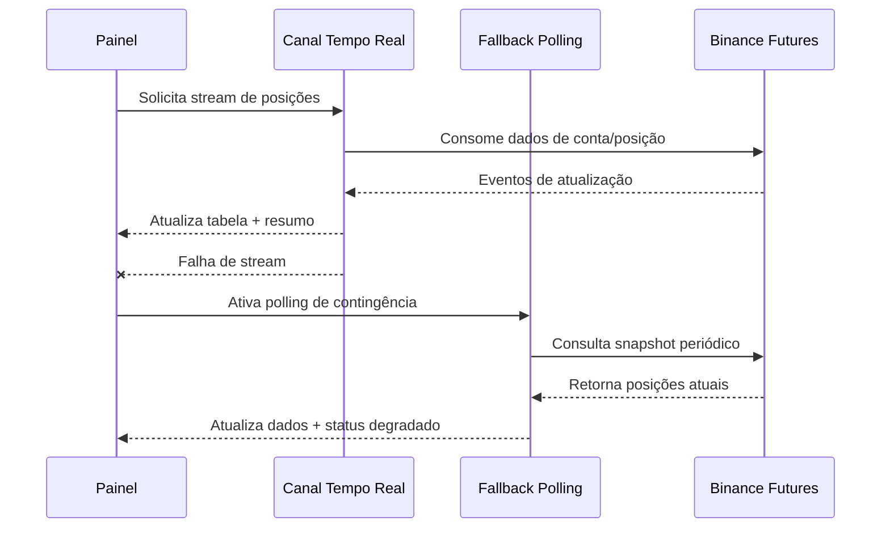

# SPEC 001 — Painel de Posições em Tempo Real

**ID:** SPEC_001
**Status:** Aprovada
**Data:** 2026-05-01
**Autor:** Time A (Refinamento)
**Executores:** Time B (Execução)
**Skill de validação:** `sdd-spec-driven-development`, `qa-review`

---

## 1. Título e Resumo

### 1.1 Nome da Funcionalidade

Painel de Posições Binance em Tempo Real (Somente Leitura)

### 1.2 Resumo (High-Level Definition)

**O que é:** Página única de observabilidade para consulta, em tempo quase real, das posições abertas na Binance Futures USDT-M.

**Por que estamos fazendo:** Centralizar visibilidade operacional e de risco em um único painel, reduzindo tempo de diagnóstico e decisão do operador.

**Valor de negócio:** Melhor controle operacional, redução de risco por falta de visibilidade e base objetiva para validação diária da operação do bot.

**Conexão com PRD/SPEC:** Origina-se em `PRD.md` (Fase 2: dashboard de performance em tempo real) e respeita os princípios de observabilidade e rastreabilidade de `docs/SDD/SPEC.md`.

---

## 2. Objetivos e Escopo

### 2.1 Objetivos (o que será entregue)

- [ ] Entregar uma página de consulta em tempo quase real das posições abertas.
- [ ] Exibir resumo agregado de exposição e risco operacional.
- [ ] Exibir status de conexão e indicador de dados desatualizados.
- [ ] Garantir modo somente leitura, sem ações de execução manual.

### 2.2 Fora do Escopo (Non-Goals)

- **Não inclui:** Fechar posição, alterar SL/TP, abrir ordem pela interface.
- **Não inclui:** Dashboard avançado de performance histórica.
- **Não inclui:** Relatório automático periódico via Telegram (fica para evolução).
- **Não inclui:** IA de recomendação, previsão ou sugestão operacional.

---

## 3. Referências

| Documento | Seção | Relevância |
|---|---|---|
| `PRD.md` | Fase 2 (Dashboard em tempo real) | Origem da necessidade de painel |
| `PRD.md` | Funcionalidades Críticas RF-10 e RF-11 | Dependências de observabilidade/performance |
| `docs/SDD/SPEC.md` | Arquitetura geral e observabilidade | Contrato técnico e padrões de integração |

---

## 4. Histórias de Usuário e Requisitos

### US-001-01: Consultar posições abertas em tempo quase real

> Como **operador**, quero **visualizar minhas posições abertas com atualização contínua** para **acompanhar exposição e resultado sem depender de consultas manuais**.

**Critérios de Aceitação (DoD desta história):**

```text
DADO   que o bot está conectado na Binance Futures USDT-M
QUANDO eu acessar a página do painel
ENTÃO  devo ver as posições abertas atualizadas em até 2 segundos (condição normal)
```

- [ ] AC-01: Tabela exibe posições abertas com dados obrigatórios.
- [ ] AC-02: Atualização contínua em até 2s em condição normal.
- [ ] AC-03: Exibe timestamp da última atualização.

---

### US-001-02: Monitorar risco agregado da conta

> Como **operador**, quero **ver um resumo agregado de risco** para **avaliar rapidamente exposição total da conta**.

**Critérios de Aceitação:**

```text
DADO   que existem posições abertas
QUANDO o painel estiver carregado
ENTÃO  devo visualizar exposição total, margem total e PnL não realizado total
```

- [ ] AC-01: Card de resumo com métricas agregadas.
- [ ] AC-02: Valores coerentes com os dados recebidos da Binance.

---

### US-001-03: Ser alertado sobre degradação de dados

> Como **operador**, quero **saber quando os dados estão desatualizados ou inconsistentes** para **evitar decisões com base em informação inválida**.

**Critérios de Aceitação:**

```text
DADO   falha no stream ou atraso acima do limite
QUANDO o painel permanecer sem atualização dentro da janela definida
ENTÃO  devo ver status degradado e alerta visual de stale data
```

- [ ] AC-01: Status de conexão visível (online, degradado, offline).
- [ ] AC-02: Alerta visual quando dados ficarem stale.
- [ ] AC-03: Reconciliação sinaliza inconsistência entre cache local e Binance.

---

## 5. Design e Arquitetura

### 5.1 Estrutura de Dados / Modelagem

Entidade de visualização de posição (contrato de leitura):

| Campo | Tipo | Obrigatório | Descrição |
|---|---|---|---|
| `symbol` | `str` | Sim | Par negociado (ex.: BTCUSDT) |
| `side` | `str` | Sim | LONG/SHORT |
| `quantity` | `float` | Sim | Tamanho da posição |
| `leverage` | `int` | Sim | Alavancagem aplicada |
| `entry_price` | `float` | Sim | Preço médio de entrada |
| `mark_price` | `float` | Sim | Preço de marcação atual |
| `unrealized_pnl_usdt` | `float` | Sim | PnL não realizado em USDT |
| `margin_used_usdt` | `float` | Sim | Margem alocada na posição |
| `liquidation_price` | `float` | Não | Preço de liquidação, quando disponível |
| `updated_at` | `datetime` | Sim | Timestamp do último update dessa linha |

Resumo agregado (contrato de leitura):

| Campo | Tipo | Obrigatório | Descrição |
|---|---|---|---|
| `total_exposure_usdt` | `float` | Sim | Exposição total |
| `total_margin_used_usdt` | `float` | Sim | Margem total utilizada |
| `total_unrealized_pnl_usdt` | `float` | Sim | PnL total não realizado |
| `connection_status` | `str` | Sim | `online` / `degraded` / `offline` |
| `last_update_at` | `datetime` | Sim | Último update global do painel |

### 5.2 Contratos de API / Interface Pública

Contrato funcional mínimo para Time B:

- Endpoint de leitura de snapshot atual de posições abertas.
- Canal de atualização contínua (stream) para refresh incremental.
- Endpoint/rotina de fallback por polling para continuidade operacional.

Entradas mínimas:

| Parâmetro | Tipo | Obrigatório | Descrição |
|---|---|---|---|
| `account_scope` | `str` | Sim | Escopo da conta única do operador |
| `symbols` | `list[str]` | Não | Filtro opcional por símbolo |

Saídas mínimas:

| Retorno | Tipo | Descrição |
|---|---|---|
| Snapshot | Objeto JSON | Lista de posições + resumo agregado |
| Atualizações | Evento stream | Alterações incrementais de posição e status |

### 5.3 Fluxo de Dados / Sequência



---

## 6. Regras de Negócio e Restrições

### 6.1 Invariantes de Negócio

| ID | Invariante | Violação -> Ação |
|---|---|---|
| INV-001-01 | Painel é estritamente somente leitura no MVP | Bloquear qualquer ação operacional na UI |
| INV-001-02 | Toda linha exibida deve conter `updated_at` válido | Marcar linha como inválida e sinalizar alerta |
| INV-001-03 | Status de conexão deve refletir estado real da fonte de dados | Forçar status `degraded` ou `offline` |

### 6.2 Validações Obrigatórias

- Atualização normal deve ocorrer em até 2 segundos.
- Se não houver atualização dentro da janela de tolerância, sinalizar stale data.
- Em inconsistência entre cache e Binance, priorizar dado da Binance e marcar reconciliação.

### 6.3 Limitações Técnicas

- Dependência de disponibilidade e latência da Binance Futures USDT-M.
- Stream pode degradar, exigindo fallback para polling.
- Precisão numérica deve manter consistência com formato de exibição definido pelo produto.

### 6.4 Padrões de Segurança

- Não expor nem logar credenciais API.
- Não exibir dados sensíveis além do necessário para monitoramento.
- Interface sem capacidade de enviar ordens no MVP.

---

## 7. Testes e Validação

### 7.1 Testes Unitários

| ID | Descrição | Cenário | Prioridade |
|---|---|---|---|
| TEST_001_01 | Mapeamento de posição para contrato de UI | Entrada válida -> saída com campos obrigatórios | Alta |
| TEST_001_02 | Cálculo de resumo agregado | Posições múltiplas -> totais corretos | Alta |
| TEST_001_03 | Detecção de stale data | Sem atualização > janela -> status degradado | Alta |

### 7.2 Testes de Integração (Testnet)

| ID | Descrição | Pré-requisito |
|---|---|---|
| INT_001_01 | Stream ativo com atualização contínua | Credenciais Testnet válidas |
| INT_001_02 | Queda de stream com fallback automático | Simulação de falha de stream |
| INT_001_03 | Reconciliação após divergência de cache | Dados locais divergentes da Binance |

### 7.3 Evidências Requeridas na PR

- [ ] Evidência de atualização em até 2s em cenário normal.
- [ ] Evidência de fallback funcional após falha de stream.
- [ ] Evidência de status e alerta visual de stale data.
- [ ] Evidência de que a UI não possui ações de trade.

---

## 8. Tratamento de Erros

| Erro / Condição | Causa | Ação do Sistema |
|---|---|---|
| Stream indisponível | Instabilidade de rede/Binance | Ativar fallback polling + status degradado |
| Dados stale | Ausência de update dentro da janela | Exibir alerta visual + timestamp destacado |
| Divergência de posição | Cache local inconsistente | Rodar reconciliação e priorizar fonte Binance |
| Falha de consulta fallback | Rate limit/erro remoto | Retry controlado e status offline temporário |

---

## 9. Riscos e Mitigações

| Risco | Impacto | Mitigação |
|---|---|---|
| Decisão operacional com dado desatualizado | Alto | Sinalização explícita de stale data e status |
| Falha de stream prolongada | Alto | Fallback por polling + reconciliação periódica |
| Escopo inflar com features não-MVP | Médio | Enforçar non-goals desta SPEC |
| Interpretação errada de métricas | Médio | Padronizar nomenclatura e contratos de campo |

---

## 10. Definição de Pronto (DoD Global)

- [ ] SPEC aprovada pelo Time A.
- [ ] Histórias US-001-01, US-001-02 e US-001-03 atendidas.
- [ ] Atualização em tempo normal validada dentro de 2 segundos.
- [ ] Fallback por polling validado em cenário de falha.
- [ ] UI confirmada como somente leitura (sem ações de trade).
- [ ] Rastreabilidade PRD -> SPEC.md -> SPEC_001 comprovada na PR.

---

## 11. Plano de Entrega

1. Time B lê `docs/SDD/SPEC.md` e esta SPEC_001.
2. Time B implementa contratos de leitura e atualização contínua.
3. Time B implementa fallback e sinalização de degradação.
4. Time B valida com `qa-review` e anexa evidências na PR.
5. Time A revisa conformidade antes do merge.

---

## Histórico

- **2026-05-01:** Criação da SPEC_001 do painel de posições em tempo real (somente leitura).
