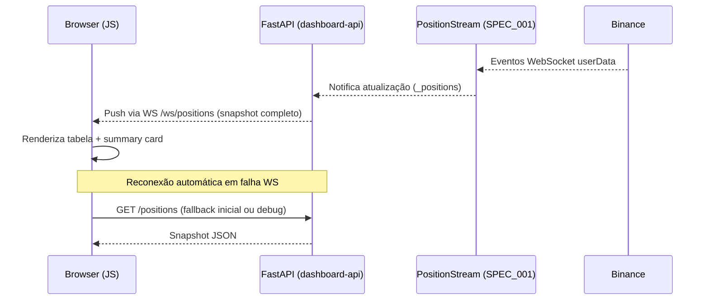

# SPEC 002 — Frontend de Consulta de Posições

**ID:** SPEC_002
**Status:** Concluída
**Data:** 2026-05-01
**Autor:** Time A (Refinamento)
**Executores:** Time B (Execução)
**Skill de validação:** `sdd-spec-driven-development`, `qa-review`, `security-audit`
**Depende de:** SPEC_001 (Painel de Posições em Tempo Real)

---

## 1. Título e Resumo

### 1.1 Nome da Funcionalidade

Frontend Web de Consulta de Posições (Somente Leitura, Local)

### 1.2 Resumo (High-Level Definition)

**O que é:** Interface web local para visualização em tempo real das posições abertas na Binance Futures USDT-M, exposta via API FastAPI + HTML/JS vanilla, integrada ao `docker-compose.yml` do projeto.

**Por que estamos fazendo:** A SPEC_001 entregou o motor de dados (stream WebSocket, polling adaptativo, cache MongoDB e modelos). O operador ainda não tem como consultar as posições sem acessar o código diretamente. Esta SPEC preenche essa lacuna com uma interface acessível via browser.

**Valor de negócio:** Visibilidade operacional imediata sem necessidade de terminal, kubectl ou acesso ao código-fonte. Reduz o tempo de diagnóstico durante operação ao vivo.

**Conexão com PRD/SPEC:** Evolução direta da SPEC_001 e do PRD.md (Fase 2 — Dashboard de performance em tempo real). Reutiliza integralmente a infraestrutura de dados entregue na SPEC_001.

---

## 2. Objetivos e Escopo

### 2.1 Objetivos (o que será entregue)

- [ ] Expor API FastAPI com endpoints REST e WebSocket consumindo `PositionStream` da SPEC_001.
- [ ] Servir frontend HTML + JS vanilla via `StaticFiles` do FastAPI (sem build step).
- [ ] Frontend exibe tabela de posições e card de resumo com atualização em tempo real via WebSocket.
- [ ] Frontend exibe indicador de status de conexão e banner de alerta em modo degradado/offline/cached.
- [ ] Container `dashboard-api` adicionado ao `docker-compose.yml` com porta vinculada a `127.0.0.1`.

### 2.2 Fora do Escopo (Non-Goals)

- **Não inclui:** Autenticação ou HTTPS (uso solo, rede local, Docker).
- **Não inclui:** Framework frontend (React, Vue, Angular) — JS vanilla apenas nesta SPEC.
- **Não inclui:** Ações de trade (fechar posição, alterar SL/TP, abrir ordem).
- **Não inclui:** Histórico de trades ou relatórios.
- **Não inclui:** Alertas externos (Telegram, email).
- **Não inclui:** Exposição externa da porta (sem `0.0.0.0`).
- **Não inclui:** Segunda instância de `DashboardClient` — reutiliza o `PositionStream` existente.

---

## 3. Referências

| Documento | Seção | Relevância |
|---|---|---|
| `docs/SDD/SPEC_001_PAINEL_POSICOES_TEMPO_REAL/SPEC.md` | Inteiro | Infraestrutura de dados que esta SPEC consome |
| `PRD.md` | Fase 2 (Dashboard em tempo real) | Origem da necessidade de interface web |
| `docs/SDD/SPEC.md` | Arquitetura geral e observabilidade | Contrato técnico e padrões de integração |
| `src/dashboard/__init__.py` | Exports públicos | Contratos públicos a consumir: `AdaptiveUpdater`, `DashboardClient`, `DashboardClientError` |

---

## 4. Histórias de Usuário e Requisitos

### US-002-01: Acessar o painel de posições via browser

> Como **operador**, quero **abrir um endereço local no browser** para **visualizar minhas posições abertas sem precisar de terminal ou código**.

**Critérios de Aceitação (DoD desta história):**

```text
DADO   que o docker-compose está rodando
QUANDO eu acessar http://127.0.0.1:8080 no browser
ENTÃO  devo ver a tabela de posições e o card de resumo carregados
```

- [ ] AC-01: `GET /` retorna a página HTML servida pelo FastAPI.
- [ ] AC-02: Página carrega sem erros de console (JS, rede, CORS).
- [ ] AC-03: Container `dashboard-api` sobe com `docker compose up` sem intervenção manual.

---

### US-002-02: Receber atualizações de posições em tempo real

> Como **operador**, quero **ver as posições atualizarem automaticamente no browser** sem precisar recarregar a página.

**Critérios de Aceitação:**

```text
DADO   que o painel está aberto no browser
QUANDO uma posição mudar na Binance
ENTÃO  a tabela deve atualizar em até 2 segundos sem reload
```

- [ ] AC-01: Frontend abre conexão WebSocket com `/ws/positions` automaticamente.
- [ ] AC-02: Cada mensagem do WebSocket atualiza a tabela e o card de resumo.
- [ ] AC-03: Frontend reconecta automaticamente em caso de queda do WebSocket (máximo 5s de intervalo).

---

### US-002-03: Consultar snapshot pontual via API

> Como **operador ou desenvolvedor**, quero **consultar as posições via curl ou ferramenta HTTP** para **debug e integração sem abrir o browser**.

**Critérios de Aceitação:**

```text
DADO   que o container dashboard-api está rodando
QUANDO eu executar GET /positions
ENTÃO  devo receber JSON com lista de posições e resumo agregado
```

- [ ] AC-01: `GET /positions` retorna `{"positions": [...], "summary": {...}, "status": "online|degraded|..."}`.
- [ ] AC-02: `GET /health` retorna `{"status": "online|degraded|offline|cached"}`.
- [ ] AC-03: Campos retornados correspondem exatamente ao contrato de `PositionView` e `AccountSummary` da SPEC_001.

---

### US-002-04: Ser alertado sobre degradação no frontend

> Como **operador**, quero **ver um alerta visual claro no browser quando os dados estiverem degradados ou desatualizados** para **não tomar decisões com base em informação inválida**.

**Critérios de Aceitação:**

```text
DADO   que o status do PositionStream é "degraded", "offline" ou "cached"
QUANDO o frontend receber esse status via WebSocket
ENTÃO  devo ver um banner de alerta com descrição do problema
```

- [ ] AC-01: Banner exibido quando status for `degraded`, `offline` ou `cached`.
- [ ] AC-02: Banner removido automaticamente quando status retornar a `online`.
- [ ] AC-03: Indicador de status (online/degraded/offline/cached) visível em todas as situações.
- [ ] AC-04: Lógica de exibição do banner **não duplica** regras — consome `DashboardSnapshotBuilder` do backend, não reimplementa no JS.

---

## 5. Design e Arquitetura

### 5.1 Estrutura de Módulos

```
src/
  api/
    __init__.py
    main.py          # FastAPI app + lifespan (PositionStream + AdaptiveUpdater)
    routes/
      __init__.py
      positions.py   # GET /positions, GET /health, WS /ws/positions
  frontend/
    static/
      index.html     # Página única
      app.js         # Lógica WebSocket + renderização
      style.css      # Estilo mínimo
```

### 5.2 Contratos de API

#### `GET /positions`

```json
{
  "positions": [
    {
      "symbol": "BTCUSDT",
      "side": "LONG",
      "quantity": 0.01,
      "leverage": 10,
      "entry_price": 60000.0,
      "mark_price": 61000.0,
      "unrealized_pnl_usdt": 10.0,
      "margin_used_usdt": 60.0,
      "liquidation_price": 55000.0,
      "updated_at": "2026-05-01T12:00:00Z"
    }
  ],
  "summary": {
    "total_exposure_usdt": 600.0,
    "total_margin_used_usdt": 60.0,
    "total_unrealized_pnl_usdt": 10.0,
    "connection_status": "online",
    "last_update_at": "2026-05-01T12:00:00Z"
  },
  "status": "online"
}
```

#### `GET /health`

```json
{"status": "online"}
```

#### `WS /ws/positions`

Envia mensagem a cada atualização do `PositionStream`. Formato idêntico ao `GET /positions`. O backend faz push; o cliente não envia mensagens.

### 5.3 Fluxo de Dados



### 5.4 Integração com Docker Compose

Novo serviço `dashboard-api` no `docker-compose.yml`:

```yaml
dashboard-api:
  build:
    context: .
    dockerfile: docker/Dockerfile.api    # ou Dockerfile existente com target
  ports:
    - "127.0.0.1:8080:8080"             # Critério de aceite de segurança
  environment:
    - DASHBOARD_API_KEY=${DASHBOARD_API_KEY}
    - DASHBOARD_API_SECRET=${DASHBOARD_API_SECRET}
  depends_on:
    - mongodb
  restart: unless-stopped
```

### 5.5 Gerenciamento de Ciclo de Vida (lifespan)

- `startup`: instancia `DashboardClient` → `PositionStream.start()` → `AdaptiveUpdater.start(stream)`
- `shutdown`: `AdaptiveUpdater.stop()` → `PositionStream.stop()` → `DashboardClient.close()`
- `PositionStream` é instância única compartilhada entre todos os handlers via `app.state`

---

## 6. Regras de Negócio e Restrições

### 6.1 Invariantes de Negócio

| ID | Invariante | Violação → Ação |
|---|---|---|
| INV-002-01 | Frontend é estritamente somente leitura | Não implementar nenhum botão ou formulário de ação |
| INV-002-02 | Porta HTTP vinculada a `127.0.0.1` | Falhar o build/deploy se `0.0.0.0` for detectado |
| INV-002-03 | Lógica de negócio reside no backend | JS renderiza dados recebidos; não recalcula PnL, status ou alertas |
| INV-002-04 | Uma única instância de `PositionStream` por processo | Proibido instanciar segundo cliente Binance no container da API |

### 6.2 Validações Obrigatórias

- `GET /positions` deve retornar `content-type: application/json`.
- WebSocket deve enviar snapshot completo (não diff) a cada atualização.
- Frontend deve exibir último `updated_at` de cada posição.
- Em ausência de posições abertas, frontend exibe estado vazio explícito (não tela em branco).

### 6.3 Limitações Técnicas

- Sem dependências de CDN externo no frontend (sem `<script src="https://...">`).
- Sem build step para o frontend (sem webpack, vite, npm run build).
- Assets estáticos em `src/frontend/static/` servidos pelo FastAPI `StaticFiles`.

### 6.4 Padrões de Segurança

- Porta vinculada a `127.0.0.1` — não exposta externamente.
- Sem credenciais Binance expostas no HTML, JS ou headers HTTP.
- Sem CORS permissivo (`*`) — origin restrita a `127.0.0.1:8080`.
- Sem logging de API keys em nenhum handler FastAPI.

---

## 7. Testes e Validação

### 7.1 Testes Unitários

| ID | Descrição | Cenário | Prioridade |
|---|---|---|---|
| TEST_002_01 | Endpoint `GET /positions` retorna estrutura correta | Mock de `PositionStream` com posições fixas | Alta |
| TEST_002_02 | Endpoint `GET /health` reflete status do stream | Mock com status `degraded` | Alta |
| TEST_002_03 | WebSocket `/ws/positions` envia snapshot ao conectar | Cliente WebSocket de teste | Alta |
| TEST_002_04 | WebSocket envia atualização quando stream notifica | Trigger manual de atualização no mock | Alta |
| TEST_002_05 | Lifespan inicializa e encerra stream corretamente | `TestClient` com lifespan | Média |

### 7.2 Testes de Integração

| ID | Descrição | Pré-requisito |
|---|---|---|
| INT_002_01 | Container sobe e responde `GET /health` com status real | `docker compose up dashboard-api` |
| INT_002_02 | WebSocket entrega snapshot com posições reais da Binance | Credenciais READ_ONLY válidas no `.env` |
| INT_002_03 | Reconexão WebSocket automática após restart do container | Simular queda do serviço |

### 7.3 Evidências Requeridas na PR

- [ ] `GET /positions` retornando JSON válido com posições reais.
- [ ] WebSocket entregando atualização no browser (screenshot ou log de console).
- [ ] Banner de alerta visível em modo `degraded` (screenshot).
- [ ] Confirmação de `@security-audit` de que porta está em `127.0.0.1`.
- [ ] Ausência de dependências de CDN externo no HTML (grep no `index.html`).

---

## 8. Tratamento de Erros

| Erro / Condição | Causa | Ação do Sistema |
|---|---|---|
| `PositionStream` falha no startup | Credencial inválida ou Binance indisponível | FastAPI retorna 503 em `/health`; container não trava (retry via `AdaptiveUpdater`) |
| WebSocket do cliente desconecta | Instabilidade de rede local | Frontend reconecta automaticamente com backoff |
| `GET /positions` chamado sem stream ativo | Container em inicialização | Retornar 503 com `{"status": "offline"}` |
| Exceção não tratada no handler WebSocket | Bug ou erro de serialização | Fechar conexão com código 1011; logar com structlog |

---

## 9. Riscos e Mitigações

| Risco | Impacto | Mitigação |
|---|---|---|
| Segunda instância de `DashboardClient` consome dois listenKeys | Alto | Arquitetura de instância única via `app.state`; task_001 valida isso explicitamente |
| Porta `0.0.0.0` exposta acidentalmente | Alto | Critério de aceite obrigatório: `@security-audit` valida `docker-compose.yml` antes do merge |
| JS reimplementa lógica de negócio (stale, PnL) | Médio | INV-002-03 proíbe recálculo no frontend; `@qa-review` valida na PR |
| Frontend exibe tela em branco sem posições abertas | Baixo | Validação explícita de estado vazio nos critérios de aceite |
| Dependência frágil de versão do FastAPI/uvicorn | Baixo | Versões fixadas no `pyproject.toml` |

---

## 10. Definição de Pronto (DoD Global)

- [ ] SPEC aprovada pelo Time A.
- [ ] Histórias US-002-01, US-002-02, US-002-03 e US-002-04 atendidas.
- [ ] Container `dashboard-api` sobe com `docker compose up` sem intervenção.
- [ ] Porta HTTP vinculada a `127.0.0.1` confirmada por `@security-audit`.
- [ ] WebSocket entrega atualização em até 2s em condição normal.
- [ ] Frontend sem dependências de CDN externo.
- [ ] UI confirmada como somente leitura (sem formulários ou botões de ação).
- [ ] Testes unitários TEST_002_01 a TEST_002_05 passando.
- [ ] Rastreabilidade PRD → SPEC.md → SPEC_001 → SPEC_002 comprovada na PR.

---

## 11. Plano de Entrega

1. Time B lê `docs/SDD/SPEC.md`, `SPEC_001/SPEC.md` e esta SPEC_002.
2. Time B resolve questão em aberto: processo compartilhado vs. isolado (recomendado: processo isolado, sem segundo `DashboardClient`).
3. Time B implementa `src/api/` (FastAPI + lifespan + routes).
4. Time B implementa `src/frontend/static/` (index.html + app.js + style.css).
5. Time B atualiza `docker-compose.yml` com container `dashboard-api`.
6. Time B valida com `@security-audit` (porta, secrets, CORS).
7. Time B valida com `@qa-review` (cobertura de testes, estado vazio, reconexão WS).
8. Time A revisa conformidade antes do merge.

---

## Questões em Aberto para o Time B

1. **Processo compartilhado vs. isolado:** O `PositionStream` será instanciado no container `dashboard-api` como processo próprio (isolado), ou o bot de trading (`main.py`) e a API compartilham o mesmo processo? **Recomendação do Time A:** processo isolado — cada container tem seu próprio `PositionStream` e `DashboardClient` READ_ONLY. O custo de dois listenKeys é aceitável.
2. **MongoDB:** O container `dashboard-api` deve ter acesso ao MongoDB para usar o cold cache (`DashboardCache`)? **Recomendação do Time A:** sim — permite exibir dados em modo `cached` mesmo sem conexão Binance.

---

## Histórico

- **2026-05-01:** Criação da SPEC_002 a partir dos artefatos da sessão de refinamento do Time A.
