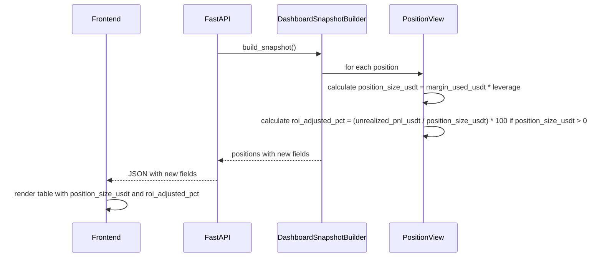

# SPEC 003 — Inclusão de Cálculos de Margem e ROI Ajustado na Consulta de Posições

**ID:** SPEC_003
**Status:** Rascunho
**Data:** 2026-05-02
**Autor:** Time A (Refinamento)
**Executores:** Time B (Execução)
**Skill de validação:** `sdd-spec-driven-development`, `qa-review`
**Depende de:** SPEC_002 (Frontend de Consulta de Posições)

---

## 1. Título e Resumo

### 1.1 Nome da Funcionalidade

Inclusão de Cálculos de Margem, Tamanho da Posição em USDT e ROI Ajustado na Consulta de Posições

### 1.2 Resumo (High-Level Definition)

**O que é:** Extensão da SPEC_002 para incluir no modelo de dados `PositionView`, API REST/WebSocket e frontend web cálculos adicionais: tamanho da posição em USDT (margem × alavancagem), ROI real ajustado pela alavancagem (P&L / tamanho da posição × 100), mantendo compatibilidade com contratos existentes.

**Por que estamos fazendo:** A SPEC_002 exibe margem usada e P&L não realizado, mas não calcula o tamanho efetivo da posição em USDT nem o ROI real considerando a alavancagem. Isso leva a interpretação incorreta do risco e performance, especialmente em posições alavancadas.

**Valor de negócio:** Visibilidade precisa do tamanho da exposição (não apenas margem) e retorno real sobre o capital alavancado, permitindo decisões mais informadas sobre gestão de risco.

**Conexão com PRD/SPEC:** Evolução direta da SPEC_002 e alinhada à Fase 2 do PRD (Dashboard de performance em tempo real). Reutiliza infraestrutura de dados da SPEC_001 e SPEC_002.

---

## 2. Objetivos e Escopo

### 2.1 Objetivos (o que será entregue)

- [ ] Atualizar `PositionView` (SPEC_001) com campos `position_size_usdt` e `roi_adjusted_pct`.
- [ ] Implementar cálculos: `position_size_usdt = margin_used_usdt * leverage`, `roi_adjusted_pct = (unrealized_pnl_usdt / position_size_usdt) * 100` se `position_size_usdt > 0`.
- [ ] Atualizar contratos de API (`GET /positions`, `WS /ws/positions`) para incluir os novos campos.
- [ ] Atualizar frontend para exibir os novos campos na tabela de posições e card de resumo.
- [ ] Manter compatibilidade backward: campos novos são adicionais, não substituem existentes.

### 2.2 Fora do Escopo (Non-Goals)

- **Não inclui:** Mudanças na estratégia de cálculo de margem ou alavancagem (reutiliza valores existentes).
- **Não inclui:** Novos endpoints ou WebSockets — apenas extensão dos contratos existentes.
- **Não inclui:** Histórico de posições ou cálculos retroativos.
- **Não inclui:** Alertas ou notificações baseados nos novos campos.
- **Não inclui:** Modificações no `RiskManager` ou `OrderManager` — apenas visualização.

---

## 3. Referências

| Documento | Seção | Relevância |
|---|---|---|
| `docs/SDD/SPEC_002_FRONTEND_CONSULTA_POSICOES/SPEC.md` | Inteiro | Contratos de API e frontend a estender |
| `docs/SDD/SPEC_001_PAINEL_POSICOES_TEMPO_REAL/SPEC.md` | PositionView e cálculos | Modelo de dados base a estender |
| `PRD.md` | Fase 2 (Dashboard em tempo real) | Origem da necessidade de métricas aprimoradas |
| `src/dashboard/models.py` | PositionView | Contrato atual a estender |

---

## 4. Histórias de Usuário e Requisitos

### US-003-01: Visualizar tamanho da posição em USDT no frontend

> Como **operador**, quero **ver o tamanho efetivo da posição em USDT (margem × alavancagem)** na tabela de posições para **entender minha exposição real**.

**Critérios de Aceitação (DoD desta história):**

```text
DADO   uma posição com margin_used_usdt = 2.73 e leverage = 10
QUANDO eu acessar o painel no browser
ENTÃO  devo ver position_size_usdt = 27.345 na tabela
```

- [ ] AC-01: Campo `position_size_usdt` exibido na tabela de posições.
- [ ] AC-02: Cálculo correto: `margin_used_usdt * leverage` (usando valores existentes).
- [ ] AC-03: Formatação: 2 casas decimais, unidade USDT.

### US-003-02: Visualizar ROI ajustado pela alavancagem no frontend

> Como **operador**, quero **ver o ROI real ajustado pela alavancagem (P&L / tamanho da posição × 100)** para **avaliar performance corretamente**.

**Critérios de Aceitação:**

```text
DADO   uma posição com unrealized_pnl_usdt = -21.0 e position_size_usdt = 27.345
QUANDO eu acessar o painel no browser
ENTÃO  devo ver roi_adjusted_pct = -77.54% na tabela
```

- [ ] AC-01: Campo `roi_adjusted_pct` exibido na tabela de posições.
- [ ] AC-02: Cálculo correto: `(unrealized_pnl_usdt / position_size_usdt) * 100` se `position_size_usdt > 0`, senão `None`.
- [ ] AC-03: Formatação: 2 casas decimais, sinal %, cor verde/vermelha baseada no sinal.

### US-003-03: Consultar novos campos via API

> Como **desenvolvedor ou integrador**, quero **receber os novos campos via GET /positions e WS /ws/positions** para **consumir em ferramentas externas**.

**Critérios de Aceitação:**

```text
DADO   o container dashboard-api rodando
QUANDO eu executar GET /positions
ENTÃO  devo receber position_size_usdt e roi_adjusted_pct em cada posição
```

- [ ] AC-01: Campos incluídos no JSON de resposta de `GET /positions`.
- [ ] AC-02: Campos incluídos nas mensagens WebSocket `/ws/positions`.
- [ ] AC-03: Campos opcionais no contrato (backward compatible).

---

## 5. Design e Arquitetura

### 5.1 Estrutura de Dados / Modelagem

Atualização em `src/dashboard/models.py`:

```python
from pydantic import BaseModel, Field
from typing import Optional

class PositionView(BaseModel):
    symbol: str
    side: str  # LONG/SHORT
    quantity: float
    leverage: int
    entry_price: float
    mark_price: float
    unrealized_pnl_usdt: float
    margin_used_usdt: float
    liquidation_price: float
    updated_at: str

    # Novos campos
    position_size_usdt: Optional[float] = Field(None, description="Tamanho efetivo da posição: margin_used_usdt * leverage")
    roi_adjusted_pct: Optional[float] = Field(None, description="ROI ajustado: (unrealized_pnl_usdt / position_size_usdt) * 100")
```

### 5.2 Contratos de API / Interface Pública

#### `GET /positions` (atualizado)

```json
{
  "positions": [
    {
      "symbol": "ATOMUSDT",
      "side": "LONG",
      "quantity": 10.0,
      "leverage": 10,
      "entry_price": 10.0,
      "mark_price": 9.0,
      "unrealized_pnl_usdt": -21.0,
      "margin_used_usdt": 2.73,
      "liquidation_price": 8.5,
      "updated_at": "2026-05-02T12:00:00Z",
      "position_size_usdt": 27.345,
      "roi_adjusted_pct": -77.54
    }
  ],
  "summary": {
    "total_exposure_usdt": 27.345,
    "total_margin_used_usdt": 2.73,
    "total_unrealized_pnl_usdt": -21.0,
    "connection_status": "online",
    "last_update_at": "2026-05-02T12:00:00Z"
  },
  "status": "online"
}
```

**Entradas:** Nenhuma mudança (reutiliza dados existentes).

**Saída:** Adicionados `position_size_usdt` e `roi_adjusted_pct` por posição. Summary atualizado para `total_exposure_usdt` (soma de position_size_usdt).

### 5.3 Fluxo de Dados / Sequência



---

## 6. Regras de Negócio e Restrições

### 6.1 Invariantes de Negócio

| ID | Invariante | Violação → Ação |
|---|---|---|
| INV-003-01 | `position_size_usdt` sempre = `margin_used_usdt * leverage` | Log WARN se divergência detectada |
| INV-003-02 | `roi_adjusted_pct` calculado apenas se `position_size_usdt > 0` | Campo `None` caso contrário |

### 6.2 Validações Obrigatórias

- `leverage > 0` — assumido do RiskManager, mas validar na construção do PositionView.
- `margin_used_usdt >= 0` — assumido da Binance, mas validar.
- Se `position_size_usdt == 0`, `roi_adjusted_pct = None` (divisão por zero).

### 6.3 Limitações Técnicas

- Precisão: Usar `Decimal` para cálculos financeiros, mas manter `float` na API por compatibilidade.
- Performance: Cálculos simples, sem impacto no polling (máximo 1ms por posição).

### 6.4 Padrões de Segurança

- Reutiliza dados existentes — nenhum novo input de usuário.

---

## 7. Testes e Validação

### 7.1 Testes Unitários

| ID | Descrição | Cenário | Prioridade |
|---|---|---|---|
| TEST_003_01 | Cálculo position_size_usdt correto | margin=2.73, leverage=10 → 27.345 | Alta |
| TEST_003_02 | Cálculo roi_adjusted_pct correto | pnl=-21.0, size=27.345 → -77.54 | Alta |
| TEST_003_03 | Roi None se size=0 | margin=0, leverage=10 → roi=None | Alta |
| TEST_003_04 | Backward compatibility | Campos novos opcionais, JSON válido sem eles | Alta |

### 7.2 Testes de Integração (Testnet)

| ID | Descrição | Pré-requisito |
|---|---|---|
| INT_003_01 | API retorna novos campos | Posição aberta em Testnet, GET /positions inclui campos |

### 7.3 Evidências Requeridas na PR

- [ ] `pytest -v --cov=src/dashboard --cov-report=term-missing` com 100% cobertura nos novos cálculos.
- [ ] Screenshot do frontend exibindo os novos campos.
- [ ] Log de GET /positions em Testnet com campos populados.

---

## 8. Tratamento de Erros

| Erro / Condição | Causa | Ação do Sistema |
|---|---|---|
| `leverage <= 0` | Dados inválidos da Binance | Log WARN, position_size_usdt = margin_used_usdt (fallback) |
| `margin_used_usdt < 0` | Dados inválidos da Binance | Log WARN, campos = None |

---

## 9. Riscos e Mitigações

| Risco | Impacto | Mitigação |
|---|---|---|
| Interpretação incorreta de ROI | Decisões erradas de risco | Documentar claramente que roi_adjusted_pct é o retorno real sobre o capital alavancado |
| Performance impact | Lentidão no frontend | Cálculos no backend, cache no PositionStream |

---

## 10. Definição de Pronto (DoD Global)

- [ ] SPEC aprovada pelo Time A
- [ ] Todas as histórias de usuário com critérios de aceitação verificados
- [ ] Implementação aderente aos contratos da seção 5
- [ ] Nenhuma invariante da seção 6.1 violada em nenhum cenário de teste
- [ ] `pytest` com 100% das asserções críticas passando
- [ ] Rastreabilidade PRD → SPEC.md → SPEC_003 → Teste → Código comprovada na PR

---

## 11. Plano de Entrega

1. **Planner Agent transforma a SPEC em Task Graph** com prioridades, dependências e DoD por task
2. **Dev Agent (com Serena) executa o Task Graph** na ordem definida e mantém rastreabilidade task -> código
3. **Validation Agent valida conformidade** (SPEC -> testes -> comportamento) e emite parecer
4. **Commit / Review Gate** só libera PR se o parecer de validação for aprovado
5. **Time A revisa conformidade final** antes do merge

---

## Histórico

- **2026-05-02:** Criação da SPEC_003.</content>
<parameter name="filePath">c:\repo\binance-phicube\docs\SDD\SPEC_003_INCLUSAO_CALCULOS_MARGEM_POSICOES\SPEC.md