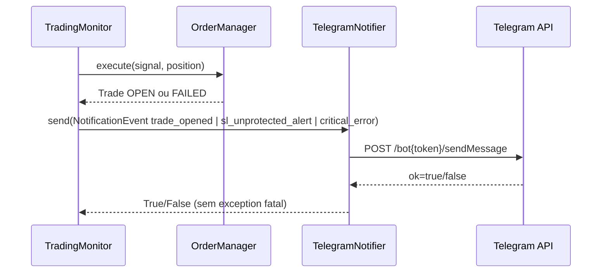

# SPEC 004 — Notificações Operacionais via Telegram

**ID:** SPEC_004
**Status:** Em Refinamento
**Data:** 2026-05-02
**Autor:** Time A (Refinamento)
**Executores:** Time B (Execução)
**Skill de validação:** `sdd-spec-driven-development`, `qa-review`, `security-audit`
**Depende de:** SPEC_001, SPEC_002, SPEC_003

---

## 1. Título e Resumo

### 1.1 Nome da Funcionalidade

Notificações operacionais do bot para o operador via Telegram

### 1.2 Resumo (High-Level Definition)

**O que é:** Implementação de um canal opcional de notificações via Telegram para eventos críticos da operação: trade aberto, trade fechado, erro crítico e falha de proteção (SL não executado após entrada).

**Por que estamos fazendo:** Hoje o operador precisa observar logs ou painel para detectar eventos importantes. Isso aumenta tempo de reação em incidentes de risco, especialmente quando não está no terminal.

**Valor de negócio:** Reduz o tempo de resposta operacional e aumenta segurança da operação ao alertar imediatamente eventos críticos de execução.

**Conexão com PRD/SPEC:** Demanda originada em `PRD.md` (Funcionalidades Críticas, item 6 — RF-10). Mantém contratos e princípios de observabilidade de `docs/SDD/SPEC.md`.

---

## 2. Objetivos e Escopo

### 2.1 Objetivos (o que será entregue)

- [ ] Adicionar configuração opcional de Telegram (`TELEGRAM_TOKEN`, `TELEGRAM_CHAT_ID`) no settings.
- [ ] Entregar um `TelegramNotifier` assíncrono com envio HTTP para `sendMessage`.
- [ ] Notificar os 4 eventos do PRD: trade aberto, trade fechado, erro crítico, SL não executado após entrada.
- [ ] Garantir modo degradado seguro: se Telegram falhar, o bot continua operando sem interrupção.
- [ ] Cobrir contratos com testes unitários e de integração local (sem chamada real de rede).

### 2.2 Fora do Escopo (Non-Goals)

- **Não inclui:** Notificação de todo sinal detectado (somente eventos operacionais críticos).
- **Não inclui:** Relatório periódico automático de performance (RF-11, próxima SPEC).
- **Não inclui:** Canal alternativo (email, Slack, SMS, Discord).
- **Não inclui:** Comandos bidirecionais pelo Telegram (somente outbound).
- **Não inclui:** Dashboard de configuração do Telegram.

---

## 3. Referências

| Documento | Seção | Relevância |
|---|---|---|
| `PRD.md` | Funcionalidades Críticas, item 6 (RF-10) | Origem da necessidade |
| `docs/SDD/SPEC.md` | §2.3 Order Manager, §2.6 Logger | Contratos de eventos e observabilidade |
| `src/main.py` | `TradingMonitor._tick` | Ponto de orquestração dos eventos |
| `src/trading/order_manager.py` | `execute` + falhas de SL/TP | Fonte de eventos de execução |
| `src/config/settings.py` | Configuração global | Entrada de variáveis de ambiente |

---

## 4. Histórias de Usuário e Requisitos

### US-004-01: Receber alerta quando trade for aberto

> Como **operador**, quero **receber mensagem no Telegram quando um trade abrir** para **acompanhar execução sem ficar no terminal**.

**Critérios de Aceitação (DoD desta história):**

```text
DADO   que TELEGRAM_TOKEN e TELEGRAM_CHAT_ID estão configurados
QUANDO um trade for aberto com sucesso
ENTÃO  o bot deve enviar mensagem contendo símbolo, direção, entry, SL, TP e quantidade
```

- [ ] AC-01: Evento `trade_opened` dispara notificação.
- [ ] AC-02: Mensagem contém os campos mínimos exigidos pelo PRD.
- [ ] AC-03: Falha no envio não interrompe o fluxo de trading.

---

### US-004-02: Receber alerta de risco quando SL não for configurado após entrada

> Como **operador**, quero **ser alertado imediatamente quando a proteção de stop falhar** para **intervir manualmente e reduzir risco de perda não protegida**.

**Critérios de Aceitação:**

```text
DADO   que a ordem de entrada foi executada
QUANDO a criação de ordem de stop loss falhar
ENTÃO  o bot deve enviar alerta crítico de intervenção manual
```

- [ ] AC-01: Falha de SL após entrada gera notificação crítica.
- [ ] AC-02: Mensagem explicita necessidade de intervenção manual.
- [ ] AC-03: Evento é auditado localmente mesmo se Telegram indisponível.

---

### US-004-03: Operar normalmente sem Telegram configurado

> Como **operador**, quero **manter o bot funcional mesmo sem token/chat_id** para **não bloquear execução em ambientes onde notificação não é necessária**.

**Critérios de Aceitação:**

```text
DADO   TELEGRAM_TOKEN e TELEGRAM_CHAT_ID ausentes
QUANDO o bot iniciar e executar ticks
ENTÃO  a operação segue normalmente sem exceção de configuração
```

- [ ] AC-01: Configuração de Telegram é opcional.
- [ ] AC-02: Bot registra log `notification_channel_disabled` no startup.
- [ ] AC-03: Nenhuma tentativa de envio é realizada sem configuração completa.

---

## 5. Design e Arquitetura

### 5.1 Estrutura de Dados / Modelagem

```python
from dataclasses import dataclass
from datetime import datetime
from typing import Literal

NotificationLevel = Literal["info", "warning", "critical"]

@dataclass(frozen=True)
class NotificationEvent:
    event_type: str
    level: NotificationLevel
    title: str
    message: str
    symbol: str | None = None
    created_at: datetime | None = None
```

### 5.2 Contratos de API / Interface Pública

```python
class TelegramNotifier:
    async def send(self, event: NotificationEvent) -> bool:
        """Envia mensagem para Telegram. Retorna True/False; nunca levanta erro fatal."""

    async def close(self) -> None:
        """Fecha recursos HTTP (ClientSession)."""
```

```python
class NullNotifier:
    async def send(self, event: NotificationEvent) -> bool:
        return False
```

**Entradas:**

| Parâmetro | Tipo | Obrigatório | Descrição |
|---|---|---|---|
| `telegram_token` | `str` | Não | Token do bot Telegram |
| `telegram_chat_id` | `str` | Não | Chat ID do operador |
| `event` | `NotificationEvent` | Sim | Evento padronizado de notificação |

**Saída:**

| Retorno | Tipo | Descrição |
|---|---|---|
| Sucesso | `True` | Mensagem aceita pela API Telegram |
| Falha recuperável | `False` | Erro de rede/API; operação continua |

### 5.3 Fluxo de Dados / Sequência



---

## 6. Regras de Negócio e Restrições

### 6.1 Invariantes de Negócio

| ID | Invariante | Violação -> Ação |
|---|---|---|
| INV-004-01 | Falha de notificação nunca pode parar o bot | Log `notification_send_failed` + seguir execução |
| INV-004-02 | Se Telegram não estiver configurado, bot opera sem tentativa de envio | Usar `NullNotifier` |
| INV-004-03 | Evento de SL não configurado após entrada deve gerar alerta crítico | Registrar e enviar alerta imediato |
| INV-004-04 | Nunca incluir segredos (token/chaves) no texto da mensagem ou logs | Sanitizar payload e logs |

### 6.2 Validações Obrigatórias

- `telegram_token` e `telegram_chat_id` devem existir juntos para ativar Telegram.
- Timeout de envio deve ser limitado (<= 5s por tentativa).
- Retry de envio: máximo 3 tentativas com backoff (1s, 2s, 4s).
- Payload deve ser texto simples, UTF-8, sem interpolar conteúdo sensível.

### 6.3 Limitações Técnicas

- Dependência de disponibilidade da API do Telegram.
- Sem garantia de entrega (canal best effort), mas com log/auditoria local obrigatórios.
- Em ambiente de rede restrita, envio pode falhar sistematicamente; bot deve permanecer estável.

### 6.4 Padrões de Segurança

- Não registrar `TELEGRAM_TOKEN` ou `TELEGRAM_CHAT_ID` em logs.
- Não aceitar override de URL por env para evitar exfiltração para endpoints não confiáveis.
- Canal continua opcional; ausência de credenciais não gera crash.

---

## 7. Testes e Validação

### 7.1 Testes Unitários

| ID | Descrição | Cenário | Prioridade |
|---|---|---|---|
| TEST_004_01 | Startup sem Telegram configurado | `token/chat_id` ausentes -> bot inicializa | Alta |
| TEST_004_02 | Envio de trade aberto | Evento `trade_opened` gera payload correto | Alta |
| TEST_004_03 | Falha de rede no Telegram | `sendMessage` falha -> retorna `False` sem exceção fatal | Alta |
| TEST_004_04 | Alerta crítico de SL não protegido | Falha no SL após entry dispara notificação `critical` | Alta |
| TEST_004_05 | Sanitização de logs | Nenhum log contém token/chat_id | Alta |

### 7.2 Testes de Integração (local)

| ID | Descrição | Pré-requisito |
|---|---|---|
| INT_004_01 | Fluxo `_tick` com notificador mockado | Simular sinal + execução com sucesso |
| INT_004_02 | Fluxo de falha de SL com notificador mockado | Simular erro em `create_stop_loss_order` |

### 7.3 Evidências Requeridas na PR

- [ ] `pytest -v tests/test_main.py tests/test_order_manager.py tests/config/test_settings.py` com cenários de notificação.
- [ ] Evidência de payload de mensagem sem dados sensíveis (assert em teste).
- [ ] Evidência de continuidade operacional quando API Telegram retorna erro.

---

## 8. Tratamento de Erros

| Erro / Condição | Causa | Ação do Sistema |
|---|---|---|
| Falha HTTP no Telegram | Timeout/rede/5xx | Retry até 3x; se persistir, logar e seguir |
| Token/chat inválido | Config incorreta (4xx) | Log warning único por ciclo + seguir |
| Exceção inesperada no notificador | Bug interno | Capturar, logar e retornar `False` |
| Telegram ausente | Variáveis não configuradas | Ativar `NullNotifier` |

---

## 9. Riscos e Mitigações

| Risco | Impacto | Mitigação |
|---|---|---|
| Falso senso de entrega garantida | Médio | Documentar best effort + auditoria local obrigatória |
| Spam de mensagens em loops de erro | Médio | Limitar envio por evento/tick e consolidar mensagens repetidas |
| Exposição de credenciais em logs | Alto | Testes de segurança e sanitização explícita |
| Acoplamento excessivo no `main.py` | Médio | Isolar lógica em módulo `src/notifications/` |

---

## 10. Definição de Pronto (DoD Global)

- [ ] SPEC aprovada pelo Time A.
- [ ] Histórias US-004-01, US-004-02 e US-004-03 atendidas.
- [ ] Bot segue operando em 100% dos cenários de falha de notificação.
- [ ] Eventos críticos definidos no PRD (RF-10) notificados.
- [ ] Sem segredos em logs ou payload de auditoria.
- [ ] Testes críticos passando e rastreabilidade PRD -> SPEC.md -> SPEC_004 comprovada.

---

## 11. Plano de Entrega

1. Time B implementa módulo `notifications` e configuração opcional no `Settings`.
2. Time B conecta disparo de eventos no `TradingMonitor` e `OrderManager`.
3. Time B cria testes de unidade e integração local com mocks da API Telegram.
4. Time B executa `qa-review` e `security-audit` focando resiliência e vazamento de segredo.
5. Time A revisa conformidade final e libera próxima SPEC (RF-11).

---

## Histórico

- **2026-05-02:** Criação da SPEC_004 para iniciar refinamento de RF-10 (notificações Telegram).
