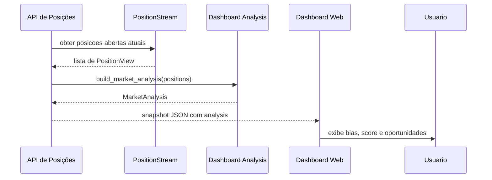

# SPEC 005 — Análise de Bias de Mercado e Oportunidades de Posições Abertas

**ID:** SPEC_005
**Status:** Em Execução
**Data:** 2026-05-03
**Autor:** Time A (Refinamento)
**Executores:** Time B (Execução)
**Skill de validação:** `sdd-spec-driven-development`, `qa-review`

---

## 1. Título e Resumo

### 1.1 Nome da Funcionalidade

Análise de Bias de Mercado com base nas posições abertas.

### 1.2 Resumo (High-Level Definition)

**O que é:** Um módulo de análise que avalia o cenário atual das posições abertas no dashboard e determina se o mercado está favorecendo LONG, SHORT ou NEUTRAL.

**Por que estamos fazendo:** Para dar visibilidade operacional imediata à direção predominante de exposição do portfólio, permitindo decisões mais alinhadas ao risco atual.

**Valor de negócio:** Aumenta a transparência do posicionamento do bot, reduz a dependência de interpretação manual e oferece um indicador de bias de mercado útil para operadores e revisão de risco.

**Conexão com PRD/SPEC:** Origina-se de `PRD.md` (monitoramento de risco e exposição de posições) e se integra aos contratos definidos em `docs/SDD/SPEC.md` e `SPEC_001_PAINEL_POSICOES_TEMPO_REAL/SPEC.md`.

---

## 2. Objetivos e Escopo

### 2.1 Objetivos (o que será entregue)

- [ ] Implementar análise de bias de mercado (`LONG` / `SHORT` / `NEUTRAL`) baseada em posições abertas.
- [ ] Expor resultado de análise no endpoint de snapshot de posições e no stream WebSocket.
- [ ] Exibir motivo do bias, confiança e score de exposição no dashboard.
- [ ] Garantir sugestões de oportunidade de trade com ações `ADD`, `REDUCE` ou `HOLD`.
- [ ] Cobrir com testes unitários e de integração.

### 2.2 Fora do Escopo (Non-Goals)

- **Não inclui:** Forecast de preço ou sinais de entrada/saída independentes de estratégia.
- **Não inclui:** Execução automática de ordens para alinhar bias.
- **Não inclui:** Cálculos de indicadores técnicos adicionais além do que já existe para a análise de posições abertas.
- **Não inclui:** Interface de relatório histórico de bias; foco é o cenário atual.

---

## 3. Referências

| Documento | Seção | Relevância |
|---|---|---|
| `PRD.md` | Monitoramento de risco e exposição | Origem da necessidade de visibilidade operacional |
| `docs/SDD/SPEC.md` | Contratos de dashboard e roteamento de API | Contrato técnico de integração |
| `docs/SDD/SPEC_001_PAINEL_POSICOES_TEMPO_REAL/SPEC.md` | Painel de posições abertas | Uso do mesmo contrato de snapshot do dashboard |

---

## 4. Histórias de Usuário e Requisitos

### US-005-01: Visualizar bias de mercado nas posições abertas

> Como **operador**, quero **ver se o mercado está favorecendo LONG ou SHORT com base nas posições abertas** para **entender rapidamente a direção predominante de exposição**.

**Critérios de Aceitação (DoD desta história):**

```text
DADO   que existem posicoes abertas no dashboard
QUANDO o endpoint de snapshot ou o stream websocket for consultado
ENTÃO  retornam bias, score, confiança e motivo da analise
```

- [ ] AC-01: `bias.direction` é `LONG`, `SHORT` ou `NEUTRAL`.
- [ ] AC-02: `bias.confidence` é `high`, `medium` ou `low`.
- [ ] AC-03: `analysis.opportunities` contém ao menos uma recomendação de ação.

---

### US-005-02: Entender por que o bias foi calculado

> Como **operador**, quero **ler a justificativa do bias** para **saber por que o mercado é considerado favorável a LONG ou SHORT**.

**Critérios de Aceitação:**

```text
DADO   um bias calculado pelo sistema
QUANDO eu visualizar o objeto de análise
ENTÃO  devo ver um campo `reason` legível que descreve a exposição comparativa
```

- [ ] AC-01: `bias.reason` descreve exposição LONG x SHORT e a porcentagem de domínio.
- [ ] AC-02: Em bias `NEUTRAL`, o motivo explica que não há direção clara.

---

### US-005-03: Receber orientação de oportunidade operacional

> Como **operador**, quero **receber sugestões de `ADD`, `REDUCE` ou `HOLD`** com base na análise de bias para **ajustar meu posicionamento de forma coerente**.

**Critérios de Aceitação:**

```text
DADO   bias LONG ou SHORT
QUANDO o snapshot for retornado
ENTÃO  devo ver recomendacoes de acao para a posicao mais representativa do lado dominante e para o lado oposto
```

- [ ] AC-01: Em bias `LONG`, há oportunidade `ADD` para a maior posição LONG.
- [ ] AC-02: Em bias `SHORT`, há oportunidade `ADD` para a maior posição SHORT.
- [ ] AC-03: Em bias neutro, a unica acao retorna `HOLD`.

---

## 5. Design e Arquitetura

### 5.1 Estrutura de Dados / Modelagem

```python
from dataclasses import dataclass
from typing import Literal

MarketBiasDirection = Literal["LONG", "SHORT", "NEUTRAL"]
MarketBiasConfidence = Literal["high", "medium", "low"]
MarketOpportunityAction = Literal["ADD", "REDUCE", "HOLD"]

@dataclass(slots=True, frozen=True)
class MarketBias:
    direction: MarketBiasDirection
    confidence: MarketBiasConfidence
    score: float
    reason: str

@dataclass(slots=True, frozen=True)
class TradeOpportunity:
    symbol: str | None
    direction: MarketBiasDirection
    action: MarketOpportunityAction
    rationale: str
    exposure_usdt: float | None = None

@dataclass(slots=True, frozen=True)
class MarketAnalysis:
    bias: MarketBias
    opportunities: list[TradeOpportunity]
```

### 5.2 Contratos de API / Interface Pública

```python
async def get_positions(request: Request) -> JSONResponse:
    """Retorna snapshot atual das posicoes abertas com analise de bias."""
```

**Entrada:**

| Parâmetro | Tipo | Obrigatório | Descrição |
|---|---|---|---|
| `request` | `Request` | Sim | Contexto HTTP do snapshot |

**Saída:**

| Retorno | Tipo | Descrição |
|---|---|---|
| JSON | `dict` | Snapshot de posições, resumo de conta e `analysis` |

Exemplo de campo `analysis`:

```json
{
  "bias": {
    "direction": "LONG",
    "confidence": "high",
    "score": 0.75,
    "reason": "Bias LONG: exposicao LONG de 15.000 contra 5.000 do lado oposto. Forca do bias: 75%."
  },
  "opportunities": [
    {
      "symbol": "BTCUSDT",
      "direction": "LONG",
      "action": "ADD",
      "rationale": "O mercado favorece LONG e esta posicao possui a maior exposicao LONG atual.",
      "exposure_usdt": 15000.0
    }
  ]
}
```

### 5.3 Fluxo de Dados / Sequência



---

## 6. Regras de Negócio e Restrições

### 6.1 Invariantes de Negócio

| ID | Invariante | Violação → Ação |
|---|---|---|
| INV-005-01 | Bias somente pode ser `LONG`, `SHORT` ou `NEUTRAL` | Exibir `NEUTRAL` e logar discrepância |
| INV-005-02 | Em ausência de posições abertas, o bias deve ser `NEUTRAL` | Não gerar ação de trade |
| INV-005-03 | O score representa relação entre exposição dominante e total | Calcular como `net_exposure / total_exposure` |

### 6.2 Validações Obrigatórias

- `analysis.bias.score` deve estar entre `0.0` e `1.0` em valor absoluto.
- `analysis.bias.reason` deve ser legível e justificar a direção.
- `analysis.opportunities` não deve ficar vazia.
- Em caso de posições com exposições inválidas, ignorar e continuar análise.

### 6.3 Limitações Técnicas

- A análise reflete apenas posições abertas, não entrada de mercado futuro.
- Se `margin_used_usdt` ou `leverage` estiverem ausentes ou incorretos, a posição pode ser excluída da soma.
- O módulo não deve fazer chamadas externas fora do conjunto de dados de posições.

### 6.4 Padrões de Segurança

- Não expor dados sensíveis de API ou chaves no objeto de análise.
- Não usar lógica de Comércio para validar a análise.
- Não gravar detalhes de PnL ou exposição em logs de debug sem necessidade.

---

## 7. Testes e Validação

### 7.1 Testes Unitários

| ID | Descrição | Cenário | Prioridade |
|---|---|---|---|
| TEST_005_01 | Bias neutro sem posições | `positions=[]` -> bias `NEUTRAL` | Alta |
| TEST_005_02 | Bias LONG com maior exposicao LONG | posições LONG dominantes | Alta |
| TEST_005_03 | Bias SHORT com recomendacao REDUCE em LONG | posições mistas | Alta |
| TEST_005_04 | Exposicao invalida é ignorada | margem negativa ou alavancagem inválida | Média |

### 7.2 Testes de Integração (Testnet)

| ID | Descrição | Pré-requisito |
|---|---|---|
| INT_005_01 | Endpoint `/positions` retorna `analysis` válido | Stream de posições ativo |
| INT_005_02 | WebSocket atualiza `analysis` quando posições mudam | Cliente WebSocket conectado |

### 7.3 Evidências Requeridas na PR

- [ ] `pytest -v tests/dashboard/test_analysis.py` passando.
- [ ] Validação de endpoint `/positions` com payload de `analysis`.
- [ ] Log de evidência de pelo menos uma atualização de `analysis` por WebSocket.

---

## 8. Tratamento de Erros

| Erro / Condição | Causa | Ação do Sistema |
|---|---|---|
| Falha ao calcular exposicao | Dados invalidos / alavancagem zero | Ignorar posicao e continuar |
| Stream inacessivel | status `offline` | Retornar HTTP 503 sem `analysis` |
| Score fora de faixa | Problema logico | Log de erro e retornar `confidence=low` |

---

## 9. Riscos e Mitigações

| Risco | Impacto | Mitigação |
|---|---|---|
| Bias falso com poucas posicoes | Médio | Usar `confidence=low` e `NEUTRAL` quando exposicao balanceada |
| Operador interpretar analise como sinal de trade | Médio | Documentar claramente que é insight, nao ordens automáticas |
| Dados stale no dashboard | Alto | Validar status de stream e sinalizar antes de usar analysis |

---

## 10. Definição de Pronto (DoD Global)

- [ ] SPEC aprovada pelo Time A.
- [ ] Implementação aderente aos contratos de `spec` e `endpoint`.
- [ ] Testes unitários e de integração relevantes criados e aprovados.
- [ ] `analysis` está presente no snapshot e no stream WebSocket.
- [ ] Nenhuma invariante da seção 6.1 violada.
- [ ] `pytest` com cobertura dos casos críticos passando.
- [ ] Documentação atualizada e rastreável.

---

## 11. Plano de Entrega

1. **Planner Agent gera Task Graph** com tarefas de análise, API, UI e testes.
2. **Dev Agent executa os targets** usando os arquivos existentes em `src/dashboard` e `src/api/routes`.
3. **Validation Agent valida** conformidade entre SPEC, código e testes.
4. **Time A revisa** antes do merge.

---

## Histórico

- **2026-05-03:** Criação da SPEC_005 para análise de bias de mercado.
