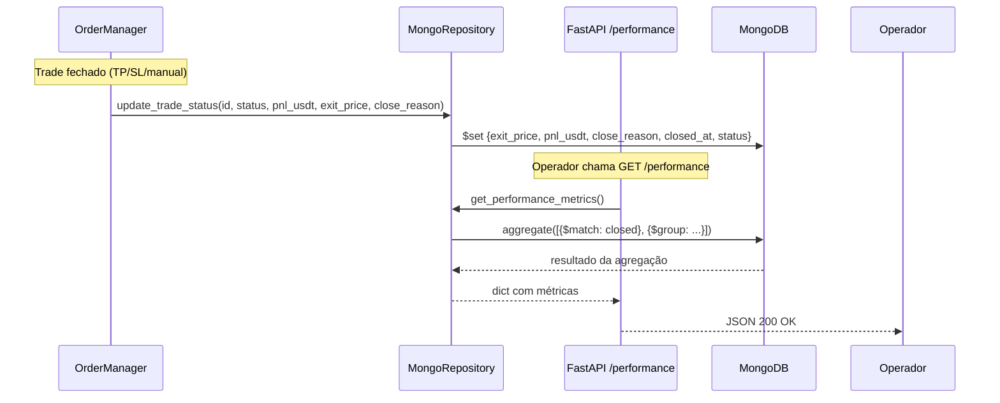

# SPEC_006 — Relatório de Performance de Trades (RF-11)

**ID:** SPEC_006  
**Status:** Concluída
**Data:** 2026-05-04  
**Autor:** Time A (Refinamento)  
**Executores:** Time B (Execução)  
**Skills requeridas:** Python, MongoDB, FastAPI, pytest  
**Depende de:** SPEC_001, SPEC_002, SPEC_003, SPEC_004  
**Conexão PRD:** RF-11 (linhas 181-193)

---

## 1. Título e Sumário

**Funcionalidade:** Relatório de Performance de Trades

**Definição em uma frase:**  
Completar o contrato de dados de fechamento de trade no modelo `Trade` e na camada de repositório, e expor métricas de performance agregadas (win rate, P&L acumulado, RRR médio, drawdown) via endpoint REST consultável manualmente.

**Valor de negócio:**  
Sem `exit_price`, `closed_at`, `pnl_usdt` e `close_reason` gravados corretamente no MongoDB, é impossível validar se a estratégia Bill Williams está gerando resultado positivo — violando o Princípio 7 do Manifesto (Evolução Baseada em Dados). Este SPEC fecha essa lacuna e habilita o ciclo de melhoria contínua.

**Conexão PRD:**  
RF-11 — Relatório de Performance (PRD linhas 181-193). Pré-requisito para validação de estratégia em Testnet antes do release MVP.

---

## 2. Objetivos e Escopo

### 2.1 O que será entregue

1. **Contrato de dados de fechamento** — campos `exit_price`, `pnl_usdt` e `close_reason` adicionados ao dataclass `Trade` e persistidos no MongoDB ao fechar posição (o campo `closed_at` já existe)
2. **Atualização do repositório** — método `update_trade_status` ampliado para receber e persistir os campos novos
3. **Queries de performance** — métodos no repositório para calcular as 4 métricas obrigatórias do PRD
4. **Endpoint REST** — `GET /performance` na API FastAPI, retornando métricas em JSON
5. **Testes** — unitários e de integração cobrindo modelo, repositório e endpoint

### 2.2 Fora de escopo (Non-Goals)

- Dashboard visual automático de performance (Fase 2)
- Geração automática de relatórios periódicos / alertas de P&L
- Filtros por data range ou símbolo no endpoint MVP (extensão futura)
- Backtesting sobre dados históricos
- Notificação Telegram de relatório (separado, SPEC_007+)
- Suporte a múltiplas estratégias simultâneas

---

## 3. Referências

| Documento | Localização | Seção |
|---|---|---|
| PRD — RF-11 | `docs/PRD.md` | Linhas 181-193 |
| Trade model atual | `src/trading/order_manager.py` | Linhas 30-77 |
| MongoDB repository | `src/storage/repository.py` | Completo |
| API FastAPI | `src/api/main.py` | Completo |
| Routes de posições | `src/api/routes/positions.py` | Completo |
| SPEC_004 (notificações) | `docs/SDD/SPEC_004_.../SPEC.md` | Completo |

---

## 4. Histórias de Usuário e Requisitos

### US-006-01: Dados completos ao fechar trade

> Como **operador**, quero **ver exit_price, pnl_usdt e close_reason gravados no MongoDB** ao fechar um trade, para **ter rastreabilidade completa de cada operação**.

**Critérios de Aceitação:**

```text
DADO   que um trade aberto é fechado por TP, SL ou manualmente
QUANDO o sistema processa o fechamento
ENTÃO  o documento do trade no MongoDB contém:
       - exit_price: float (preço real de fechamento)
       - pnl_usdt: float (P&L realizado em USDT)
       - close_reason: "TP" | "SL" | "manual"
       - closed_at: datetime (já existente)
```

- [ ] AC-01: Campo `exit_price` no modelo `Trade` e salvo no MongoDB.
- [ ] AC-02: Campo `pnl_usdt` no modelo `Trade` (renomear/alias de `pnl`) e salvo no MongoDB.
- [ ] AC-03: Campo `close_reason` derivado de `TradeStatus` e salvo no MongoDB.
- [ ] AC-04: Nenhum trade fechado tem esses campos nulos no MongoDB após a implementação.

---

### US-006-02: Consultar métricas de performance via API

> Como **operador**, quero **chamar GET /performance e receber as métricas calculadas**, para **avaliar a saúde da estratégia sem consultar o MongoDB manualmente**.

**Critérios de Aceitação:**

```text
DADO   que há trades fechados no MongoDB
QUANDO o operador chama GET /performance
ENTÃO  o endpoint retorna JSON com:
       - total_trades: int (total de trades fechados)
       - win_rate_pct: float (% de trades com pnl_usdt > 0)
       - total_pnl_usdt: float (soma de todos pnl_usdt)
       - avg_rrr: float (RRR médio realizado = pnl_usdt / risk_amount)
       - max_drawdown_usdt: float (maior sequência de perdas acumuladas)
       - profit_factor: float (soma ganhos / soma perdas absolutas)
```

- [ ] AC-01: Endpoint `GET /performance` responde com status 200 e JSON válido.
- [ ] AC-02: Métricas calculadas corretamente (validadas contra cálculo manual em 10 trades Testnet).
- [ ] AC-03: Se não houver trades fechados, retorna métricas zeradas com status 200.
- [ ] AC-04: Endpoint não quebra com trades parcialmente preenchidos (campos None tratados).

---

### US-006-03: Operação sem impacto no bot de trading

> Como **operador**, quero **que o módulo de performance não interfira na execução de ordens**, para **não adicionar latência ou risco ao trading loop**.

**Critérios de Aceitação:**

```text
DADO   que o bot está executando sinais e abrindo/fechando posições
QUANDO o módulo de performance calcula métricas no banco
ENTÃO  o bot não experimenta latência adicional no ciclo de execução
```

- [ ] AC-01: Queries de performance são read-only e não bloqueiam escritas de trade.
- [ ] AC-02: Falha no endpoint `/performance` não interrompe `TradingMonitor`.
- [ ] AC-03: `update_trade_status` ampliado não aumenta latência de fechamento em >10ms.

---

## 5. Design e Arquitetura

### 5.1 Estrutura de Dados — Trade Model Atualizado

**Arquivo:** `src/trading/order_manager.py`

Campos a adicionar ao dataclass `Trade` (linhas 38-77):

```python
@dataclass
class Trade:
    # --- campos existentes (inalterados) ---
    symbol: str
    timeframe: str
    direction: Direction
    quantity: float
    entry_price: float
    stop_loss: float
    take_profit: float
    risk_amount: float
    margin_used: float
    entry_order_id: str
    sl_order_id: str | None
    tp_order_id: str | None
    status: TradeStatus = TradeStatus.OPEN
    opened_at: datetime = field(default_factory=lambda: datetime.now(timezone.utc))
    closed_at: datetime | None = None
    pnl: float | None = None          # manter para compatibilidade
    signal: dict[str, Any] = field(default_factory=dict)

    # --- campos NOVOS para RF-11 ---
    exit_price: float | None = None   # preço real de fechamento
    pnl_usdt: float | None = None     # P&L em USDT (alias explícito de pnl)
    close_reason: str | None = None   # "TP" | "SL" | "manual"
```

**Mapeamento `close_reason` ← `TradeStatus`:**

| TradeStatus | close_reason |
|---|---|
| CLOSED_TP | "TP" |
| CLOSED_SL | "SL" |
| CLOSED_MANUAL | "manual" |
| OPEN / FAILED | None |

---

### 5.2 Contrato do Repositório — Atualização de Fechamento

**Arquivo:** `src/storage/repository.py`

Assinatura atual:
```python
async def update_trade_status(
    self,
    entry_order_id: str,
    status: TradeStatus,
    pnl: float | None = None,
) -> None:
```

Nova assinatura (retrocompatível — novos campos opcionais):
```python
async def update_trade_status(
    self,
    entry_order_id: str,
    status: TradeStatus,
    pnl: float | None = None,
    exit_price: float | None = None,
    pnl_usdt: float | None = None,
    close_reason: str | None = None,
) -> None:
```

O `$set` do MongoDB deve incluir os novos campos quando presentes.

---

### 5.3 Queries de Performance — Novo Método no Repositório

**Arquivo:** `src/storage/repository.py`

```python
async def get_performance_metrics(self) -> dict[str, float | int]:
    """
    Retorna métricas agregadas de trades fechados.
    Trades sem pnl_usdt são ignorados no cálculo de P&L.
    """
```

Implementação via MongoDB aggregation pipeline:
1. `$match`: status in [CLOSED_TP, CLOSED_SL, CLOSED_MANUAL]
2. `$group`: calcular total, somas de pnl_usdt positivos/negativos
3. Cálculos em Python: win_rate, avg_rrr, max_drawdown, profit_factor

---

### 5.4 Endpoint REST

**Arquivo:** `src/api/routes/performance.py` *(novo arquivo)*

```python
GET /performance
```

**Resposta JSON (200 OK):**
```json
{
  "total_trades": 10,
  "win_rate_pct": 60.0,
  "total_pnl_usdt": 45.50,
  "avg_rrr": 1.8,
  "max_drawdown_usdt": -22.0,
  "profit_factor": 2.1,
  "generated_at": "2026-05-04T12:00:00Z"
}
```

**Resposta sem trades (200 OK):**
```json
{
  "total_trades": 0,
  "win_rate_pct": 0.0,
  "total_pnl_usdt": 0.0,
  "avg_rrr": 0.0,
  "max_drawdown_usdt": 0.0,
  "profit_factor": 0.0,
  "generated_at": "2026-05-04T12:00:00Z"
}
```

O router deve ser registrado em `src/api/main.py` via `app.include_router(performance_router)`.

---

### 5.5 Fluxo de Dados



---

## 6. Regras de Negócio e Restrições

### 6.1 Invariantes de Negócio

| ID | Invariante | Violação → Ação |
|---|---|---|
| INV-006-01 | Todo trade CLOSED_* deve ter `exit_price`, `pnl_usdt` e `close_reason` preenchidos | Log `trade_close_data_incomplete` + auditoria |
| INV-006-02 | `pnl_usdt` deve ser positivo para TP e pode ser negativo para SL | Não tratar como erro; ambos são válidos |
| INV-006-03 | Falha no endpoint `/performance` não interrompe o bot | Endpoint isolado; nunca acessa `TradingMonitor` |
| INV-006-04 | Métricas só consideram trades com status CLOSED_* (não OPEN, não FAILED) | Filtro obrigatório no `$match` |
| INV-006-05 | `profit_factor` com zero em perdas retorna `float('inf')` → normalizar para 0.0 | Evitar divisão por zero |

### 6.2 Validações Obrigatórias

- `exit_price` deve ser > 0 quando fornecido.
- `pnl_usdt` pode ser qualquer float (positivo = lucro, negativo = perda).
- `close_reason` aceita apenas: `"TP"`, `"SL"`, `"manual"`.
- Retrocompatibilidade: trades antigos sem `exit_price`/`pnl_usdt` não devem bloquear as queries.

### 6.3 Limitações Técnicas

- Métricas calculadas no momento da requisição (sem cache); aceitável para MVP.
- `max_drawdown_usdt` calculado ordenando trades por `closed_at` e acumulando; pode ser impreciso se `closed_at` não for monotônico.
- Sem filtro por data/símbolo no MVP — agrega todos os trades fechados.

### 6.4 Padrões de Segurança

- Endpoint `/performance` é somente leitura; não aceita body ou parâmetros de escrita.
- Sem dados sensíveis (API keys, tokens) na resposta.

---

## 7. Testes e Validação

### 7.1 Testes Unitários

| ID | Descrição | Cenário | Prioridade |
|---|---|---|---|
| TEST_006_01 | Trade fechado por TP tem campos corretos | status=CLOSED_TP → close_reason="TP", pnl_usdt>0 | Alta |
| TEST_006_02 | Trade fechado por SL tem campos corretos | status=CLOSED_SL → close_reason="SL", pnl_usdt<0 | Alta |
| TEST_006_03 | `update_trade_status` persiste novos campos | mock MongoDB verifica $set com exit_price, pnl_usdt, close_reason | Alta |
| TEST_006_04 | `get_performance_metrics` com trades mistos | 3 trades TP + 2 SL → métricas calculadas corretamente | Alta |
| TEST_006_05 | `get_performance_metrics` sem trades | coleção vazia → retorna tudo zerado, sem exceção | Alta |
| TEST_006_06 | `profit_factor` com zero perdas | todos TP → profit_factor normalizado (sem divisão por zero) | Média |
| TEST_006_07 | Endpoint GET /performance retorna 200 | resposta JSON com schema correto | Alta |
| TEST_006_08 | Endpoint resiliente com MongoDB indisponível | conexão falha → retorna 503, bot segue operando | Média |

### 7.2 Testes de Integração

| ID | Descrição | Pré-requisito |
|---|---|---|
| INT_006_01 | Ciclo completo: abrir trade → fechar → verificar campos no MongoDB | MongoDB local / mock |
| INT_006_02 | Endpoint `/performance` com 5 trades mockados no repositório | Repository mockado |

### 7.3 Evidências Requeridas na PR

- [ ] `pytest tests/performance/ tests/trading/ -v` — todos os novos testes passando.
- [ ] Saída de `GET /performance` com 10 trades de Testnet ou dados mockados confirmando valores corretos.
- [ ] Confirm que `update_trade_status` retrocompatível: testes existentes em `tests/notifications/test_integration.py` continuam passando.

---

## 8. Tratamento de Erros

| Erro / Condição | Causa | Ação do Sistema |
|---|---|---|
| Trade fechado sem `exit_price` fornecido | OrderManager não passou o campo | Log `trade_close_data_incomplete`; gravar o que tem; auditoria |
| MongoDB indisponível em GET /performance | Falha de rede/conexão | Retornar HTTP 503 com body `{"error": "database_unavailable"}` |
| Coleção `trades` vazia | Nenhum trade fechado ainda | Retornar métricas zeradas (HTTP 200) |
| `close_reason` inválido | Bug no mapeamento de status | Log `invalid_close_reason`; gravar None; não bloquear fechamento |
| Divisão por zero em `profit_factor` | Zero perdas acumuladas | Normalizar para `0.0` (ou valor especial documentado) |

---

## 9. Riscos e Mitigações

| Risco | Impacto | Mitigação |
|---|---|---|
| Trades históricos sem os novos campos bloqueiam queries | Alto | Queries tolerantes a `None`; tratar ausência como exclusão do cálculo |
| Cálculo de `max_drawdown` incorreto por `closed_at` impreciso | Médio | Ordenar por `closed_at` e documentar limitação; refinar em Fase 2 |
| Latência de agregação MongoDB em volume alto | Médio | Índice em `(status, closed_at)`; aceitável para MVP com <1000 trades |
| Retrocompatibilidade de `update_trade_status` quebrada | Alto | Novos parâmetros com default `None`; testes de regressão obrigatórios |

---

## 10. Definição de Pronto (DoD Global)

- [x] SPEC aprovada pelo Time A.
- [x] Campos `exit_price`, `pnl_usdt`, `close_reason` presentes no dataclass `Trade`.
- [x] `update_trade_status` persiste os novos campos corretamente.
- [x] `get_performance_metrics` retorna as 6 métricas do PRD sem erro.
- [x] Endpoint `GET /performance` registrado e respondendo 200 com JSON válido.
- [x] Testes unitários e de integração cobrindo todos os cenários listados em §7.
- [x] Nenhum teste existente quebrado (regressão zero).
- [x] Sem dados sensíveis expostos no endpoint.
- [x] Rastreabilidade PRD RF-11 → SPEC_006 → código comprovada.

---

## 11. Plano de Entrega

### Task Graph

```
task_001: Adicionar exit_price, pnl_usdt, close_reason ao dataclass Trade
          → src/trading/order_manager.py
          → testes: tests/trading/test_trade_model.py

task_002: Ampliar update_trade_status no repositório (retrocompatível)
          → src/storage/repository.py
          → testes: tests/storage/test_repository.py
          → [depende de: task_001]

task_003: Implementar get_performance_metrics no repositório
          → src/storage/repository.py
          → testes: tests/storage/test_performance_metrics.py
          → [depende de: task_002]

task_004: Criar src/api/routes/performance.py + registrar em main.py
          → src/api/routes/performance.py
          → src/api/main.py (include_router)
          → testes: tests/api/test_performance_endpoint.py
          → [depende de: task_003]

task_005: QA gate — regressão completa + evidências
          → pytest tests/ -v
          → [depende de: task_001-004]
```

### Sequência

1. Time B implementa tasks 001-002 (modelo + repositório)
2. Time B implementa task 003 (queries de métricas)
3. Time B implementa task 004 (endpoint REST)
4. Time B executa QA gate (task 005)
5. Time A revisa conformidade e libera próxima SPEC

---

## Histórico

- **2026-05-04:** Criação da SPEC_006 — refinamento RF-11 (Relatório de Performance).
