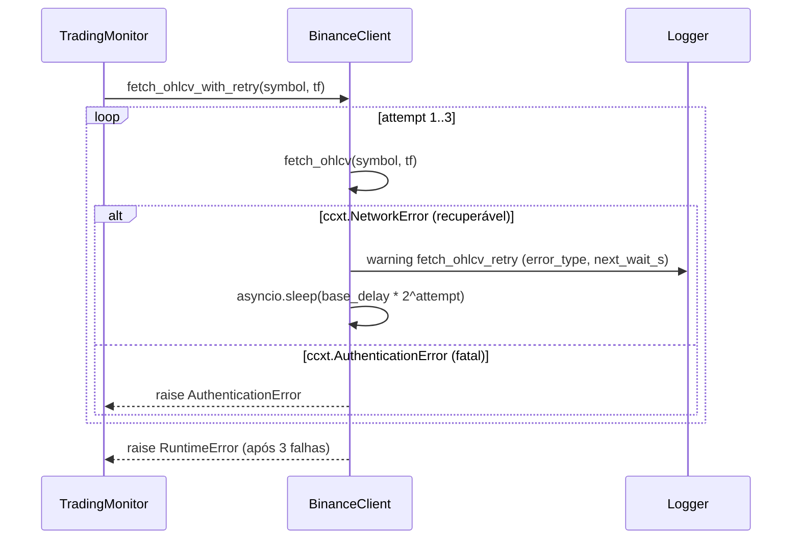

# SPEC_007 — Resiliência e Continuidade Operacional

**ID:** SPEC_007
**Status:** Concluída
**Data:** 2026-05-04
**Autor:** Time A (Refinamento)
**Executores:** Time B (Execução)
**Skills requeridas:** Python, asyncio, ccxt, motor, FastAPI, pytest
**Depende de:** SPEC_001, SPEC_004, SPEC_006
**Conexão PRD:** §MVP item 5 (linhas 163–167), OKR Nível 3 (linhas 115–119), Risco "Operação duplicada" (linha 382)

---

## 1. Título e Resumo

### 1.1 Nome da Funcionalidade

Resiliência e Continuidade Operacional do Bot de Trading.

### 1.2 Resumo (High-Level Definition)

**O que é:** Especificação executável dos mecanismos de resiliência operacional: retry com backoff exponencial e distinção de erros fatais vs. recuperáveis, deduplicação de ordens ao reiniciar o bot, e endpoint `/health` para monitoramento da saúde da API.

**Por que estamos fazendo:** O PRD §MVP item 5 exige resiliência como requisito da Fase 1, mas nenhuma SPEC anterior formalizou os contratos, critérios de aceite e testes obrigatórios para esses mecanismos.
O retry atual em `binance_client.py` usa delay linear, loga `str(exc)` (vazando potencialmente URLs com token), e não distingue erros recuperáveis de fatais.
Não existe guard de deduplicação no `save_trade`, nem endpoint de health check.

**Valor de negócio:** Previne ordens duplicadas em caso de crash/restart (impacto financeiro direto), garante reconexão automática sem intervenção manual, e fornece endpoint de saúde para monitoramento operacional.

**Conexão com PRD/SPEC:** PRD §MVP item 5 — "Reconexão: retry 3x backoff exponencial. Durabilidade: nenhuma ordem duplicada se bot reinicia. Health check: Testnet + bot health endpoint respondendo."

---

## 2. Objetivos e Escopo

### 2.1 Objetivos (o que será entregue)

- [ ] Retry com backoff exponencial formalizado: delays 1s, 2s, 4s; distinção fatal vs. recuperável
- [ ] Logs de retry sem exposição de token (`type(exc).__name__`, não `str(exc)`)
- [ ] Deduplicação de ordens: `save_trade` captura `DuplicateKeyError` sem crash
- [ ] Guard de deduplicação no loop por símbolo: consulta trades ativos antes de abrir nova posição
- [ ] Endpoint `GET /health` retornando estado do MongoDB e da API
- [ ] Testes unitários para todos os cenários acima

### 2.2 Fora do Escopo (Non-Goals)

- **Não inclui:** IPC entre processo bot e processo API — `bot_process` reporta `"unknown"` por design
- **Não inclui:** Retry para operações de criação de ordem (fatais por natureza — rollback imediato)
- **Não inclui:** Dashboard de métricas de uptime — apenas endpoint de health básico
- **Não inclui:** Persistência de estado do bot em arquivo (stateless restart é suficiente para MVP)
- **Não inclui:** Critério formal de 48h em Testnet automatizado — evidência manual é aceita no MVP

---

## 3. Referências

| Documento | Seção | Relevância |
|---|---|---|
| `PRD.md` | §MVP item 5, linhas 163–167 | Requisito de origem |
| `PRD.md` | Risco "Operação duplicada", linha 382 | Risco a mitigar |
| `docs/SDD/SPEC.md` | §2.4 Exchange Integration | Contrato de retry |
| `docs/SDD/SPEC.md` | §2.5 Storage Layer | Índice único `entry_order_id` |
| `docs/SDD/SPEC.md` | §2.3 Order Manager | Invariante: sem estado indefinido |
| `SPEC_004` | §6.2, §7.1 | Padrão de sanitização de logs |

---

## 4. Histórias de Usuário e Requisitos

### US-007-01: Retry sem vazar token nos logs

> Como **operador**, quero que o bot reconecte automaticamente em falhas temporárias de rede sem expor credenciais nos logs.

**Critérios de Aceitação:**

```text
DADO   que uma chamada à Binance falha com erro de rede (ccxt.NetworkError)
QUANDO o bot tenta novamente
ENTÃO  o log de retry contém `error_type` (nome da classe), nunca `str(exc)` com URL
E      o delay entre tentativas é exponencial: 1s, 2s, 4s
E      após 3 falhas, a exceção original é relançada
```

- [ ] AC-01: Log `fetch_ohlcv_retry` usa `error_type=type(exc).__name__`
- [ ] AC-02: Delay entre tentativas segue `base_delay * (2 ** (attempt - 1))`
- [ ] AC-03: Erro fatal (AuthenticationError) não entra em retry — falha imediatamente

---

### US-007-02: Deduplicação ao reiniciar

> Como **operador**, quero que o bot nunca abra duas ordens para o mesmo símbolo, mesmo após um crash e restart inesperado.

**Critérios de Aceitação:**

```text
DADO   que um trade ACTIVE existe no MongoDB para BTCUSDT
QUANDO o bot reinicia e processa o símbolo BTCUSDT no loop principal
ENTÃO  o bot detecta o trade existente e não abre nova posição
E      loga `simbolo_ja_em_trade_ativo` com o símbolo

DADO   que `save_trade` é chamado com `entry_order_id` já existente
QUANDO o MongoDB rejeita com DuplicateKeyError
ENTÃO  o sistema loga `trade_duplicado_ignorado` e retorna sem crash
```

- [ ] AC-01: `TradingMonitor` consulta `repository.get_open_trades_for_symbol(symbol)` antes de avaliar sinal
- [ ] AC-02: Se trade ativo existe → skip com log, sem sinal avaliado
- [ ] AC-03: `save_trade` captura `DuplicateKeyError`, loga warning, retorna `None` sem relançar

---

### US-007-03: Health check endpoint

> Como **operador**, quero um endpoint HTTP que me diga se a API e o MongoDB estão operacionais.

**Critérios de Aceitação:**

```text
DADO   que o MongoDB está acessível
QUANDO GET /health é chamado
ENTÃO  resposta 200 com `{"status": "ok", "mongodb": "ok", "bot_process": "unknown", "timestamp": "..."}`

DADO   que o MongoDB está inacessível
QUANDO GET /health é chamado
ENTÃO  resposta 503 com `{"status": "error", "mongodb": "error"}`
```

- [ ] AC-01: `GET /health` retorna 200 quando MongoDB responde ao ping
- [ ] AC-02: `GET /health` retorna 503 quando MongoDB inacessível
- [ ] AC-03: Campo `bot_process` sempre `"unknown"` (sem IPC entre processos)
- [ ] AC-04: Campo `timestamp` em ISO 8601 UTC

---

## 5. Design e Arquitetura

### 5.1 Retry Formalizado (`src/exchange/binance_client.py`)

**Classificação de erros:**

```python
import ccxt

# Recuperáveis — retry até 3x com backoff exponencial
_RECOVERABLE_ERRORS = (
    ccxt.NetworkError,        # timeouts, connection reset
    ccxt.RequestTimeout,      # timeout de requisição
    ccxt.RateLimitExceeded,   # 429
)

# Fatais — falha imediata, sem retry
_FATAL_ERRORS = (
    ccxt.AuthenticationError,  # 401 — credencial inválida
    ccxt.InsufficientFunds,    # saldo insuficiente
    ccxt.BadSymbol,            # símbolo inválido
    ccxt.InvalidOrder,         # parâmetro de ordem inválido
)
```

**Contrato revisado:**

```python
async def fetch_ohlcv_with_retry(
    self,
    symbol: str,
    timeframe: str,
    limit: int = 200,
    retries: int = 3,
    base_delay: float = 1.0,
) -> pd.DataFrame:
    """
    Retry com backoff exponencial apenas para erros recuperáveis.
    Delays: 1s, 2s, 4s (base_delay * 2^attempt).
    Lança a exceção original após esgotar tentativas.
    Nunca usa str(exc) no log — usa type(exc).__name__.
    """
```

**Log obrigatório (seguro):**

```python
logger.warning(
    "fetch_ohlcv_retry",
    symbol=symbol,
    timeframe=timeframe,
    attempt=attempt,
    retries=retries,
    error_type=type(exc).__name__,
    next_wait_s=next_delay,
)
```

### 5.2 Deduplicação no Loop Principal (`src/main.py`)

Guard a ser inserido em `TradingMonitor._process_symbol()` ou equivalente, antes de avaliar sinal:

```python
open_trades = await self.repository.get_open_trades_for_symbol(symbol)
if open_trades:
    logger.info("simbolo_ja_em_trade_ativo", symbol=symbol, open_count=len(open_trades))
    return
```

### 5.3 Guard de DuplicateKeyError (`src/storage/repository.py`)

```python
from pymongo.errors import DuplicateKeyError

async def save_trade(self, trade: Trade) -> str | None:
    try:
        result = await self._db[_TRADES_COLLECTION].insert_one(trade.to_dict())
        doc_id = str(result.inserted_id)
        logger.info("trade_saved", symbol=trade.symbol, doc_id=doc_id)
        return doc_id
    except DuplicateKeyError:
        logger.warning("trade_duplicado_ignorado", entry_order_id=trade.entry_order_id)
        return None
```

### 5.4 Health Check Endpoint (`src/api/routes/health.py`)

```python
from datetime import UTC, datetime

from fastapi import APIRouter, HTTPException, Request

router = APIRouter(tags=["health"])


@router.get("/health")
async def health_check(request: Request) -> dict:
    """Verifica saúde da API e conectividade com MongoDB."""
    try:
        db = request.app.state.mongo_db
        await db.command("ping")
        mongodb_status = "ok"
    except Exception:
        raise HTTPException(
            status_code=503,
            detail={"status": "error", "mongodb": "error"},
        )

    return {
        "status": "ok",
        "mongodb": mongodb_status,
        "bot_process": "unknown",
        "timestamp": datetime.now(UTC).isoformat(),
    }
```

**Requisito de estado:** `app.state.mongo_db` deve ser populado no `lifespan` de `src/api/main.py` com a instância `AsyncIOMotorDatabase`.

### 5.5 Fluxo de Dados — Retry



---

## 6. Regras de Negócio e Restrições

### 6.1 Invariantes de Negócio

| ID | Invariante | Violação → Ação |
|---|---|---|
| INV-007-01 | Nunca dois trades ACTIVE para o mesmo símbolo | Skip silencioso + log `simbolo_ja_em_trade_ativo` |
| INV-007-02 | `entry_order_id` é globalmente único | `DuplicateKeyError` capturado; `save_trade` retorna `None` |
| INV-007-03 | Logs de retry nunca contêm token, secret ou URL com credencial | `str(exc)` proibido; usar `type(exc).__name__` |
| INV-007-04 | Erros fatais (401, saldo insuficiente) não entram em retry | Falha imediata; propagar exceção |

### 6.2 Validações Obrigatórias

- `retries >= 1` — parâmetro mínimo para `fetch_ohlcv_with_retry`
- `base_delay > 0` — delay nunca pode ser zero ou negativo
- Índice único `entry_order_id` deve existir antes de qualquer `save_trade` (criado em `setup_indexes`)

### 6.3 Limitações Técnicas

- Rate limit Binance Futures: 1200 req/min — retry com backoff respeita naturalmente
- `bot_process` sempre `"unknown"`: bot e API são processos independentes sem IPC no MVP

### 6.4 Padrões de Segurança

- Nunca logar `str(exc)` em contexto de chamadas ccxt (URL do exchange pode conter credencial)
- Usar exclusivamente `type(exc).__name__` para identificar o tipo do erro nos logs
- `GET /health` não expõe dados de configuração, credenciais ou chaves de API

---

## 7. Testes e Validação

### 7.1 Testes Unitários

| ID | Descrição | Cenário | Prioridade |
|---|---|---|---|
| TEST_007_01 | Retry em NetworkError com backoff exponencial | 2 falhas NetworkError + 1 sucesso | Alta |
| TEST_007_02 | Erro fatal não entra em retry | AuthenticationError → falha imediata | Alta |
| TEST_007_03 | Retry esgotado relança exceção original | 3 falhas NetworkError → RuntimeError | Alta |
| TEST_007_04 | Log de retry não contém token nem URL | caplog verifica ausência de `str(exc)` | Alta |
| TEST_007_05 | Guard de deduplicação por símbolo | trade ACTIVE existe → skip, sem sinal avaliado | Alta |
| TEST_007_06 | DuplicateKeyError em save_trade retorna None sem crash | insert_one levanta DuplicateKeyError | Alta |
| TEST_007_07 | GET /health retorna 200 quando MongoDB ok | mock db.command("ping") OK | Média |
| TEST_007_08 | GET /health retorna 503 quando MongoDB falha | mock db.command("ping") lança Exception | Média |

### 7.2 Testes de Integração (Testnet)

| ID | Descrição | Pré-requisito |
|---|---|---|
| INT_007_01 | Bot reinicia sem duplicar ordem existente | Trade ACTIVE no MongoDB; restart manual |
| INT_007_02 | GET /health retorna 200 com stack rodando | docker compose up -d |

### 7.3 Evidências Requeridas na PR

- [ ] Output de `pytest tests/ -v -k "retry or duplicate or health" --tb=short` com todos passando
- [ ] Trecho de log mostrando `fetch_ohlcv_retry` com `error_type` (sem `str(exc)`)
- [ ] `GET /health` respondendo 200 com `mongodb: ok` (curl ou screenshot)
- [ ] Referência às seções §5.1–§5.4 desta SPEC no corpo da PR

---

## 8. Tratamento de Erros

| Erro / Condição | Causa | Ação do Sistema |
|---|---|---|
| `ccxt.NetworkError` | Falha de rede temporária | retry×3 com backoff 1s, 2s, 4s |
| `ccxt.RateLimitExceeded` | 429 da Binance | retry×3 com backoff 1s, 2s, 4s |
| `ccxt.RequestTimeout` | Timeout de requisição | retry×3 com backoff 1s, 2s, 4s |
| `ccxt.AuthenticationError` | Credencial inválida | fatal — relança imediatamente, sem retry |
| `ccxt.InsufficientFunds` | Saldo insuficiente | fatal — relança imediatamente |
| `ccxt.BadSymbol` | Símbolo não existe na exchange | fatal — relança imediatamente |
| `ccxt.InvalidOrder` | Parâmetro de ordem inválido | fatal — relança imediatamente |
| `DuplicateKeyError` em `save_trade` | `entry_order_id` já existe | log warning, retorna `None`, sem crash |
| MongoDB inacessível em `/health` | Container down ou rede | HTTP 503 com `{"status": "error", "mongodb": "error"}` |

---

## 9. Riscos e Mitigações

| Risco | Impacto | Mitigação |
|---|---|---|
| Backoff insuficiente em pico de rate limit | Médio — retry falha mesmo com 3 tentativas | Exponential base_delay=1.0 dá 7s total; suficiente para maioria dos rate limits |
| Trade ACTIVE órfão no MongoDB (bot crashes antes de save) | Alto — posição aberta sem registro | Guard consulta exchange via `fetch_open_positions()` em SPEC futura; MVP mitiga com índice único |
| `GET /health` expõe informações de infraestrutura | Baixo — apenas status binário | Response limita-se a `ok`/`error`; nenhum detalhe de configuração exposto |

---

## 10. Definição de Pronto (DoD Global)

- [ ] SPEC aprovada pelo Time A
- [ ] `fetch_ohlcv_with_retry` usa backoff exponencial, distingue fatais vs. recuperáveis, nunca loga `str(exc)`
- [ ] `save_trade` captura `DuplicateKeyError` e retorna `None` sem crash
- [ ] Guard de deduplicação por símbolo implementado no loop principal
- [ ] `GET /health` retorna 200/503 conforme estado do MongoDB
- [ ] Todos os 8 testes unitários (TEST_007_01 a TEST_007_08) passando
- [ ] Nenhuma invariante da seção 6.1 violada em nenhum cenário de teste
- [ ] Rastreabilidade PRD §MVP item 5 → SPEC_007 → Teste → Código comprovada na PR

---

## 11. Plano de Entrega

### task_001 — Retry formalizado

- Refatorar `fetch_ohlcv_with_retry` em `src/exchange/binance_client.py`
- Corrigir logs de `set_leverage` e `set_margin_mode` (também usam `str(exc)`)
- Implementar TEST_007_01 a TEST_007_04

### task_002 — Deduplicação de ordens

- Adicionar guard em `TradingMonitor` (ler `src/main.py` para localizar ponto exato)
- Adicionar handling de `DuplicateKeyError` em `repository.save_trade`
- Implementar TEST_007_05 e TEST_007_06

### task_003 — Health check endpoint

- Criar `src/api/routes/health.py`
- Registrar router e expor `mongo_db` em `app.state` no `lifespan` de `src/api/main.py`
- Implementar TEST_007_07 e TEST_007_08

### task_004 — QA gate

- `pytest tests/ -v --tb=short` — 100% passing
- Atualizar `tasks_status.json` e `spec_status_update.md`
- Atualizar `docs/SDD/README.md` — SPEC_007 status: `Concluída`

---

## Histórico

- **2026-05-04:** Criação da SPEC_007 pelo Time A.
