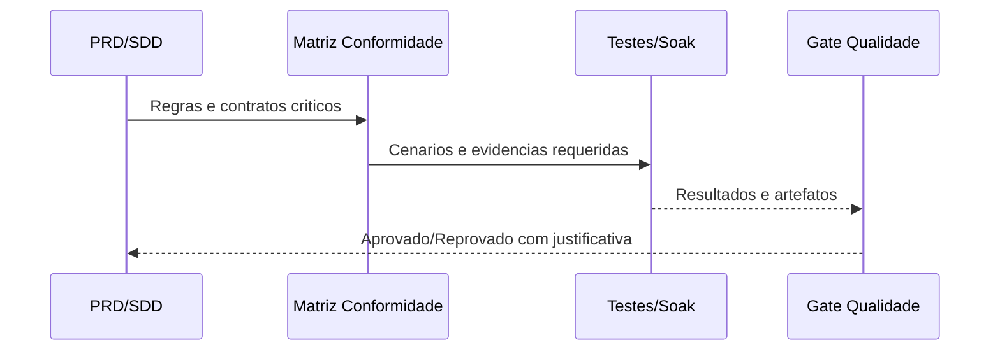

# SPEC_021 — Validacao Operacional e Resiliencia de Producao

**ID:** SPEC_021
**Status:** Em Execucao
**Data:** 2026-05-07
**Autor:** Time A (Refinamento)
**Executores:** Time B (Execucao)
**Skill de validacao:** `sdd-spec-driven-development`, `qa-review`

---

## 1. Titulo e Resumo

### 1.1 Nome da Funcionalidade

Validacao Operacional e Resiliencia de Producao

### 1.2 Resumo (High-Level Definition)

**O que e:** Esta SPEC define o pacote de validacao operacional para comprovar estabilidade de execucao, conformidade de componentes criticos e prontidao de producao.

**Por que estamos fazendo:** O PRD exige evidencia objetiva de resiliencia, qualidade e seguranca operacional alem da conclusao documental de SPECs anteriores.

**Valor de negocio:** Reduz risco de regressao silenciosa, melhora previsibilidade operacional e cria gate tecnico para evolucoes futuras com evidencias verificaveis.

**Conexao com PRD/SPEC:** PRD.md (OKRs e criterios de resiliencia/seguranca/qualidade), docs/SDD/SPEC.md (contratos de Signal/Risk/Order/Exchange/Storage).

---

## 2. Objetivos e Escopo

### 2.1 Objetivos (o que sera entregue)

- [ ] Definir protocolo de soak test 48h com criterios objetivos de aprovacao/reprovacao.
- [ ] Definir matriz de conformidade PRD->SPEC->teste para Signal Engine, Risk Manager e Order Manager.
- [ ] Definir baseline de cobertura e gate de qualidade para aceite da SPEC.
- [ ] Definir checklist de hardening operacional para runtime/container/logs sensiveis.

### 2.2 Fora do Escopo (Non-Goals)

- **Nao inclui:** Redesign da estrategia de trading.
- **Nao inclui:** Automacao de aplicacao de configuracao em runtime alem da documentacao operacional.
- **Nao inclui:** Replataformizacao de arquitetura, IAM/RBAC completo ou multi-tenant.

---

## 3. Referencias

| Documento | Secao | Relevancia |
|---|---|---|
| `PRD.md` | Objetivos estrategicos, criterios de sucesso, riscos | Origem dos requisitos de validacao operacional |
| `docs/SDD/SPEC.md` | Componentes 2.1, 2.2, 2.3 e checklists | Contratos tecnicos a validar |
| `docs/SDD/SPEC_020_HARDENING_GOVERNANCA_SEGURANCA_ONBOARDING/SPEC.md` | Escopo e rastreabilidade previa | Continuidade do hardening |
| `docs/SDD/README.md` | Semantica canonica de status | Governanca SDD |

---

## 4. Historias de Usuario e Requisitos

### US-021-01: Validacao de Resiliencia em Operacao Continua

> Como **operador do bot**, quero **protocolo de soak test 48h com criterios claros**, para **comprovar estabilidade de producao sem inferencia subjetiva**.

**Criterios de Aceitacao:**

```text
DADO ambiente controlado de teste operacional
QUANDO o bot executar o protocolo por 48h
ENTAO existe resultado objetivo de aprovado/reprovado com evidencias minimas definidas
```

- [ ] AC-01: protocolo define pre-condicoes, eventos obrigatorios e criterio de interrupcao.
- [ ] AC-02: protocolo define evidencias minimas coletadas para auditoria.
- [ ] AC-03: resultado final e binario (aprovado/reprovado) com justificativa.

---

### US-021-02: Conformidade Funcional dos Componentes Criticos

> Como **time de engenharia**, quero **matriz de conformidade PRD->SPEC->teste**, para **evitar lacunas entre requisito, comportamento e evidencia**.

**Criterios de Aceitacao:**

```text
DADO contratos de Signal/Risk/Order no SDD
QUANDO a matriz for preenchida
ENTAO cada regra critica possui rastreabilidade explicita para testes e evidencias
```

- [ ] AC-01: cobertura de regras criticas de Signal Engine, Risk Manager e Order Manager.
- [ ] AC-02: lacunas abertas sao explicitadas como pendencia (sem mascaramento).
- [ ] AC-03: criterio de aceite da matriz e verificavel por revisao tecnica.

---

### US-021-03: Gate de Qualidade e Hardening Operacional

> Como **responsavel por release**, quero **baseline de qualidade e checklist operacional de hardening**, para **reduzir risco de deploy inseguro ou instavel**.

**Criterios de Aceitacao:**

```text
DADO baseline de cobertura e checklist de hardening
QUANDO um ciclo de validacao da SPEC_021 for executado
ENTAO o gate decide aprovado/reprovado com base em criterios mensuraveis
```

- [ ] AC-01: baseline de cobertura minima definida para aceite da SPEC.
- [ ] AC-02: checklist inclui runtime/container/logs sensiveis com criterios pass/fail.
- [ ] AC-03: desvios produzem bloqueio explicito para fechamento da SPEC.

---

## 5. Design e Arquitetura

### 5.1 Estrutura de Dados / Modelagem

```python
from dataclasses import dataclass

@dataclass(frozen=True)
class SoakEvidence:
    run_id: str
    started_at: str
    finished_at: str
    duration_hours: float
    approved: bool
    failure_reason: str | None

@dataclass(frozen=True)
class ComplianceItem:
    requirement_id: str
    source_ref: str
    test_ref: str
    status: str  # pass/fail/pending
    notes: str
```

### 5.2 Contratos de Interface (documentais desta SPEC)

- Formato de evidencia de soak:
  - identificador da execucao
  - janela de tempo
  - resultado binario
  - razao de falha quando reprovado
- Matriz de conformidade:
  - requisito de origem
  - referencia de contrato SDD
  - referencia de teste
  - status pass/fail/pending
- Gate de qualidade:
  - baseline de cobertura
  - checklist de hardening pass/fail

### 5.3 Fluxo de Dados / Sequencia (alto nivel)



---

## 6. Regras de Negocio e Restricoes

### 6.1 Invariantes

| ID | Invariante | Violacao -> Acao |
|---|---|---|
| INV-021-01 | Nenhuma aprovacao sem evidencia objetiva | Bloquear fechamento da SPEC |
| INV-021-02 | Nenhuma lacuna de conformidade pode ser marcada como concluida sem justificativa | Registrar pendencia e manter status aberto |
| INV-021-03 | Nenhum dado sensivel pode aparecer em evidencias de log | Reprovar checklist de hardening |

### 6.2 Validacoes Obrigatorias

- Estrutura documental completa da SPEC_021 presente.
- `tasks.json` e `tasks_status.json` validos.
- Coerencia entre objetivos, tasks e status baseline.
- Referencia da SPEC_021 no indice `docs/SDD/README.md`.

### 6.3 Limitacoes Tecnicas

- Esta SPEC define estrutura e contratos documentais, sem alteracao de API publica de runtime nesta fase.
- Execucao de soak 48h e verificacoes de cobertura dependem de ciclo posterior de implementacao/validacao.

---

## 7. Testes e Validacao

### 7.1 Testes da Estrutura da SPEC

| ID | Descricao | Resultado esperado |
|---|---|---|
| TEST_021_01 | Diretorio SPEC_021 contem 5 arquivos obrigatorios | Pass |
| TEST_021_02 | `tasks.json` e `tasks_status.json` sao JSON valido | Pass |
| TEST_021_03 | Coerencia entre SPEC.md, tasks e status baseline | Pass |
| TEST_021_04 | README SDD referencia SPEC_021 com status Em Refinamento | Pass |

### 7.2 Evidencias Requeridas nesta fase

- [ ] Snapshot dos arquivos criados.
- [ ] Validacao de JSON sem erro.
- [ ] Diff do README com entrada da SPEC_021.

---

## 8. Tratamento de Erros

| Erro / Condicao | Causa | Acao do Sistema |
|---|---|---|
| JSON invalido em task/status | Estrutura malformada | Corrigir artefato e revalidar |
| Ausencia de arquivo obrigatorio | Criacao incompleta da SPEC | Bloquear aceite da estrutura |
| Divergencia entre objetivo e task | Modelagem inconsistente | Revisar task graph antes de execucao |

---

## 9. Riscos e Mitigacoes

| Risco | Impacto | Mitigacao |
|---|---|---|
| Estrutura completa sem criterios objetivos suficientes | Medio | Definir pass/fail explicito em todos os objetivos |
| Fechamento prematuro sem evidencias reais | Alto | Invariantes de bloqueio + status inicial Em Refinamento |
| Lacuna entre PRD e testes | Alto | Matriz obrigatoria PRD->SPEC->teste |

---

## 10. Definicao de Pronto (DoD Global)

- [ ] Diretorio e arquivos obrigatorios da SPEC_021 criados.
- [ ] `SPEC.md`, `plan.md`, `tasks.json`, `tasks_status.json`, `spec_status_update.md` coerentes entre si.
- [ ] Entrada no `docs/SDD/README.md` adicionada com status `Em Refinamento`.
- [ ] Validacao documental concluida (arquivos + JSON + coerencia).

---

## 11. Plano de Entrega

1. Criar estrutura documental da SPEC_021.
2. Publicar task graph com dependencias e criterios de aceite.
3. Inicializar acompanhamento com status baseline.
4. Atualizar indice SDD para descoberta da SPEC.
5. Entregar pronto para execucao por agentes.

---

## Historico

- **2026-05-07:** Criacao da SPEC_021.
- **2026-05-07:** Execucao parcial iniciada com artefatos operacionais, gate de qualidade, checklist de hardening e pipeline CI.
