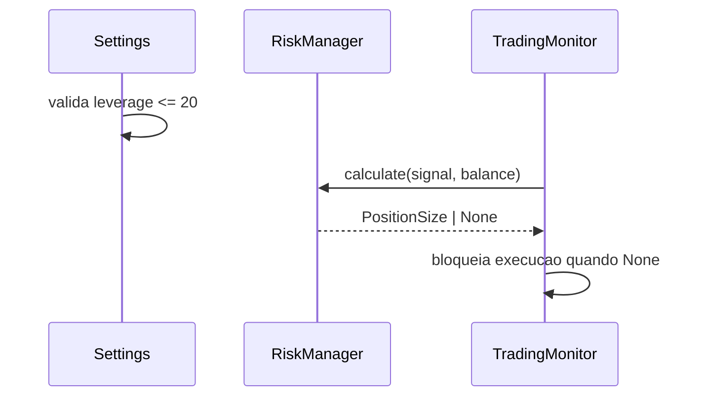

# SPEC_022 — Convergencia PRD-SDD-Codigo para Regras Criticas de Risco e Escalabilidade

**ID:** SPEC_022
**Status:** Concluida
**Data:** 2026-05-07
**Autor:** Time A (Refinamento)
**Executores:** Time B (Execucao)
**Skill de validacao:** `sdd-spec-driven-development`, `qa-review`

---

## 1. Titulo e Resumo

### 1.1 Nome da Funcionalidade

Convergencia PRD-SDD-Codigo para Regras Criticas de Risco e Escalabilidade

### 1.2 Resumo (High-Level Definition)

**O que e:** Esta SPEC define o pacote de alinhamento entre PRD, SDD e implementacao para regras criticas de risco e limites operacionais. O foco e eliminar ambiguidade entre documento e comportamento real.

**Por que estamos fazendo:** Foram identificados gaps entre contratos declarados e implementacao atual em temas de leverage maximo, politica de violacao de alocacao de capital e meta de escalabilidade.

**Valor de negocio:** Reduz risco de operacao fora de politica, evita interpretacoes divergentes em code review e fortalece auditabilidade de decisoes de risco.

**Conexao com PRD/SPEC:** PRD.md (LEVERAGE maximo 20x, politica de bloqueio por alocacao, meta de escalabilidade), docs/SDD/SPEC.md (Risk Manager, monitoramento e contratos operacionais), SPEC_021 (governanca de conformidade).

---

## 2. Objetivos e Escopo

### 2.1 Objetivos (o que sera entregue)

- [x] Definir e implementar validacao obrigatoria de `LEVERAGE <= 20x` na inicializacao/configuracao, com erro explicito.
- [x] Definir contrato canonico para violacao de `max_capital_allocation_pct` e alinhar PRD, SDD, codigo e testes para comportamento unico.
- [x] Alinhar contrato de escalabilidade (meta e limite operacional) entre PRD, SDD e runtime, removendo inconsistencias documentais.
- [x] Entregar rastreabilidade formal requisito -> SPEC -> teste -> codigo para os 3 eixos desta SPEC.

### 2.2 Fora do Escopo (Non-Goals)

- **Nao inclui:** Implementacao de multiplas estrategias de trading.
- **Nao inclui:** Otimizacao automatica de parametros de estrategia.
- **Nao inclui:** Redesenho completo de arquitetura de monitoramento distribuido.

---

## 3. Referencias

| Documento | Secao | Relevancia |
|---|---|---|
| `PRD.md` | Requisito de leverage maximo, politica de alocacao, criterio de escalabilidade | Origem dos requisitos de negocio |
| `docs/SDD/SPEC.md` | 1.3, 1.4, 2.2 e contratos de monitor/risk | Contratos tecnicos impactados |
| `docs/SDD/SPEC_021_VALIDACAO_OPERACIONAL_RESILIENCIA/SPEC.md` | Invariantes de evidencia objetiva | Continuidade de governanca |
| `src/config/settings.py` | Parse e validacao de `SYMBOL:TIMEFRAME:LEVERAGE` | Ponto de entrada de validacao |
| `src/trading/risk_manager.py` | Politica atual de scale-down | Ponto de mudanca de contrato |

---

## 4. Historias de Usuario e Requisitos

### US-022-01: Guardrail de Leverage Obrigatorio

> Como **operador**, quero **garantia de rejeicao de leverage acima de 20x**, para **evitar inicializacao do bot com risco fora da politica do produto**.

**Criterios de Aceitacao (DoD desta historia):**

```text
DADO configuracao com SYMBOL:TIMEFRAME:LEVERAGE acima de 20
QUANDO o sistema carregar as configuracoes
ENTAO a inicializacao e bloqueada com erro explicito e orientacao de correcao
```

- [x] AC-01: qualquer leverage > 20 falha na validacao de config.
- [x] AC-02: mensagem de erro indica limite maximo de 20x e campo invalido.
- [x] AC-03: testes de configuracao cobrem cenarios valido/limite/invalido.

---

### US-022-02: Politica Canonica para Violacao de Alocacao

> Como **risk manager do sistema**, quero **comportamento unico e auditavel quando margem excede alocacao maxima**, para **eliminar divergencia entre regra de negocio e execucao**.

**Criterios de Aceitacao:**

```text
DADO sinal valido com margem requerida acima de max_capital_allocation_pct
QUANDO o RiskManager calcular a posicao
ENTAO a operacao e rejeitada (retorno None) e um warning estruturado e emitido
```

- [x] AC-01: regra canonica definida como "bloquear operacao" (sem scale-down implicito).
- [x] AC-02: PRD/SDD/codigo/testes descrevem o mesmo comportamento.
- [x] AC-03: teste unitario cobre explicitamente o bloqueio e a emissao de warning.

---

### US-022-03: Convergencia de Escalabilidade e Limites Operacionais

> Como **time de engenharia**, quero **contrato de limite operacional coerente com meta de escalabilidade**, para **evitar regra obsoleta e decisoes contraditorias em producao**.

**Criterios de Aceitacao:**

```text
DADO os documentos PRD e SDD e a implementacao de monitoramento
QUANDO a revisao de contratos for aplicada
ENTAO nao ha conflito textual de limites de simbolos e a regra vigente esta testada
```

- [x] AC-01: limite operacional vigente documentado em um unico contrato tecnico.
- [x] AC-02: texto obsoleto de limite fixo removido ou atualizado com justificativa.
- [x] AC-03: testes e/ou validacoes de configuracao cobrem o limite vigente.

---

## 5. Design e Arquitetura

### 5.1 Estrutura de Dados / Modelagem

```python
from dataclasses import dataclass


@dataclass(frozen=True)
class RiskPolicyDecision:
    rule_id: str
    decision: str  # "allow" | "reject"
    reason: str
    context: dict
```

Colecoes MongoDB: sem nova colecao obrigatoria nesta SPEC.

### 5.2 Contratos de API / Interface Publica

```python
class SymbolConfig:
    @classmethod
    def from_triplet(cls, triplet: str) -> SymbolConfig:
        """
        Contrato adicional SPEC_022:
        - leverage deve ser inteiro no intervalo [1, 20]
        - violacao gera ValueError com mensagem explicita
        """


class RiskManager:
    def calculate(self, signal: Signal, available_balance: float, quantity_precision: int = 3) -> PositionSize | None:
        """
        Contrato adicional SPEC_022:
        - se margin_required exceder limite de alocacao, retorna None
        - deve emitir warning estruturado com motivo de rejeicao
        """
```

### 5.3 Fluxo de Dados / Sequencia



---

## 6. Regras de Negocio e Restricoes

### 6.1 Invariantes de Negocio

| ID | Invariante | Violacao -> Acao |
|---|---|---|
| INV-022-01 | Nenhum `LEVERAGE` acima de 20x pode iniciar runtime | Falha de inicializacao com erro explicito |
| INV-022-02 | Excesso de alocacao de capital nao pode ser executado parcialmente | Rejeitar operacao e registrar warning |
| INV-022-03 | Nao pode haver conflito entre PRD e SDD para limite operacional vigente | Bloquear fechamento da SPEC ate convergencia |

### 6.2 Validacoes Obrigatorias

- `1 <= leverage <= 20` para todo item de `SYMBOL_TIMEFRAMES`.
- `margin_required <= max_allowed_margin` como pre-condicao para retornar `PositionSize`.
- Revisao de consistencia PRD/SDD para regra de escalabilidade com parecer explicito.

### 6.3 Limitacoes Tecnicas

- Mudancas desta SPEC nao introduzem paralelizacao distribuida nova.
- Ajustes de escalabilidade ficam restritos a contratos e controles do runtime atual.

### 6.4 Padroes de Seguranca

- Nao logar segredos ao reportar erro de configuracao.
- Logs de rejeicao de risco nao devem incluir credenciais ou dados sensiveis.

---

## 7. Testes e Validacao

### 7.1 Testes Unitarios

| ID | Descricao | Cenario | Prioridade |
|---|---|---|---|
| TEST_022_01 | Leverage acima do limite falha | `BTCUSDT:15m:21` gera erro | Alta |
| TEST_022_02 | Leverage limite permitido | `...:20` e aceito | Alta |
| TEST_022_03 | Violacao de alocacao bloqueia operacao | `RiskManager.calculate()` retorna `None` | Alta |
| TEST_022_04 | Log estruturado de rejeicao | warning com motivo padronizado | Media |
| TEST_022_05 | Convergencia documental de limite operacional | contrato sem contradicao entre PRD/SDD | Media |

### 7.2 Testes de Integracao (Testnet)

| ID | Descricao | Pre-requisito |
|---|---|---|
| INT_022_01 | Inicializacao com configuracao invalida e bloqueada | Ambiente local de validacao de config |
| INT_022_02 | Trade rejeitado por alocacao sem execucao de ordem | Mock/Testnet com cenarios de margem |

### 7.3 Evidencias Requeridas na PR

- [x] `pytest` dos modulos impactados com testes SPEC_022 passando.
- [x] Evidencia de logs de rejeicao por alocacao acima do limite.
- [x] Atualizacao de PRD/SDD/README SDD com referencias consistentes da regra vigente.

---

## 8. Tratamento de Erros

| Erro / Condicao | Causa | Acao do Sistema |
|---|---|---|
| `ValueError` de leverage invalido | valor fora do intervalo [1, 20] | bloquear startup e orientar ajuste de config |
| Rejeicao por alocacao | margem requerida acima do permitido | retornar `None` no RiskManager e logar warning |
| Divergencia documental detectada | PRD e SDD com regras conflitantes | bloquear fechamento da SPEC ate saneamento |

---

## 9. Riscos e Mitigacoes

| Risco | Impacto | Mitigacao |
|---|---|---|
| Mudanca de comportamento do RiskManager causar regressao de execucao | Alto | suite de testes dedicada e comparacao de cenarios limite |
| Ajuste documental sem refletir runtime real | Alto | checklist de rastreabilidade obrigatoria antes de concluir |
| Interpretacao ambigua de escalabilidade alvo vs limite operacional | Medio | contrato unico com glossario de "meta" vs "limite atual" |

---

## 10. Definicao de Pronto (DoD Global)

- [x] SPEC_022 aprovada pelo Time A.
- [x] `LEVERAGE <= 20` validado em configuracao com testes.
- [x] Politica de alocacao canonica implementada e coberta por testes.
- [x] PRD, SDD e codigo sem divergencia para limites operacionais.
- [x] Rastreabilidade requisito -> spec -> teste -> codigo consolidada em `spec_status_update.md`.

---

## 11. Plano de Entrega

1. Definir contratos canonicos de leverage, alocacao e escalabilidade.
2. Gerar task graph com dependencias e criterios objetivos de aceite.
3. Implementar e validar mudancas de codigo e documentacao.
4. Consolidar evidencias e fechar SPEC com status coerente.

---

## Historico

- **2026-05-07:** Criacao da SPEC_022.
- **2026-05-07:** Implementacao iniciada com alinhamento de leverage, politica de alocacao e contratos documentais.
- **2026-05-07:** Fechamento formal da SPEC_022 com validacao integrada adicional (52 passed) e consolidacao de rastreabilidade.
