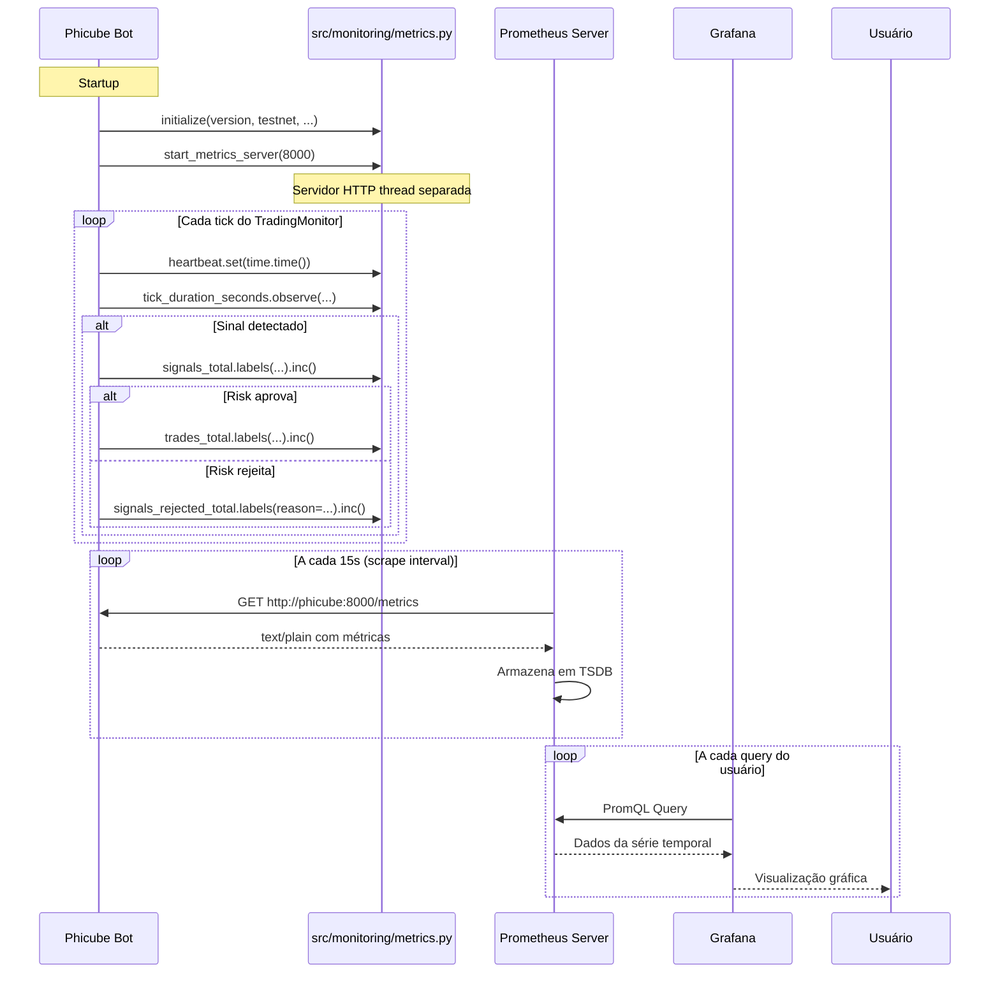

# SPEC_032 — Observabilidade com Prometheus + Grafana

**ID:** SPEC_032
**Status:** Em Refinamento → Aprovada
**Data:** 2026-05-12
**Autor:** Time A (Refinamento)
**Executores:** Time B (Execução)
**Skill de validação:** `qa-review`, `security-audit`
**Dependências:** SPEC_007 (resiliência), SPEC_017 (healthcheck)
**PRD §:** Fase 2 — "Monitoramento e métricas"

---

## 1. Título e Resumo

### 1.1 Nome da Funcionalidade

Observabilidade operacional do bot Phicube via Prometheus + Grafana.

### 1.2 Resumo (High-Level Definition)

**O que é:** Exportação de métricas operacionais e de negócio no formato Prometheus, com endpoint `/metrics` no bot e na dashboard API, mais provisionamento automático de Prometheus + Grafana no docker-compose.

**Por que estamos fazendo:** Atualmente a única forma de monitorar o bot é via logs estruturados e MongoDB. Não há:
- Histórico temporal de métricas (ex: quantos sinais por hora nas últimas 24h)
- Visualização gráfica (win rate ao longo do tempo, latência da API)
- Alertamento automático (ex: bot não envia heartbeat há 5min)
- Dashboard de saúde operacional centralizado

**Valor de negócio:**
- Reduz tempo de detecção de problemas (de horas para minutos)
- Permite análise de tendências (sinais por período, performance por símbolo)
- Habilita alertamento proativo antes que problemas impactem o capital
- Rastreabilidade histórica para validação da estratégia

**Conexão com PRD/SPEC:**
- `PRD.md` Fase 2: "Dashboard de performance em tempo real", "Relatório de performance"
- `docs/SDD/SPEC.md` § 2.6 Logger: logging estruturado é insuficiente para métricas temporais
- `docs/SDD/SPEC.md` § 1.1 Estrutura Geral: não há componente de métricas na arquitetura atual

---

## 2. Objetivos e Escopo

### 2.1 Objetivos (o que será entregue)

- [ ] Endpoint `GET /metrics` no formato Prometheus funcional no bot
- [ ] Endpoint `GET /metrics` na dashboard API (FastAPI)
- [ ] Módulo `src/monitoring/metrics.py` com todas métricas definidas
- [ ] Integração no startup do bot: `prometheus_client.start_http_server()`
- [ ] Integração na API: rota `/metrics` retornando `generate_latest()`
- [ ] Pontos de instrumentação em todos componentes-chave
- [ ] `docker-compose.yml` atualizado com serviços `prometheus` e `grafana`
- [ ] Arquivos de configuração: `monitoring/prometheus.yml`, `monitoring/grafana/*`
- [ ] Novas env vars em `src/config/settings.py`
- [ ] Dependência `prometheus-client>=0.19.0` em `pyproject.toml`
- [ ] Testes: `tests/monitoring/test_metrics.py` com cobertura ≥ 80%

### 2.2 Fora do Escopo (Non-Goals)

> Crucial para evitar scope creep.

- **Não inclui:** Tracing distribuído (OpenTelemetry) — será tratado em SPEC futura
- **Não inclui:** Métricas avançadas de negócio (Sharpe, Sortino, Calmar) — estas são calculadas no dashboard via queries, não exportadas diretamente
- **Não inclui:** AlertManager + integração Telegram nativa — alertas podem ser configurados no Grafana, não via código customizado
- **Não inclui:** Pushgateway — usamos modelo pull (Prometheus scrape), não push
- **Não inclui:** Multi-tenancy — instância única, um operador

---

## 3. Referências

| Documento                          | Seção                    | Relevância                                                            |
| ---------------------------------- | ------------------------ | --------------------------------------------------------------------- |
| `PRD.md`                           | § Fase 2                 | Requisito de origem: monitoramento e dashboard de performance        |
| `docs/SDD/SPEC.md`                | § 2.6 Logger             | Base existente de logging estruturado; métricas são camada acima    |
| `docs/SDD/SPEC.md`                | § 1.1 Estrutura Geral    | Arquitetura atual que receberá o novo componente                     |
| `SPEC_017_SAUDE_BOT_HEALTHCHECK`  | —                        | Pré-requisito: healthcheck já existe na porta 8081                  |
| `SPEC_007_RESILIENCIA`            | —                        | Pré-requisito: métricas de erro e latência para resiliência          |
| `SPEC_TEMPLATE.md`                | —                        | Formato canônico para esta especificação                              |

---

## 4. Histórias de Usuário e Requisitos

### US-032-01: Métricas de Trading Expostas no Bot

> Como **operador**, quero **acessar `http://localhost:8000/metrics` e ver métricas de trades, sinais, PnL, heartbeat e erros** para **monitorar a saúde do bot em tempo real via Grafana**.

**Critérios de Aceitação:**

```text
DADO   o bot rodando com PROMETHEUS_ENABLED=true
QUANDO eu faço GET http://localhost:8000/metrics
ENTÃO  a resposta tem Content-Type: text/plain e formato Prometheus válido
E      contém as métricas: phicube_trades_total, phicube_signals_total, phicube_heartbeat_seconds, phicube_errors_total
E      response status = 200
```

- [ ] AC-01: Endpoint `/metrics` no bot retorna 200
- [ ] AC-02: Content-Type é `text/plain` ou `text/plain; charset=utf-8`
- [ ] AC-03: Pelo menos 4 métricas core estão presentes
- [ ] AC-04: Healthcheck na 8081 continua funcionando (não quebrado)

### US-032-02: Métricas na Dashboard API

> Como **operador**, quero **acessar `http://localhost:8080/metrics`** para **monitorar também a dashboard API**.

**Critérios de Aceitação:**

```text
DADO   a dashboard API rodando
QUANDO eu faço GET http://localhost:8080/metrics
ENTÃO  a resposta tem formato Prometheus válido
E      response status = 200
```

- [ ] AC-01: Rota `/metrics` existe e retorna 200
- [ ] AC-02: Outras rotas da API continuam funcionando

### US-032-03: Contadores Incrementam Corretamente

> Como **operador**, quero **que um trade executado incremente `phicube_trades_total`** para **ter histórico de quantos trades o bot executou**.

**Critérios de Aceitação:**

```text
DADO   valor inicial de phicube_trades_total{direction="long",status="open"} = 0
QUANDO o OrderManager.execute() retorna um Trade válido
ENTÃO  phicube_trades_total{direction="long",status="open"} = 1
```

- [ ] AC-01: Counter incrementa em +1 após trade
- [ ] AC-02: Labels `symbol`, `direction`, `status` estão corretos

### US-032-04: Heartbeat Atualiza no Tick

> Como **operador**, quero **que `phicube_heartbeat_seconds` atualize a cada tick** para **alertar se o bot parou**.

**Critérios de Aceitação:**

```text
DADO   t0 = phicube_heartbeat_seconds
QUANDO TradingMonitor._tick() executa
ENTÃO  phicube_heartbeat_seconds > t0
```

- [ ] AC-01: Gauge atualiza com `time.time()` ou similar
- [ ] AC-02: Atualização acontece no início do tick

### US-032-05: Docker Stack Prometheus + Grafana

> Como **operador**, quero **`docker compose up` subir Prometheus e Grafana automaticamente** para **não precisar configurar manualmente**.

**Critérios de Aceitação:**

```text
DADO   docker-compose.yml atualizado com prometheus e grafana
QUANDO eu executo docker compose up
ENTÃO  prometheus responde em http://localhost:9090
E      grafana responde em http://localhost:3000
E      grafana já tem datasource Prometheus configurado
E      grafana já tem painel Phicube Overview importado
```

- [ ] AC-01: Ambos serviços startam sem erros
- [ ] AC-02: Prometheus consegue scrape o bot e a API
- [ ] AC-03: Grafana provisioning funciona (datasource + dashboards)

---

## 5. Design e Arquitetura

### 5.1 Estrutura de Dados / Modelagem

#### Métricas Prometheus (Canônicas)

| Nome da Métrica                            | Tipo      | Labels Dinâmicos                          | Descrição                                                                 |
| ------------------------------------------ | --------- | ------------------------------------------ | ------------------------------------------------------------------------- |
| `phicube_info`                               | Gauge     | `version`, `testnet`, `python_version`    | Info estável da aplicação (sempre 1; labels carregam metadados)          |
| `phicube_start_time_seconds`                 | Gauge     | —                                          | Unix timestamp do startup da aplicação                                    |
| `phicube_up`                                 | Gauge     | —                                          | 1 = saudável, 0 = problema (opcional, usado pelo Prometheus scrape)       |
| `phicube_heartbeat_seconds`                  | Gauge     | —                                          | Unix timestamp do último heartbeat (atualizado a cada tick)               |
| `phicube_positions_open`                     | Gauge     | —                                          | Quantidade de posições abertas atualmente                                  |
| `phicube_pnl_usdt`                           | Gauge     | `symbol` (opcional)                        | PnL acumulado em USDT (snapshot em tempo real; pode ser negativo)         |
| `phicube_signals_total`                      | Counter   | `symbol`, `timeframe`, `direction`        | Sinais válidos detectados pelo SignalEngine                                 |
| `phicube_signals_evaluated_total`            | Counter   | `symbol`, `timeframe`                      | Todas avaliações de sinal (base para calcular taxa de detecção)           |
| `phicube_signals_rejected_total`             | Counter   | `symbol`, `reason`                         | Sinais rejeitados pelo RiskManager (RRR baixo, limite de capital, etc.)    |
| `phicube_trades_total`                       | Counter   | `symbol`, `direction`, `status`           | Trades executados: `status=open|win|loss|closed_manual`                    |
| `phicube_pnl_realized_win_total`             | Counter   | `symbol`                                   | PnL positivo realizado (sempre crescente; para rate() e sum_over_time())    |
| `phicube_pnl_realized_loss_total`            | Counter   | `symbol`                                   | PnL negativo realizado (valor absoluto; sempre crescente)                   |
| `phicube_errors_total`                       | Counter   | `module`, `error_type`                     | Erros capturados: `module=signal_engine|risk_manager|order_manager|exchange` |
| `phicube_candle_latency_seconds`             | Histogram | `symbol`                                   | Latência de `fetch_ohlcv()` em segundos                                      |
| `phicube_api_requests_total`                 | Counter   | `endpoint`, `status`                       | Chamadas à API Binance: `status=success|error`                               |
| `phicube_tick_duration_seconds`              | Histogram | `symbol`, `timeframe`                      | Duração total de um `_tick()` completo                                       |
| `phicube_monitor_count`                      | Gauge     | —                                          | Número de TradingMonitors ativos no runtime                                  |

#### Regras de Cardinalidade (Segurança)

**MÁXIMO 3 labels dinâmicos por métrica.**

| Métrica                                    | Máximo de Séries Esperado | Justificativa                          |
| ------------------------------------------ | -------------------------- | ------------------------------------- |
| `phicube_trades_total`                       | 10 símbolos × 2 direction × 4 status = **80** | Baixo, controlado                      |
| `phicube_signals_total`                      | 10 × N timeframes × 2 = ~40 | Baixo                                  |
| `phicube_errors_total`                       | 5 modules × ~10 error_types = **50** | Baixo                                  |
| `phicube_pnl_usdt` (Gauge)                   | 10 (opcional por symbol) = **10** | Muito baixo                            |

**NUNCA use valores dinâmicos unbounded como labels:**
- ❌ Erro: `order_id`, `trade_id`, `timestamp` como label
- ✅ Correto: Apenas valores de conjunto fechado pré-definido

### 5.2 Contratos de API / Interface Pública

#### `src/monitoring/metrics.py` — Interface Pública

```python
"""
Módulo singleton de métricas Prometheus para o Phicube.

Uso:
    from src.monitoring.metrics import (
        trades_total,
        signals_total,
        heartbeat,
        get_metrics,
    )

    # Incrementar contador
    trades_total.labels(symbol="BTCUSDT", direction="long", status="open").inc()

    # Atualizar heartbeat
    heartbeat.set(time.time())

    # Obter texto formatado (para endpoint FastAPI)
    metrics_text = get_metrics()
"""

from prometheus_client import (
    Counter,
    Gauge,
    Histogram,
    Info,
    generate_latest,
    REGISTRY,
)
from prometheus_client import start_http_server as prometheus_start_server

# --- Info e Meta ---
phicube_info = Info(
    "phicube",
    "Informação estável da aplicação Phicube",
)

start_time = Gauge(
    "phicube_start_time_seconds",
    "Unix timestamp do startup da aplicação",
)

up = Gauge(
    "phicube_up",
    "Status da aplicação (1=saudável, 0=problema)",
)

heartbeat = Gauge(
    "phicube_heartbeat_seconds",
    "Unix timestamp do último heartbeat TradingMonitor",
)

positions_open = Gauge(
    "phicube_positions_open",
    "Quantidade de posições abertas atualmente",
)

pnl_usdt = Gauge(
    "phicube_pnl_usdt",
    "PnL acumulado em USDT (snapshot; pode ser negativo)",
    ["symbol"],  # label opcional
)

# --- Counters ---
signals_total = Counter(
    "phicube_signals_total",
    "Sinais válidos detectados pelo SignalEngine",
    ["symbol", "timeframe", "direction"],
)

signals_evaluated_total = Counter(
    "phicube_signals_evaluated_total",
    "Todas avaliações de sinal (base para rate de detecção)",
    ["symbol", "timeframe"],
)

signals_rejected_total = Counter(
    "phicube_signals_rejected_total",
    "Sinais rejeitados pelo RiskManager",
    ["symbol", "reason"],
)

trades_total = Counter(
    "phicube_trades_total",
    "Trades executados pelo OrderManager",
    ["symbol", "direction", "status"],
)

pnl_realized_win_total = Counter(
    "phicube_pnl_realized_win_total",
    "PnL positivo realizado (sempre crescente)",
    ["symbol"],
)

pnl_realized_loss_total = Counter(
    "phicube_pnl_realized_loss_total",
    "PnL negativo realizado (valor absoluto; sempre crescente)",
    ["symbol"],
)

errors_total = Counter(
    "phicube_errors_total",
    "Erros capturados por módulo",
    ["module", "error_type"],
)

api_requests_total = Counter(
    "phicube_api_requests_total",
    "Chamadas à API Binance",
    ["endpoint", "status"],
)

# --- Histograms ---
candle_latency_seconds = Histogram(
    "phicube_candle_latency_seconds",
    "Latência de fetch_ohlcv() em segundos",
    ["symbol"],
    buckets=(0.05, 0.1, 0.25, 0.5, 1.0, 2.5, 5.0, 10.0, 30.0),
)

tick_duration_seconds = Histogram(
    "phicube_tick_duration_seconds",
    "Duração total de um _tick() completo",
    ["symbol", "timeframe"],
    buckets=(0.05, 0.1, 0.25, 0.5, 1.0, 2.5, 5.0, 10.0),
)

# --- Runtime ---
monitor_count = Gauge(
    "phicube_monitor_count",
    "Número de TradingMonitors ativos",
)


def initialize(
    version: str = "unknown",
    testnet: bool = True,
    python_version: str = "unknown",
) -> None:
    """
    Inicializa métricas de info no startup.

    Deve ser chamado UMA VEZ no início do _main().
    """
    phicube_info.info(
        {
            "version": version,
            "testnet": str(testnet).lower(),
            "python_version": python_version,
        }
    )
    import time

    start_time.set(time.time())
    up.set(1)


def start_metrics_server(port: int, bind_host: str = "0.0.0.0") -> None:
    """
    Inicia o servidor HTTP embutido do prometheus_client.

    Executa em thread separada (built-in da lib).
    Não bloqueia o event loop do asyncio.

    Args:
        port: Porta para escutar (padrão SPEC: 8000)
        bind_host: Interface para bind (padrão: 0.0.0.0; produção: 127.0.0.1)
    """
    prometheus_start_server(port, addr=bind_host)


def get_metrics() -> str:
    """
    Retorna as métricas formatadas como texto Prometheus.

    Usado pela dashboard API (FastAPI) que tem seu próprio servidor HTTP.

    Returns:
        String com todas métricas no formato Prometheus.
    """
    return generate_latest(REGISTRY).decode("utf-8")
```

#### Entradas e Saídas

**`start_metrics_server(port, bind_host)`:**

| Parâmetro    | Tipo  | Obrigatório | Descrição                                                         |
| ------------ | ----- | ----------- | ----------------------------------------------------------------- |
| `port`       | `int` | Sim         | Porta para o servidor de métricas (padrão: 8000)                |
| `bind_host`  | `str` | Não         | Interface para bind (padrão: "0.0.0.0"; segurança: "127.0.0.1") |

**`get_metrics()`:**

| Retorno | Tipo   | Descrição                               |
| ------- | ------ | --------------------------------------- |
| Sucesso | `str`  | Métricas formatadas em texto Prometheus |
| Falha  | Exceção | Apenas se `prometheus_client` falhar catastróficamente |

### 5.3 Fluxo de Dados / Sequência



---

## 6. Regras de Negócio e Restrições

### 6.1 Invariantes de Negócio

| ID             | Invariante                                                                                                | Violação → Ação                                                                 |
| -------------- | --------------------------------------------------------------------------------------------------------- | ------------------------------------------------------------------------------- |
| INV-032-01     | Todo `Counter` é monotonicamente crescente. Nunca use `inc()` com valor negativo.                        | Log ERROR `metrics_counter_violation`; não lançar exceção (não quebrar o bot) |
| INV-032-02     | Número máximo de labels dinâmicos por métrica = 3.                                                      | Rejeitar em code review; adicionar teste de cardinalidade                       |
| INV-032-03     | Valores unbounded (order_id, trade_id, timestamp) NUNCA são usados como labels.                          | Rejeitar em code review                                                          |
| INV-032-04     | Servidor de métricas só bind em `0.0.0.0` se explicitamente configurado. Default = `127.0.0.1` ou rede docker. | Segurança: não expor métricas publicamente sem intenção                          |
| INV-032-05     | `phicube_up.set(0)` NUNCA é chamado exceto em shutdown gracioso.                                          | `up=0` indica falha para o Prometheus; não usar para erros recuperáveis           |

### 6.2 Validações Obrigatórias

- `port` em `start_metrics_server()` deve estar entre 1024-65535 — portas bem conhecidas (<1024) requerem root
- `bind_host` deve ser validado contra allowlist: `["0.0.0.0", "127.0.0.1", "localhost"]`
- Antes de incrementar qualquer métrica, verificar que labels não contêm caracteres especiais do Prometheus (`=`, `"`, `\n`)

### 6.3 Limitações Técnicas

- `prometheus_client.start_http_server()` roda em **thread separada**, não no event loop asyncio. Isto é intencional e não causa problema.
- Histogram buckets são fixos no código. Para customizar, seria necessário redefinir a métrica.
- Registro de métricas é global no `REGISTRY` do `prometheus_client`. Não há suporte nativo para múltiplos registros isolados.

### 6.4 Padrões de Segurança

1. **Bind localhost por padrão:** Endpoint `/metrics` NÃO deve ser exposto publicamente.
   - Docker: publicar apenas `127.0.0.1:8000:8000`, não `8000:8000`
   - Rede docker: containers se comunicam via network name; ports não precisam ser publicados

2. **Nunca exponha dados sensíveis em métricas:**
   - ❌ Errado: `api_key`, `balance`, `order_id` como label ou valor
   - ✅ Correto: Apenas contadores, gauges, histogramas com valores agregados

3. **Limite de taxa (implicitamente):**
   - Prometheus scrape é pull-based; operador controla o `scrape_interval` (padrão: 15s-1min)
   - Não há risco de DDoS no endpoint `/metrics` como em APIs públicas

---

## 7. Testes e Validação

### 7.1 Testes Unitários

| ID               | Descrição                                                                 | Cenário                                                                 | Prioridade |
| ---------------- | ------------------------------------------------------------------------- | ----------------------------------------------------------------------- | ---------- |
| TEST_032_01      | `get_metrics()` retorna string não vazia com formato válido               | Chamar função e verificar que contém pelo menos `# HELP` ou `# TYPE`   | Alta       |
| TEST_032_02      | Counter `phicube_trades_total` incrementa corretamente                     | `.inc()` → verificar que valor aumentou em 1                           | Alta       |
| TEST_032_03      | Gauge `phicube_heartbeat_seconds` atualiza com timestamp                   | `.set(t)` → verificar `.collect()` retorna o valor                      | Alta       |
| TEST_032_04      | Histogram `phicube_candle_latency_seconds` registra observação             | `.observe(0.1)` → verificar bucket count incrementou                     | Alta       |
| TEST_032_05      | `initialize()` popula `phicube_info` corretamente                          | Após init, verificar que info tem version, testnet, python_version       | Média      |
| TEST_032_06      | Labels válidos vs. inválidos                                                | Tentar usar label com `=` → deve falhar ou sanitizar                     | Média      |
| TEST_032_07      | Integração endpoint FastAPI                                                  | Mock `get_metrics()` → verificar rota `/metrics` retorna texto            | Alta       |
| TEST_032_08      | Cardinalidade: máximo 3 labels dinâmicos                                    | Verificar que nenhuma métrica define >3 labels                            | Alta       |

### 7.2 Testes de Integração (opcional)

| ID               | Descrição                                                                 | Pré-requisito                                          |
| ---------------- | ------------------------------------------------------------------------- | ------------------------------------------------------ |
| INT_032_01       | `start_metrics_server()` realmente serve requests HTTP                    | Porta livre no ambiente de teste                        |
| INT_032_02       | Prometheus consegue scrape o endpoint                                     | Prometheus rodando, network acessível                   |
| INT_032_03       | Grafana provisioning carrega datasource e dashboard automaticamente      | Docker stack rodando                                    |

### 7.3 Evidências Requeridas na PR

- [ ] Output de `pytest tests/monitoring/ -v --cov=src/monitoring --cov-report=term-missing` com todas asserções passando
- [ ] Cobertura ≥ 80% para `src/monitoring/metrics.py`
- [ ] `ruff check src/monitoring/ tests/monitoring/` limpo
- [ ] `ruff format --check` passando
- [ ] (Opcional) Screenshot do Grafana mostrando painel carregado

---

## 8. Tratamento de Erros

| Erro / Condição                            | Causa Provável                                                                 | Ação do Sistema                                                                 |
| ------------------------------------------ | ------------------------------------------------------------------------------ | ------------------------------------------------------------------------------- |
| `prometheus_client` import falha           | Dependência não instalada                                                      | Log WARNING `prometheus_client_unavailable`; continuar sem métricas (não quebrar o bot) |
| `start_metrics_server()` porta já em uso   | Outro processo na porta 8000                                                    | Log WARNING `metrics_port_in_use`; tentar porta alternativa? Ou continuar sem? → DECISÃO: Log e continuar (não fatal) |
| `generate_latest()` falha                  | Corrupção no REGISTRY (raro)                                                   | Log ERROR `metrics_generate_failed`; retornar string vazia ou erro 500 na API |
| Label com caractere inválido               | Código usando `=` ou `"` em valor de label                                      | Log WARNING `metrics_invalid_label`; sanitizar ou ignorar a atualização          |
| Docker prometheus não consegue scrape      | Network, DNS, bind host errado                                                    | Healthcheck do prometheus falha; logs do container `phicube-prometheus`         |

**Regra de Ouro:** Falha no sistema de métricas **NUNCA** deve quebrar o bot. Toda chamada às métricas deve ser tolerante a falha.

Exemplo de wrapper seguro:
```python
# Uso seguro em qualquer componente
try:
    trades_total.labels(
        symbol=trade.symbol,
        direction=trade.direction.value,
        status=trade.status.value,
    ).inc()
except Exception as exc:
    logger.warning("metrics_update_failed", metric="trades_total", error_type=type(exc).__name__)
```

---

## 9. Riscos e Mitigações

| Risco                                                               | Impacto | Probabilidade | Mitigação Concreta                                                                 |
| ------------------------------------------------------------------- | ------- | ------------- | ---------------------------------------------------------------------------------- |
| **Alta cardinalidade de labels** → explosão de séries temporais    | ALTO    | MÉDIA         | 1) Máximo 3 labels por métrica; 2) Apenas valores de conjunto fechado; 3) Teste unitário que valida definição |
| **Conflito de porta 8000**                                          | MÉDIO   | BAIXA         | 1) Permitir override via env var `PROMETHEUS_PORT`; 2) Logar WARN se porta já em uso; 3) Não fatal para o bot |
| **Métricas não atualizadas** → cegueira operacional                | ALTO    | BAIXA         | 1) Heartbeat como fonte primária de verdade; 2) Se heartbeat não atualiza em 5min → alerta no Grafana/Prometheus |
| **Exposição pública de `/metrics`** → vazamento de informação      | MÉDIO   | BAIXA         | 1) Bind `127.0.0.1` por padrão; 2) Docker `127.0.0.1:8000:8000` não `0.0.0.0`; 3) Rede docker isolada para containers |
| **PnL negativo não capturado corretamente** → métrica errada        | MÉDIO   | MÉDIA         | 1) PnL snapshot = Gauge (suporta negativo); 2) PnL histórico = 2 Counters separados (win/loss); 3) Teste unitário com loss |
| **`prometheus_client` thread vs. asyncio** → possível bloqueio?      | BAIXO   | BAIXA         | 1) Servidor roda em thread gerenciada pela lib; 2) Não compartilha estado com event loop; 3) Validado pela comunidade |
| **Docker latest tag** → não reprodutível, quebras surpresa           | MÉDIO   | MÉDIA         | 1) Pinar versões explicitamente: `prom/prometheus:v2.49.1`, `grafana/grafana:10.4.0`; 2) Nunca usar `latest` em produção |
| **Grafana default password `changeme`** → risco se exposto           | MÉDIO   | BAIXA         | 1) Apenas bind localhost; 2) Env var `GRAFANA_ADMIN_PASSWORD` para override; 3) Documentar que é apenas para dev |

---

## 10. Definição de Pronto (DoD Global)

- [ ] **SPEC aprovada** pelo Time A (esta versão)
- [ ] **Todas histórias de usuário** com critérios de aceitação verificados
- [ ] **Implementação aderente** aos contratos da seção 5.2
- [ ] **Nenhuma invariante** da seção 6.1 violada em nenhum cenário de teste
- [ ] `pytest` com **100% das asserções críticas passando**
- [ ] Cobertura `src/monitoring/metrics.py` ≥ **80%**
- [ ] **Rastreabilidade**: PRD § Fase 2 → SPEC_032 → Testes → Código
- [ ] **Arquitetura não quebrada**: Healthcheck 8081 continua funcional, todas rotas API continuam funcionais

---

## 11. Plano de Entrega (Ordem de Implementação)

1. **Planner Agent transforma a SPEC em Task Graph** com prioridades, dependências e DoD por task
2. **Task 01**: Atualizar `pyproject.toml` + `src/config/settings.py` (dependência + env vars)
3. **Task 02**: Implementar `src/monitoring/metrics.py` com todas métricas e interfaces
4. **Task 03**: Escrever `tests/monitoring/test_metrics.py`
5. **Task 04**: Integrar no bot: chamar `initialize()` + `start_metrics_server()` no `_main()`
6. **Task 05**: Instrumentar componentes: TradingMonitor, SignalEngine, RiskManager, OrderManager, OrderMonitor, BinanceClient
7. **Task 06**: Integrar na API: adicionar rota `GET /metrics` em `src/api/main.py`
8. **Task 07**: Criar estrutura `monitoring/`: `prometheus.yml`, `grafana/datasources/`, `grafana/dashboards/`
9. **Task 08**: Atualizar `docker-compose.yml`: novos serviços `prometheus` e `grafana`
10. **Validation Agent valida conformidade** (SPEC → testes → comportamento) e emite parecer
11. **Commit / Review Gate** só libera PR se o parecer de validação for aprovado
12. **Time A revisa conformidade final** antes do merge

---

## 12. Arquivos e Mudanças

| Arquivo                                              | Mudança                              | Responsável |
| ---------------------------------------------------- | ------------------------------------ | ----------- |
| `pyproject.toml`                                     | Adicionar `prometheus-client>=0.19.0` | Time B      |
| `src/config/settings.py`                             | Novas env vars Prometheus           | Time B      |
| `src/monitoring/metrics.py`                          | **NOVO** — módulo singleton métricas | Time B      |
| `src/main.py`                                         | Chamar `initialize()` + `start_metrics_server()` | Time B |
| `src/strategy/signal_engine.py`                      | Instrumentar `signals_total` + `signals_evaluated_total` | Time B |
| `src/trading/risk_manager.py`                        | Instrumentar `signals_rejected_total` | Time B |
| `src/trading/order_manager.py`                       | Instrumentar `trades_total` | Time B |
| `src/trading/trade_close_router.py` / `order_monitor.py` | Instrumentar PnL win/loss | Time B |
| `src/exchange/binance_client.py`                     | Instrumentar `candle_latency_seconds` + `api_requests_total` + `errors_total` | Time B |
| `src/api/main.py`                                    | Adicionar rota `GET /metrics` | Time B |
| `monitoring/prometheus.yml`                          | **NOVO** — config scrape Prometheus | Time B |
| `monitoring/grafana/datasources/prometheus.yml`      | **NOVO** — provisioning datasource | Time B |
| `monitoring/grafana/dashboards.yaml`                  | **NOVO** — manifest provisioning | Time B |
| `monitoring/grafana/dashboards/phicube-overview.json` | **NOVO** — painel pré-configurado | Time B |
| `docker-compose.yml`                                  | Adicionar serviços `prometheus` + `grafana` | Time B |
| `tests/monitoring/test_metrics.py`                   | **NOVO** — testes unitários | Time B |
| `.env.example`                                        | Adicionar novas env vars documentadas | Time B |

---

## Histórico

| Data       | Versão | Autor    | Mudanças                                                                 |
| ---------- | ------ | -------- | ------------------------------------------------------------------------ |
| 2026-05-10 | 1.0    | Time A   | Criação da SPEC_032 como rascunho inicial                               |
| 2026-05-12 | 2.0    | Time A   | Refinamento completo seguindo `SPEC_TEMPLATE.md`. Decisões arquiteturais: porta 8000, servidor embutido prometheus_client, PnL Gauge + 2 Counters, versões docker pinadas, bind localhost. |

---

**Esta SPEC é a verdade executável para o Time B. Todo código deve conformar a isto.**

*Mantido por: Backend Sênior + Quant Developer*
*Governado por: Time A + Risk Manager*
*Última atualização: 2026-05-12*
