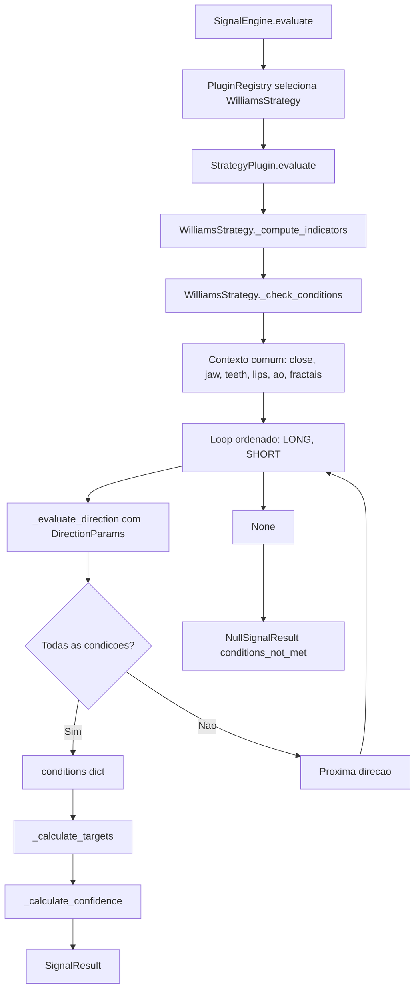

# SPEC_038 — Consolidação LONG/SHORT da WilliamsStrategy

**ID:** SPEC_038
**Status:** Em Refinamento
**Data:** 2026-05-11
**Versão:** 2.0
**Dependências:** SPEC_013, SPEC_033, SPEC_034, SPEC_037
**Skill de validação:** `signal-review`, `sdd-spec-driven-development`, `qa-review`

---

## 1. Título e Resumo

### 1.1 Nome da Funcionalidade

Consolidação da lógica de avaliação LONG/SHORT no plugin `WilliamsStrategy`

### 1.2 Resumo

**O que é:** Refatoração interna do plugin `src/strategies/williams_strategy.py` para eliminar a duplicação entre os blocos LONG e SHORT em `_check_conditions()`, substituindo ramificações simétricas por uma avaliação orientada a parâmetros de direção.

**Por que estamos fazendo:** A arquitetura atual, definida pela SPEC_033, removeu a lógica BO Williams de `SignalEngine` e a isolou no plugin `WilliamsStrategy`. A SPEC_038 original ainda mirava `SignalEngine.evaluate()`, mas esse método hoje é um orquestrador async com `PluginRegistry`, Chain of Responsibility, Observer e retorno `Result[SignalResult | NullSignalResult, SignalError]`. A duplicação real que esta SPEC deve tratar está no plugin Williams.

**Valor de negócio:** Reduz risco de regressão assimétrica entre LONG e SHORT, preserva o método BO Williams, facilita auditoria dos motivos de sinal ou ausência de sinal por meio de logs/metadata interna e mantém a arquitetura de plugins estável.

**Conexão com PRD/SPEC:** Refatoração técnica sem mudança comportamental do método BO Williams. Deve manter compatibilidade com SPEC_013 (corpus de validação), SPEC_033 (plugins de estratégia), SPEC_034 (padrões de design) e SPEC_037 (padrão de refatoração segura).

---

## 2. Objetivos e Escopo

### 2.1 Objetivos

- [ ] Consolidar a avaliação LONG/SHORT dentro de `WilliamsStrategy._check_conditions()`.
- [ ] Introduzir uma estrutura interna de parâmetros por direção, como `_DirectionParams`, para representar as diferenças entre LONG e SHORT.
- [ ] Garantir que LONG e SHORT usem o mesmo fluxo de decisão, variando apenas parâmetros declarativos de direção.
- [ ] Preservar o contrato público de `SignalEngine.evaluate()` e `StrategyPlugin.evaluate()`.
- [ ] Preservar os campos de `SignalResult`: `direction`, `entry_price`, `stop_loss`, `take_profit`, `metadata`.
- [ ] Preservar o comportamento atual validado pelos testes existentes e pelo corpus SPEC_013.
- [ ] Melhorar a rastreabilidade da ausência de sinal via diagnóstico interno e logs estruturados, sem alterar o contrato público.

### 2.2 Fora do Escopo

- **Não inclui:** Alteração em `SignalEngine.evaluate()`, sua assinatura async, seu retorno `Result[...]`, Observer ou Chain of Responsibility.
- **Não inclui:** Mudança na detecção de Alligator, Awesome Oscillator, fractais ou ATR.
- **Não inclui:** Mudança em `StrategyPlugin`, `PluginRegistry`, decorators ou descoberta de plugins.
- **Não inclui:** Nova estratégia, nova direção ou modo `neutral`.
- **Não inclui:** Mudança de regra operacional de entrada, stop-loss, take-profit ou risk/reward.
- **Não inclui:** Exposição de metadata diagnóstica em `NullSignalResult` nesta SPEC.
- **Não inclui:** Implementação de ML, scoring adaptativo ou mudança de confidence além de preservar o cálculo atual.

---

## 3. Referências

| Documento / Módulo | Seção | Relevância |
|---|---|---|
| `src/strategies/williams_strategy.py` | `_check_conditions()` | Código alvo da consolidação LONG/SHORT |
| `src/strategy/signal_engine.py` | `SignalEngine.evaluate()` | Contrato a preservar, não alvo da refatoração |
| `src/strategy/plugin_base.py` | `StrategyPlugin.evaluate()` | Template Method que chama `_check_conditions()` |
| `docs/SDD/SPEC_013_VALIDACAO_SIGNAL_ENGINE/SPEC.md` | Corpus | Barreira de regressão do método BO Williams |
| `docs/SDD/SPEC_033_PLUGINS_ESTRATEGIA/SPEC.md` | Arquitetura de plugins | Define WilliamsStrategy como plugin concreto |
| `docs/SDD/SPEC_034_DESIGN_PATTERNS/SPEC.md` | Padrões | Mantém Template Method, Chain, Observer, Registry |

---

## 4. Histórias de Usuário e Requisitos

### US-038-01: Consolidar avaliação por direção no WilliamsStrategy

> Como **desenvolvedor**, quero **um único fluxo interno para avaliar LONG e SHORT no WilliamsStrategy** para **evitar bugs assimétricos entre os dois lados da estratégia**.

**Critérios de Aceitação:**

```text
DADO   um WilliamsStrategy com indicadores enriquecidos
QUANDO a direção LONG é avaliada pelo fluxo consolidado
ENTÃO  o resultado é equivalente ao comportamento LONG anterior
E      direction="LONG" é retornado apenas quando todas as condições LONG forem satisfeitas
```

```text
DADO   um WilliamsStrategy com indicadores enriquecidos
QUANDO a direção SHORT é avaliada pelo fluxo consolidado
ENTÃO  o resultado é equivalente ao comportamento SHORT anterior
E      direction="SHORT" é retornado apenas quando todas as condições SHORT forem satisfeitas
```

```text
DADO   um WilliamsStrategy com indicadores enriquecidos
QUANDO nenhuma direção satisfaz todas as condições
ENTÃO  StrategyPlugin.evaluate() continua retornando NullSignalResult(reason="conditions_not_met")
E      a ausência de sinal pode ser diagnosticada por logs estruturados ou estrutura privada interna
```

- [ ] AC-038-01: `_check_conditions()` não contém dois blocos longos duplicados para LONG e SHORT.
- [ ] AC-038-02: A ordem de prioridade histórica é preservada: LONG avaliado antes de SHORT.
- [ ] AC-038-03: A estrutura retornada para um sinal continua compatível com `_calculate_targets()` e `_build_result()`.
- [ ] AC-038-04: `SignalEngine.evaluate()` permanece sem mudança de assinatura, retorno e responsabilidade.

### US-038-02: Contrato declarativo de parâmetros por direção

> Como **desenvolvedor**, quero **um contrato explícito de parâmetros por direção** para **tornar a simetria LONG/SHORT auditável**.

**Critérios de Aceitação:**

- [ ] AC-038-05: Existe uma estrutura interna imutável, como `_DirectionParams`, ou alternativa equivalente.
- [ ] AC-038-06: A estrutura diferencia pelo menos:
  - direção (`"LONG"` ou `"SHORT"`);
  - função de Alligator;
  - condição de AO;
  - fractal de rompimento;
  - condição de preço contra o fractal de rompimento;
  - fractal usado como stop-loss;
  - validação do stop-loss contra o entry;
  - identificadores diagnósticos das condições.
- [ ] AC-038-07: As diferenças entre LONG e SHORT ficam declaradas em um único mapa ou sequência ordenada.
- [ ] AC-038-08: A estrutura não expõe API pública nova.

### US-038-03: Diagnóstico de condições sem mudar o contrato público

> Como **operador**, quero **entender por que um sinal não foi emitido** para **auditar o comportamento do bot sem inspecionar código**.

**Critérios de Aceitação:**

- [ ] AC-038-09: Para cada direção, o fluxo consolidado calcula um diagnóstico de condições avaliadas.
- [ ] AC-038-10: O diagnóstico distingue no mínimo:
  - Alligator alinhado ou não;
  - AO no lado correto ou não;
  - fractal de rompimento presente ou ausente;
  - close rompeu ou não o fractal de referência;
  - fractal de stop-loss presente ou ausente;
  - stop-loss válido ou inválido contra o entry.
- [ ] AC-038-11: O diagnóstico não altera `SignalResult` em caso de sinal, exceto por metadata compatível e retrocompatível.
- [ ] AC-038-12: Em caso de ausência de sinal, o retorno público continua sendo `NullSignalResult`, sem exceções para fluxo normal.

---

## 5. Design e Arquitetura

### 5.1 Arquitetura atual a preservar

`SignalEngine` permanece responsável apenas por orquestração:

- validar pré-condições mínimas antes da cadeia;
- selecionar plugin via `PluginRegistry`;
- executar Chain of Responsibility;
- emitir Observer events;
- retornar `Result[SignalResult | NullSignalResult, SignalError]`.

`WilliamsStrategy` permanece responsável pela estratégia BO Williams:

- enriquecer ou reutilizar indicadores;
- avaliar condições da estratégia;
- calcular targets;
- calcular confidence;
- construir `SignalResult` via Template Method herdado de `StrategyPlugin`.

Fluxo de integração esperado:

- no caminho normal de produção, `SignalEngine` entrega ao plugin um `DataFrame` já enriquecido com `jaw`, `teeth`, `lips` e `ao`;
- quando `WilliamsStrategy` for chamado diretamente em testes ou utilitários, ele continua podendo enriquecer os indicadores por conta própria;
- esta SPEC não altera a fronteira de responsabilidades entre orquestração e estratégia.

### 5.2 Alvo da refatoração

O alvo desta SPEC é a lógica interna de `WilliamsStrategy._check_conditions()`. O fluxo desejado é:

1. Extrair o último candle avaliado e valores comuns uma única vez.
2. Calcular `fractal_high` e `fractal_low` uma única vez.
3. Montar um contexto comum de avaliação.
4. Iterar direções em ordem fixa: LONG, depois SHORT.
5. Avaliar cada direção com a mesma função interna e parâmetros próprios.
6. Retornar o primeiro conjunto de condições aprovado.
7. Se nenhuma direção aprovar, retornar `None` para manter o comportamento de `StrategyPlugin.evaluate()`.

### 5.3 Contrato conceitual de parâmetros

A implementação pode usar dataclass, tupla nomeada ou estrutura equivalente, desde que o contrato seja claro e testável.

```python
@dataclass(frozen=True)
class _DirectionParams:
    direction: str
    alligator_check: Callable[[float, float, float, float], bool]
    ao_check: Callable[[float], bool]
    breakout_fractal_getter: Callable[[pd.DataFrame], float | None]
    breakout_check: Callable[[float, float], bool]
    stop_fractal_getter: Callable[[pd.DataFrame], float | None]
    stop_valid_check: Callable[[float, float], bool]
```

Mapeamento esperado:

| Parâmetro | LONG | SHORT |
|---|---|---|
| Direção | `"LONG"` | `"SHORT"` |
| Alligator | `is_alligator_bullish` | `is_alligator_bearish` |
| AO | `ao > 0` | `ao < 0` |
| Fractal de rompimento | `fractal_high` | `fractal_low` |
| Condição de preço | `close > fractal_high` | `close < fractal_low` |
| Fractal de SL | `fractal_low` | `fractal_high` |
| Validação de SL | `fractal_low < close` | `fractal_high > close` |

### 5.4 Invariantes de compatibilidade

- `WilliamsStrategy.warmup_candles()` continua retornando `34`.
- `_compute_indicators()` continua reutilizando colunas existentes quando `jaw`, `teeth`, `lips` e `ao` já estão presentes.
- `_calculate_targets()` continua recebendo `conditions` e `df`.
- `_calculate_confidence()` continua recebendo `conditions` e `df`.
- `metadata["indicators"]` continua contendo `alligator_jaws`, `ao_value`, `fractal_high`, `fractal_low`.
- `metadata["plugin"]` continua sendo definido pelo Template Method em `_build_result()`.
- `metadata["confidence"]` continua sendo adicionada por `_build_result()`.
- Nenhuma exceção deve representar ausência normal de sinal.
- O diagnóstico interno de condições pode ser registrado em log estruturado ou em estrutura privada de apoio, mas não é parte do contrato público desta SPEC.

### 5.5 Fluxo de Dados



---

## 6. Regras de Negócio e Restrições

### 6.1 Invariantes

| ID | Invariante | Violação -> Ação |
|---|---|---|
| INV-038-01 | LONG é avaliado antes de SHORT | Falha em teste unitário |
| INV-038-02 | LONG só é válido com `SL < entry < TP` | Retornar ausência de sinal |
| INV-038-03 | SHORT só é válido com `TP < entry < SL` | Retornar ausência de sinal |
| INV-038-04 | Sinal só existe com fractal de rompimento e fractal de SL presentes | Retornar ausência de sinal |
| INV-038-05 | Ausência de sinal não lança exceção | Retornar `NullSignalResult` via Template Method |
| INV-038-06 | `SignalEngine` não assume detalhes da estratégia Williams | Nenhuma alteração em `SignalEngine` |
| INV-038-07 | Corpus SPEC_013 continua sendo barreira de regressão | Falha de corpus bloqueia conclusão |
| INV-038-08 | Diagnóstico interno não altera contrato público | Manter logs/estrutura privada apenas |

### 6.2 Regras LONG

Todas as condições devem ser verdadeiras:

- Alligator bullish: `lips > teeth > jaw` e `close > lips`.
- AO positivo: `ao > 0`.
- Fractal de rompimento existe: `fractal_high is not None`.
- Preço rompe resistência fractal: `close > fractal_high`.
- Fractal de stop existe: `fractal_low is not None`.
- Stop é válido: `fractal_low < close`.

Targets:

- `entry_price = close`
- `stop_loss = fractal_low`
- `take_profit = entry_price + (entry_price - stop_loss) * risk_reward_ratio`

### 6.3 Regras SHORT

Todas as condições devem ser verdadeiras:

- Alligator bearish: `lips < teeth < jaw` e `close < lips`.
- AO negativo: `ao < 0`.
- Fractal de rompimento existe: `fractal_low is not None`.
- Preço rompe suporte fractal: `close < fractal_low`.
- Fractal de stop existe: `fractal_high is not None`.
- Stop é válido: `fractal_high > close`.

Targets:

- `entry_price = close`
- `stop_loss = fractal_high`
- `take_profit = entry_price - (stop_loss - entry_price) * risk_reward_ratio`

---

## 7. Testes e Validação

### 7.1 Testes Obrigatórios

| ID | Descrição | Escopo |
|---|---|---|
| TEST-038-01 | LONG válido continua gerando `SignalResult(direction="LONG")` | `tests/test_signal_engine.py` ou novo teste específico de Williams |
| TEST-038-02 | SHORT válido continua gerando `SignalResult(direction="SHORT")` | `tests/test_signal_engine.py` ou novo teste específico de Williams |
| TEST-038-03 | Mercado sem condições retorna `NullSignalResult` | Estratégia via `SignalEngine` |
| TEST-038-04 | LONG preserva `stop_loss < entry_price < take_profit` | Unitário |
| TEST-038-05 | SHORT preserva `take_profit < entry_price < stop_loss` | Unitário |
| TEST-038-06 | Ordem LONG antes de SHORT é preservada em teste estrutural com ambos os ramos elegíveis | Unitário de Williams |
| TEST-038-07 | Metadata de indicadores permanece compatível | Unitário |
| TEST-038-08 | RRR customizado continua respeitado | Unitário |
| TEST-038-09 | Corpus SPEC_013 continua compatível | `tests/strategy/test_signal_engine_corpus.py` |
| TEST-038-10 | `SignalEngine.evaluate()` continua retornando `Result[...]` | Regressão de contrato |

### 7.2 Evidências Requeridas na PR

- [ ] `pytest tests/test_signal_engine.py -v`
- [ ] `pytest tests/strategy/test_signal_engine_corpus.py -v`
- [ ] `pytest tests/strategy/ -v --tb=short`
- [ ] `ruff check src/strategies/williams_strategy.py src/strategy/signal_engine.py tests/strategy/ tests/test_signal_engine.py`
- [ ] Evidência de que `src/strategy/signal_engine.py` não teve alteração funcional nesta SPEC.

### 7.3 Critério de Não Regressão

A refatoração só é aceita se:

- todos os testes existentes de estratégia continuam passando;
- o corpus SPEC_013 não perde casos passantes;
- nenhum campo público de `SignalResult` ou `NullSignalResult` é removido;
- nenhum consumidor precisa mudar chamada de `SignalEngine.evaluate()`;
- nenhum log ou metadata sensível é introduzido.

---

## 8. Tratamento de Erros

O tratamento de erro segue o Template Method atual:

- exceções inesperadas dentro de `StrategyPlugin.evaluate()` resultam em `NullSignalResult(reason="evaluation_error")`;
- ausência normal de sinal resulta em `NullSignalResult(reason="conditions_not_met")`;
- indicadores insuficientes ou ausentes continuam sendo tratados pelo `SignalEngine` antes da chamada ao plugin quando aplicável;
- o plugin não deve mascarar erro de programação como sinal válido.

Recomendação para Time B: se quiser expor diagnóstico detalhado, faça isso por log estruturado ou estrutura privada de apoio. Nesta SPEC, `NullSignalResult` permanece sem metadata diagnóstica nova.

---

## 9. Riscos e Mitigações

| Risco | Impacto | Mitigação |
|---|---|---|
| Refatorar o componente errado (`SignalEngine`) | Alto | Escopo declara `SignalEngine` fora do alvo funcional |
| Quebra silenciosa de simetria LONG/SHORT | Alto | `_DirectionParams` + testes equivalentes para ambos os lados |
| Alteração involuntária do método BO Williams | Alto | Corpus SPEC_013 + `signal-review` |
| Diagnóstico novo quebrar consumidores | Médio | Diagnóstico interno apenas, sem alterar contrato público |
| Abstração excessiva dificultar leitura | Médio | Contrato declarativo pequeno e nomes explícitos |
| Performance degradada | Baixo | Avaliação O(1), duas direções por candle fechado |

---

## 10. Definição de Pronto (DoD)

- [ ] SPEC_038 implementada apenas no escopo do plugin `WilliamsStrategy`, salvo testes e documentação.
- [ ] `SignalEngine` preservado como orquestrador de plugins.
- [ ] `_check_conditions()` consolidado sem blocos longos duplicados LONG/SHORT.
- [ ] Parâmetros por direção declarados de forma explícita e auditável.
- [ ] LONG e SHORT preservam regras, targets, RRR e metadata atuais.
- [ ] Ausência de sinal continua usando `NullSignalResult`.
- [ ] Testes obrigatórios da seção 7 executados e evidenciados.
- [ ] `signal-review` aplicado pelo Time B antes de concluir.
- [ ] `qa-review` aplicado para confirmar cobertura e casos de borda.
- [ ] Nenhuma mudança comportamental aprovada sem divergência documentada e aceite humano.

---

## 11. Direcionamento para o Time B

### 11.1 Instrução principal

Executar uma refatoração comportamentalmente neutra em `src/strategies/williams_strategy.py`, consolidando a lógica LONG/SHORT de `_check_conditions()` por meio de parâmetros de direção.

### 11.2 Restrições para execução

- Não alterar o contrato público de `SignalEngine.evaluate()`.
- Não alterar `StrategyPlugin.evaluate()` nesta SPEC.
- Não alterar cálculo dos indicadores.
- Não alterar ordem de avaliação LONG -> SHORT.
- Não alterar regra de SL/TP/RRR.
- Não remover metadata existente.
- Não transformar ausência de sinal em exceção.

### 11.3 Skills recomendadas para validação

- `signal-review`: validar aderência ao BO Williams.
- `qa-review`: validar cobertura, regressão e corpus.
- `sdd-spec-driven-development`: garantir rastreabilidade SPEC -> implementação -> testes.

---

## 12. Questões em Aberto

- [ ] O Time B deve expor diagnóstico detalhado apenas em logs estruturados/estrutura privada, ou também abrir uma SPEC futura para metadata pública?
- [ ] A cobertura alvo deve ser medida em `src/strategies/williams_strategy.py` individualmente ou no pacote `src/strategy + src/strategies`?
- [ ] A SPEC_013 deve ser atualizada para referenciar explicitamente `WilliamsStrategy` como implementação concreta do método BO Williams, mantendo `SignalEngine` como ponto de entrada?

---

## Histórico

- **2026-05-11:** Criação da SPEC_038 v1.0 mirando `SignalEngine`.
- **2026-05-15:** Refinamento Time A aprovado pelo humano. Pivot para `WilliamsStrategy` como alvo real da consolidação LONG/SHORT, preservando `SignalEngine` como orquestrador de plugins.
