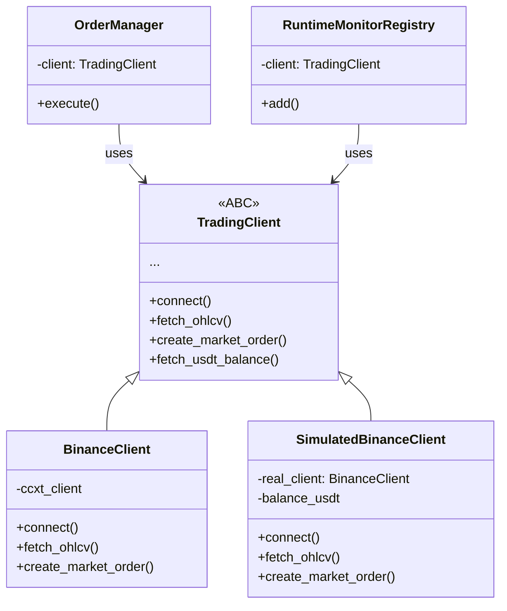

# SPEC_042 — Contrato `TradingClient` (ABC/Protocol)

**ID:** SPEC_042
**Status:** Rascunho
**Data:** 2026-05-11
**Versão:** 1.0
**Dependências:** Nenhuma
**Skill de validação:** `sdd-spec-driven-development`, `security-audit`, `qa-review`

---

## 1. Título e Resumo

### 1.1 Nome da Funcionalidade

Classe abstrata `TradingClient` para contratos de exchange

### 1.2 Resumo

**O que é:** Definição de uma classe base abstrata (ABC) `TradingClient` em `src/exchange/base_client.py` que formaliza o contrato entre o sistema de trading e qualquer exchange — documentando todos os métodos que `BinanceClient` e `SimulatedBinanceClient` devem implementar com tipos concretos.

**Por que estamos fazendo:** Atualmente `BinanceClient` e `SimulatedBinanceClient` não compartilham uma interface formal. O `OrderManager` e `RuntimeMonitorRegistry` usam `Any` como tipo do client, eliminando qualquer verificação estática. Métodos como `set_margin_mode` são no-ops silenciosos no `SimulatedClient` em vez de parte do contrato.

**Valor de negócio:** Type safety na camada crítica de exchange, detecção de incompatibilidades em tempo de compilação, documentação viva do contrato, facilidade para adicionar novas exchanges no futuro (ex: Bybit, OKX).

**Conexão com PRD/SPEC:** Transversal — toda operação de exchange passa por este contrato.

---

## 2. Objetivos e Escopo

### 2.1 Objetivos

- [ ] Criar `src/exchange/base_client.py` com `TradingClient(ABC)`
- [ ] Documentar todos os métodos obrigatórios com assinaturas tipadas
- [ ] Refatorar `BinanceClient` para herdar de `TradingClient`
- [ ] Refatorar `SimulatedBinanceClient` para herdar de `TradingClient`
- [ ] Substituir `type: Any` por `TradingClient` em `OrderManager`, `RuntimeMonitorRegistry`, `OrderMonitor`

### 2.2 Fora do Escopo

- **Não inclui:** Implementação de novas exchanges (Bybit, OKX, etc.)
- **Não inclui:** Mudança na lógica de execução de ordens
- **Não inclui:** Refatoração de `SimulatedBinanceClient._update_position` (lógica interna)

---

## 3. Referências

| Documento | Seção | Relevância |
|---|---|---|
| `src/exchange/binance_client.py` | — | Implementação real |
| `src/exchange/simulated_client.py` | — | Implementação simulada |
| `src/trading/order_manager.py` | `__init__` | Consumidor do contrato |
| `src/main.py` | `RuntimeMonitorRegistry` | Consumidor do contrato |
| `src/monitoring/order_monitor.py` | `__init__` | Consumidor do contrato |

---

## 4. Histórias de Usuário e Requisitos

### US-042-01: ABC `TradingClient`

> Como **arquiteto**, quero **um ABC `TradingClient` que defina o contrato completo de interação com a exchange** para **garantir type safety e compatibilidade entre clientes reais e simulados**.

**Métodos do contrato:**

| Método | Grupo | Obrigatório |
|---|---|---|
| `connect()` | Lifecycle | Sim |
| `close()` | Lifecycle | Sim |
| `fetch_ohlcv()` | Market Data | Sim |
| `fetch_ohlcv_with_retry()` | Market Data | Sim |
| `fetch_ticker()` | Market Data | Sim |
| `fetch_usdt_balance()` | Balance | Sim |
| `fetch_balance()` | Balance | Sim |
| `set_leverage()` | Leverage | Sim |
| `set_margin_mode()` | Leverage | Sim |
| `create_market_order()` | Orders | Sim |
| `create_stop_loss_order()` | Orders | Sim |
| `create_take_profit_order()` | Orders | Sim |
| `cancel_all_orders()` | Orders | Sim |
| `fetch_open_orders()` | Orders | Sim |
| `fetch_order()` | Orders | Sim |
| `fetch_open_positions()` | Positions | Sim |
| `fetch_position_risk()` | Positions | Sim |
| `validate_market_liquidity()` | Validation | Não (default ok) |
| `fetch_quantity_precision_map()` | Precision | Não (default retorna dict vazio) |
| `get_quantity_precision()` | Precision | Sim |
| `round_quantity()` | Precision | Sim |
| `round_price()` | Precision | Sim |

- [ ] AC-01: `TradingClient` define todos os métodos como abstratos ou com default
- [ ] AC-02: `BinanceClient` herda de `TradingClient` sem erros de tipo
- [ ] AC-03: `SimulatedBinanceClient` herda de `TradingClient` sem erros de tipo

### US-042-02: Type safety em consumidores

> Como **desenvolvedor**, quero **que `OrderManager`, `RuntimeMonitorRegistry` e `OrderMonitor` usem `TradingClient` em vez de `Any`** para **detectar incompatibilidades em tempo de compilação**.

- [ ] AC-01: `OrderManager.__init__` aceita `TradingClient` não `Any`
- [ ] AC-02: `RuntimeMonitorRegistry.__init__` aceita `TradingClient`
- [ ] AC-03: `pyright` ou `mypy` passa sem erros nos módulos alterados

---

## 5. Design e Arquitetura

### 5.1 Módulo `src/exchange/base_client.py`

```python
from __future__ import annotations

from abc import ABC, abstractmethod
from typing import Any

import pandas as pd


class TradingClient(ABC):
    """Contrato abstrato para interação com exchanges de futuros."""

    # ─── Lifecycle ────────────────────────────────────────────────────

    @abstractmethod
    async def connect(self) -> None:
        """Conecta à exchange. Deve ser chamado antes de qualquer operação."""
        ...

    @abstractmethod
    async def close(self) -> None:
        """Fecha conexão e libera recursos."""
        ...

    # ─── Market Data ──────────────────────────────────────────────────

    @abstractmethod
    async def fetch_ohlcv(
        self,
        symbol: str,
        timeframe: str,
        limit: int = 200,
        since: int | None = None,
    ) -> pd.DataFrame:
        """Retorna DataFrame OHLCV."""
        ...

    @abstractmethod
    async def fetch_ohlcv_with_retry(
        self,
        symbol: str,
        timeframe: str,
        limit: int = 200,
        retries: int | None = None,
        base_delay: float | None = None,
    ) -> pd.DataFrame:
        """Retorna OHLCV com retry em caso de falha."""
        ...

    @abstractmethod
    async def fetch_ticker(self, symbol: str) -> dict[str, Any]:
        """Retorna ticker atual (last, bid, ask, volume)."""
        ...

    # ─── Balance ──────────────────────────────────────────────────────

    @abstractmethod
    async def fetch_usdt_balance(self) -> float:
        """Retorna saldo disponível em USDT."""
        ...

    @abstractmethod
    async def fetch_balance(self) -> dict[str, Any]:
        """Retorna saldo completo (free, used, total)."""
        ...

    # ─── Leverage ─────────────────────────────────────────────────────

    @abstractmethod
    async def set_leverage(self, symbol: str, leverage: int) -> None:
        """Configura alavancagem para o símbolo."""
        ...

    @abstractmethod
    async def set_margin_mode(self, symbol: str, mode: str = "isolated") -> None:
        """Configura modo de margem."""
        ...

    # ─── Orders ───────────────────────────────────────────────────────

    @abstractmethod
    async def create_market_order(
        self,
        symbol: str,
        side: str,
        quantity: float,
        params: dict[str, Any] | None = None,
    ) -> dict[str, Any]:
        """Executa ordem de mercado."""
        ...

    @abstractmethod
    async def create_stop_loss_order(
        self,
        symbol: str,
        side: str,
        quantity: float,
        stop_price: float,
    ) -> dict[str, Any]:
        """Cria ordem STOP_MARKET."""
        ...

    @abstractmethod
    async def create_take_profit_order(
        self,
        symbol: str,
        side: str,
        quantity: float,
        take_profit_price: float,
    ) -> dict[str, Any]:
        """Cria ordem TAKE_PROFIT_MARKET."""
        ...

    @abstractmethod
    async def cancel_all_orders(self, symbol: str) -> None:
        """Cancela todas as ordens abertas de um símbolo."""
        ...

    @abstractmethod
    async def fetch_open_orders(self, symbol: str) -> list[dict[str, Any]]:
        """Retorna ordens abertas."""
        ...

    @abstractmethod
    async def fetch_order(self, order_id: str, symbol: str) -> dict[str, Any]:
        """Retorna detalhes de uma ordem específica."""
        ...

    # ─── Positions ────────────────────────────────────────────────────

    @abstractmethod
    async def fetch_open_positions(self) -> list[dict[str, Any]]:
        """Retorna posições abertas."""
        ...

    @abstractmethod
    async def fetch_position_risk(
        self,
        *,
        symbol: str | None = None,
    ) -> list[dict[str, Any]]:
        """Retorna risco de posições."""
        ...

    # ─── Validation & Precision ───────────────────────────────────────

    async def validate_market_liquidity(
        self,
        symbol: str,
        min_volume: float = 500_000.0,
        min_oi: float = 200_000.0,
    ) -> None:
        """Valida liquidez do mercado. Default: ok."""
        return None

    async def fetch_quantity_precision_map(
        self,
        symbols: list[str],
    ) -> dict[str, int]:
        """Retorna mapa de precisão por símbolo. Default: vazio."""
        return {}

    @abstractmethod
    def get_quantity_precision(self, symbol: str) -> int:
        """Retorna precisão de quantidade para o símbolo."""
        ...

    @abstractmethod
    def round_quantity(self, symbol: str, qty: float) -> float:
        """Arredonda quantidade para a precisão da exchange."""
        ...

    @abstractmethod
    def round_price(self, symbol: str, price: float) -> float:
        """Arredonda preço para a precisão da exchange."""
        ...
```

### 5.2 Arquivos Afetados

| Arquivo | Mudança |
|---|---|
| `src/exchange/base_client.py` | **Novo** — ABC TradingClient |
| `src/exchange/binance_client.py` | Herdar de `TradingClient` |
| `src/exchange/simulated_client.py` | Herdar de `TradingClient` |
| `src/trading/order_manager.py` | `Any` → `TradingClient` no construtor |
| `src/main.py` | `Any` → `TradingClient` no RuntimeMonitorRegistry |
| `src/monitoring/order_monitor.py` | `Any` → `TradingClient` (se aplicável) |

### 5.3 Fluxo de Dados



---

## 6. Regras de Negócio e Restrições

### 6.1 Invariantes

| ID | Invariante | Violação → Ação |
|---|---|---|
| INV-042-01 | `connect()` deve ser chamado antes de qualquer outro método | RuntimeError |
| INV-042-02 | `set_margin_mode` no SimulatedClient não é no-op — registra modo | Log com o modo escolhido |

### 6.2 Padrões de Segurança

- `TradingClient` nunca expõe API keys ou secrets
- Métodos que retornam `dict[str, Any]` nunca incluem `api_key` ou `api_secret`

---

## 7. Testes e Validação

### 7.1 Testes Unitários

| ID | Descrição | Cenário |
|---|---|---|
| TEST-042-01 | BinanceClient implementa todos os métodos de TradingClient | `isinstance(client, TradingClient)` |
| TEST-042-02 | SimulatedBinanceClient implementa todos os métodos | `isinstance(client, TradingClient)` |
| TEST-042-03 | OrderManager aceita TradingClient | `OrderManager(client=simulated, ...)` |
| TEST-042-04 | Método não implementado levanta TypeError | `TradingClient()` diretamente |

### 7.2 Evidências Requeridas na PR

- [ ] `mypy src/ --strict` ou `pyright` passando sem erros de tipo
- [ ] Testes de exchange existentes passando sem alteração

---

## 8. Tratamento de Erros

| Erro / Condição | Causa | Ação do Sistema |
|---|---|---|
| `NotImplementedError` | Método não implementado em subclass | Erro em runtime — detectado em testes |
| `TypeError` | Parâmetro incompatível no construtor | Erro em runtime |

---

## 9. Riscos e Mitigações

| Risco | Impacto | Mitigação |
|---|---|---|
| `BinanceClient` tem métodos que `SimulatedClient` não implementa | Alto | `TradingClient` com default não-abstrato onde possível |
| Quebra de compatibilidade em runtime | Alto | Testes existentes + mypy garantem |

---

## 10. Definição de Pronto (DoD)

- [ ] `TradingClient(ABC)` criado com todos os métodos mapeados
- [ ] `BinanceClient` herda de `TradingClient` + testes passam
- [ ] `SimulatedBinanceClient` herda de `TradingClient` + testes passam
- [ ] `OrderManager` usa `TradingClient` em vez de `Any`
- [ ] `mypy`/`pyright` sem erros nos módulos alterados

---

## Histórico

- **2026-05-11:** Criação da SPEC_042.
