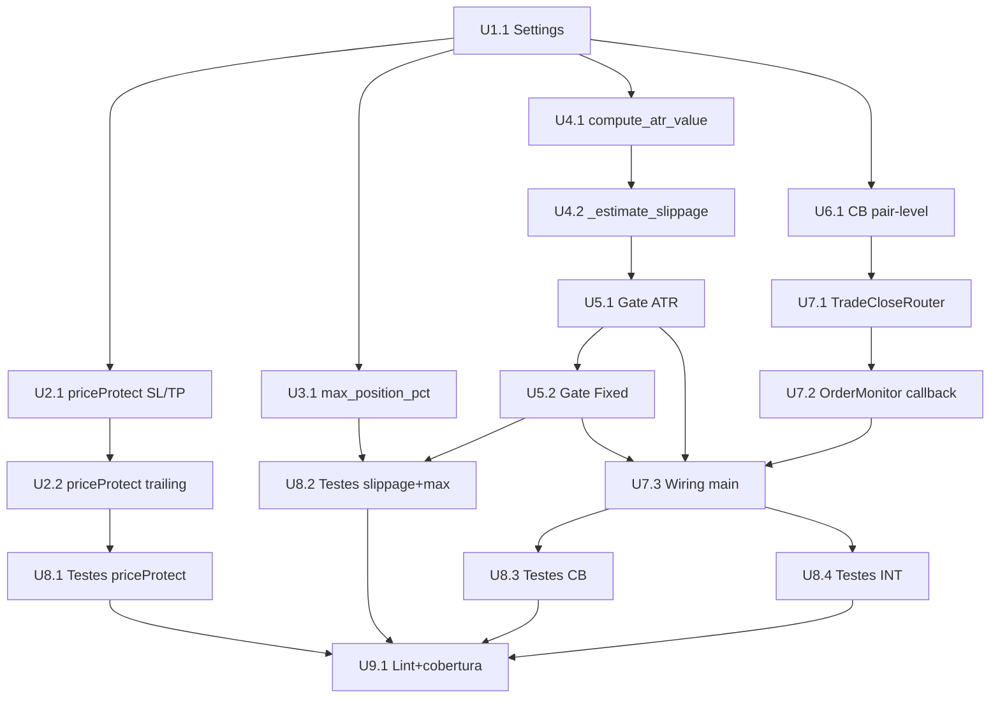

# Plano de Implementação — SPEC_043

**Artefatos relacionados:**
- `SPEC.md` — Especificação técnica v2.0
- `PRD_043.md` — Product Requirements Document
- `docs/SDD/SPEC.md` — SPEC raiz do projeto

**Status:** Aprovado — Aguardando Implementação
**Data:** 2026-05-12
**Versão:** 1.0
**Skill:** `agentic-engineering`, `sdd-spec-driven-development`, `qa-review`

---

## 1. Resumo Executivo

Implementação de 5 requisitos (R1-R4+R6) do sistema de proteção contra slippage e circuit breaker de perda consecutiva no bot Phicube. O plano contempla **15 unidades de implementação** seguindo a regra dos 15 minutos, **18 testes** (12 unitários + 6 adicionais identificados pelo Risk Analyst), **4 fases de rollout** com feature flags e abordagem eval-first (testes antes do código). A entrega total está estimada em ~8 horas de trabalho, dividida em 3 PRs com rollback controlado por flags `slippage_validation_enabled` e `circuit_breaker_enabled`.

---

## 2. Consistência PRD ↔ SPEC ↔ Código

| # | Divergência | PRD diz | SPEC diz | Código atual | Resolução do Arquiteto |
|---|---|---|---|---|---|
| D02 | Exceção fallback trailing | `except ccxt.BadRequest` | `except Exception` | N/A | **SEGUIR PRD**: `except ccxt.BadRequest` — captura específica, não engole erros reais |
| D04 | Portfolio CB threshold | threshold=2, reduction=0.75 (25%) | threshold=4, reduction=0.5 (50%) | N/A | **SEGUIR PRD**: threshold=2, reduction=0.75 — portfólio é early warning, mais sensível que pair-level |
| D07 | Tolerância dual slippage | 1.10× normal, 1.05× com CB ativo | Apenas 1.10× | N/A | **ADICIONAR NA SPEC**: tolerância reduzida quando `circuit_breaker_active == True` |
| D09 | Lock register_trade_outcome | `asyncio.Lock` | Sem lock | N/A | **ADICIONAR NA SPEC**: `asyncio.Lock` para race condition com múltiplos trades fechando |
| D10 | PnL=0 neutro | Zona morta (-0.001, +0.001) | `if pnl > 0` win, `else` loss | N/A | **ADICIONAR NA SPEC**: zona morta, não incrementa nem reseta contadores |
| L06 | _calculate_atr() atr_value | Precisa expor atr_value | assume disponível | Não expõe | **REFATORAR**: criar `_compute_atr_value(df) -> float` reutilizável |
| L07 | OrderMonitor callback | Callable on_trade_closed | assume existente | Não existe | **IMPLEMENTAR**: construtor aceita `on_trade_closed: Callable[[str, float], None] \| None`, chamar nos 3 handlers |
| L08 | Mapeamento rejection | — | — | `_map_risk_rejection_outcome` sem SLIPPAGE_EXCEEDS_TOLERANCE nem CIRCUIT_BREAKER_ACTIVE | **ADICIONAR** mapeamento em `main.py` |

### 2.1 Divergências Esclarecidas

| # | Divergência | PRD diz | SPEC diz | Código atual | Resolução do Arquiteto |
|---|---|---|---|---|---|
| D01 | priceProtect fixo | Fixo em True, sem env var | Fixo em True, sem env var | N/A | **CONSISTENTE**. INV-043-01 mantido. |
| D03 | CB pair threshold | threshold=3, reduction=0.5 | threshold=3, reduction=0.5 | N/A | **CONSISTENTE**. |
| D05 | CB não persistido | Em restart, contador zera | Em restart, contador zera | N/A | **CONSISTENTE**. INV-043-06 mantida. |
| D06 | Piso CB $1.00 | `max(reduced_risk, 1.0)` | `max(reduced_risk, 1.0)` | N/A | **CONSISTENTE**. INV-043-03 mantida. |
| D08 | Acoplamento via Callable | `Callable[[str, float], None]` | Callable no construtor | N/A | **CONSISTENTE**. OrderMonitor desacoplado. |
| D11 | priceProtect lag | Lag documentado, sem alerta | Lag documentado, sem alerta | N/A | **CONSISTENTE**. Aceito como limitação. |

---

## 3. Unidades de Implementação (15-Minute Rule)

Cada unidade segue a regra dos 15 minutos: independentemente verificável, risco dominante único, condição de done clara.

### Fase 1: Settings (Fundação — Risco Zero)

#### U1.1: Expandir Settings com campos SPEC_043

- **Arquivos:** `src/config/settings.py`, `.env.example`
- **Risco dominante:** Pydantic Field() constraints impedem startup
- **Condition de done:** Startup do bot não quebra com defaults
- **Depende de:** Nenhuma
- **Ordem:** 1
- **Estimativa:** ~15 min

Campos a adicionar em `Settings`:

```python
max_position_pct: Annotated[float, Field(ge=0, le=100)] = 0.0
consecutive_loss_threshold: Annotated[int, Field(ge=1, le=10)] = 3
portfolio_loss_threshold: Annotated[int, Field(ge=1, le=10)] = 2
slippage_tolerance_multiplier: Annotated[float, Field(ge=1.0, le=2.0)] = 1.10
slippage_tolerance_reduced: Annotated[float, Field(ge=1.0, le=1.5)] = 1.05
cb_risk_reduction_factor: Annotated[float, Field(ge=0.1, le=1.0)] = 0.5
portfolio_risk_reduction_factor: Annotated[float, Field(ge=0.1, le=1.0)] = 0.75
slippage_validation_enabled: bool = True
circuit_breaker_enabled: bool = True
```

> **Nota:** `price_protect_enabled` **NÃO** deve ser criado conforme INV-043-01: o priceProtect nunca deve ser falseável por configuração externa.

### Fase 2: R1 — priceProtect (Risco Baixo)

#### U2.1: priceProtect em STOP_MARKET e TAKE_PROFIT_MARKET

- **Arquivos:** `src/exchange/binance_client.py`
  - `create_stop_loss_order()`
  - `create_take_profit_order()`
- **Risco dominante:** Exchange rejeitar priceProtect em produção
- **Condition de done:** `params` dict contém `"priceProtect": True` em ambas as funções; testes unitários mockados passam
- **Depende de:** Nenhuma
- **Ordem:** 2
- **Estimativa:** ~15 min

Mudança em `create_stop_loss_order()`:

```python
params = {
    "stopPrice": stop_price,
    "reduceOnly": True,
    "priceProtect": True,  # SPEC_043: mark price trigger
}
```

Mudança em `create_take_profit_order()`:

```python
params = {
    "stopPrice": take_profit_price,
    "reduceOnly": True,
    "priceProtect": True,  # SPEC_043: mark price trigger
}
```

#### U2.2: priceProtect condicional em trailing stop com fallback

- **Arquivos:** `src/exchange/binance_client.py` (`create_trailing_stop_order()`)
- **Risco dominante:** `except ccxt.BadRequest` vs `except Exception` (resolvido: seguir PRD D02)
- **Condition de done:** Tentativa com priceProtect; se `ccxt.BadRequest`, remove e reenvia com WARN; exceção não-BadRequest propaga
- **Depende de:** U2.1
- **Ordem:** 3
- **Estimativa:** ~15 min

```python
try:
    params["priceProtect"] = True
    order = await self._exchange.create_order(...)
except ccxt.BadRequest:
    params.pop("priceProtect", None)
    order = await self._exchange.create_order(...)
    logger.warning("priceProtect_not_supported_for_trailing_stop", symbol=symbol)
```

### Fase 3: R6 — max_position_pct (Risco Baixo)

#### U3.1: Implementar max_position_pct no RiskManager

- **Arquivos:** `src/trading/risk_manager.py` (`_calculate_atr()`, `calculate()`)
- **Risco dominante:** Divisão por zero se `max_position_pct=0` (deve desabilitar, não crashar)
- **Condition de done:**
  - `effective_max = min(MAX_POSITION_USDT, balance * pct / 100)`
  - Se pct=0, usa apenas `MAX_POSITION_USDT` (comportamento legado)
  - Novo campo no construtor: `self._max_position_pct: float = kwargs.get("max_position_pct", 0.0)`
- **Depende de:** U1.1
- **Ordem:** 4
- **Estimativa:** ~15 min

### Fase 4: R2 — Modelo de Slippage (Risco Médio)

#### U4.1: Criar método `_compute_atr_value(df) -> float`

- **Arquivos:** `src/trading/risk_manager.py` (novo método auxiliar)
- **Risco dominante:** Refatoração de `_calculate_atr()` quebra o fluxo existente
- **Condition de done:**
  - `_calculate_atr()` usa `_compute_atr_value()` internamente
  - `calculate()` pode chamar `_compute_atr_value()` independentemente
  - Valor retornado é idêntico ao anterior para mesmos inputs
  - Teste de regressão com dados conhecidos passa
- **Depende de:** U1.1
- **Ordem:** 5
- **Estimativa:** ~15 min

```python
def _compute_atr_value(self, df: pd.DataFrame) -> float:
    """Calcula o valor atual do ATR a partir do DataFrame OHLCV.

    Retorna o último valor de ATR (SMMA de High-Low True Range).
    Se o DataFrame está vazio, retorna 0.0.
    """
    if df is None or df.empty:
        return 0.0
    atr_series = self._calculate_atr_internal(df)  # lógica extraída
    return float(atr_series.iloc[-1]) if not atr_series.empty else 0.0
```

#### U4.2: Implementar `_estimate_slippage()`

- **Arquivos:** `src/trading/risk_manager.py`
- **Risco dominante:** `entry_price=0` ou `atr_value=0` causando NaN
- **Condition de done:**
  - Método retorna `max(static=liq_tier_pct * notional, dynamic=atr_ratio * notional * 0.5)`
  - Proteções contra divisão por zero
  - Par não mapeado = tier "medium" (0.08%)
  - Log estruturado com `slippage_tier`, `slippage_estimate_usdt`, `atr_ratio`
- **Depende de:** U4.1 (precisa de atr_value)
- **Ordem:** 6
- **Estimativa:** ~30 min

```python
def _estimate_slippage(
    self,
    symbol: str,
    quantity: float,
    entry_price: float,
    atr_value: float,
) -> float:
    liq_map = getattr(self, "_liq_map", {})
    tier = liq_map.get(symbol, "medium")
    slip_map = getattr(self, "_slippage_map", {})
    slippage_pct = slip_map.get(tier, 0.0008)

    notional = entry_price * quantity
    static_slippage = slippage_pct * notional

    atr_ratio = atr_value / entry_price if atr_value and entry_price > 0 else 0
    dynamic_slippage = atr_ratio * notional * 0.5

    return max(static_slippage, dynamic_slippage)
```

### Fase 5: R3 — Validação de Slippage (Risco Médio)

#### U5.1: Gate de slippage em `_calculate_atr()`

- **Arquivos:** `src/trading/risk_manager.py`
- **Risco dominante:** Rejeitar trades válidos (falso positivo) com slippage estimada > 1.10×
- **Condition de done:**
  - Após `actual_risk_usdt`, calcula `total_risk = risk + slippage`
  - Se `total_risk > risk_per_trade * tolerance`, retorna `None` com `RiskRejection(code="SLIPPAGE_EXCEEDS_TOLERANCE")`
  - Log `slippage_check_passed` se aprovado
  - Tolerância reduz para 1.05 quando CB ativo (D07)
  - Gate só executa se `slippage_validation_enabled == True`
- **Depende de:** U4.2
- **Ordem:** 7
- **Estimativa:** ~30 min

#### U5.2: Gate de slippage em `_calculate_fixed()`

- **Arquivos:** `src/trading/risk_manager.py`
- **Risco dominante:** `_calculate_fixed()` não expõe `actual_risk_usdt` como `_calculate_atr()` faz
- **Condition de done:**
  - `_calculate_fixed()` calcula `actual_risk_usdt = qty * stop_distance` ou reusa `risk_amount`
  - Slippage dinâmico usa `atr_value=0` (apenas estático)
  - Rejeita se `total_risk > limite`
  - Gate só executa se `slippage_validation_enabled == True`
- **Depende de:** U5.1
- **Ordem:** 8
- **Estimativa:** ~15 min

### Fase 6: R4 — Circuit Breaker Pair-Level (Risco Alto)

#### U6.1: Implementar estado e `register_trade_outcome()`

- **Arquivos:** `src/trading/risk_manager.py`
- **Risco dominante:** Race condition em `register_trade_outcome()` chamado concorrentemente por diferentes monitores
- **Condition de done:**
  - `asyncio.Lock` protege estado (D09)
  - 3 perdas consecutivas → `circuit_breaker_active=True` + `risk` reduzido por `cb_risk_reduction_factor`
  - 1 vitória reseta contador
  - PnL=0 zona morta (-0.001, +0.001) — não incrementa nem reseta (D10)
  - Piso $1.00 (INV-043-03)
  - `effective_risk_per_trade_usdt` property reflete valor atual
  - `async def register_trade_outcome()`
  - Gate só executa se `circuit_breaker_enabled == True`
- **Depende de:** U1.1, D09 (asyncio.Lock), D10 (zona morta)
- **Ordem:** 9
- **Estimativa:** ~45 min

```python
async def register_trade_outcome(self, pnl_usdt: float) -> None:
    async with self._cb_lock:
        if abs(pnl_usdt) <= 0.001:
            return  # zona morta — D10

        if pnl_usdt > 0:
            if self._circuit_breaker_active:
                self._recovery_wins_count += 1
                if self._recovery_wins_count >= self._recovery_wins_needed:
                    self._circuit_breaker_active = False
                    self._consecutive_losses = 0
                    self._recovery_wins_count = 0
                    self._risk_per_trade_usdt = self._original_risk_per_trade_usdt
                    logger.info("circuit_breaker_reset", ...)
            else:
                self._consecutive_losses = 0
        else:
            self._consecutive_losses += 1
            self._recovery_wins_count = 0
            if (self._consecutive_losses >= self._consecutive_loss_threshold
                    and not self._circuit_breaker_active):
                self._circuit_breaker_active = True
                reduced = self._original_risk_per_trade_usdt * self._loss_reduction_factor
                self._risk_per_trade_usdt = max(reduced, 1.0)
                logger.warning("circuit_breaker_activated", ...)
```

### Fase 7: R4 — Circuit Breaker Portfolio + Callback Wiring (Risco Alto)

#### U7.1: Criar `TradeCloseRouter`

- **Arquivos:** `src/trading/trade_close_router.py` (novo arquivo)
- **Risco dominante:** Acoplamento circular — OrderMonitor não pode importar RiskManager
- **Condition de done:**
  - `TradeCloseRouter` mantém `dict[str, RiskManager]` + portfolio CB state
  - `register(symbol, rm)` mapeia símbolo → RiskManager
  - `async def __call__(symbol, pnl_usdt)` roteia para RM correto + atualiza portfolio CB
  - Portfolio: threshold=2, reduction=0.75, `asyncio.Lock` próprio
  - Portfolio segue mesma lógica de zona morta (D10)
- **Depende de:** U6.1
- **Ordem:** 10
- **Estimativa:** ~30 min

```python
class TradeCloseRouter:
    def __init__(self, ...):
        self._rms: dict[str, RiskManager] = {}
        self._portfolio_losses: int = 0
        self._portfolio_breaker_active: bool = False
        self._portfolio_lock = asyncio.Lock()
        self._portfolio_threshold: int = 2
        self._portfolio_reduction: float = 0.75

    def register(self, symbol: str, rm: RiskManager) -> None:
        self._rms[symbol] = rm

    async def __call__(self, symbol: str, pnl_usdt: float) -> None:
        rm = self._rms.get(symbol)
        if rm:
            await rm.register_trade_outcome(pnl_usdt)
        await self._update_portfolio(pnl_usdt)
```

#### U7.2: Adicionar callback `on_trade_closed` no OrderMonitor

- **Arquivos:** `src/monitoring/order_monitor.py`
- **Risco dominante:** Chamar callback ANTES de persistir trade no MongoDB — estado inconsistente
- **Condition de done:**
  - Construtor aceita `on_trade_closed: Callable[[str, float], None] | None`
  - Chamado APÓS `update_trade_status()` e `audit()` nos 3 handlers:
    - `tp_executed`
    - `sl_executed`
    - `manual_close`
  - Chamado com `(symbol, trade.pnl_usdt)`
- **Depende de:** U7.1
- **Ordem:** 11
- **Estimativa:** ~30 min

#### U7.3: Wiring no `_main()`

- **Arquivos:** `src/main.py`
- **Risco dominante:** TradingMonitor criado ANTES do router — callback None nos primeiros trades
- **Condition de done:**
  - `_main()` cria `TradeCloseRouter` antes dos monitores
  - Registra RMs no router via `router.register(symbol, rm)`
  - OrderMonitor recebe `on_trade_closed=router`
  - `_map_risk_rejection_outcome()` mapeia `SLIPPAGE_EXCEEDS_TOLERANCE` e `CIRCUIT_BREAKER_ACTIVE`
  - Ordem de inicialização: Settings → Router → RiskManagers → OrderMonitor → TradingMonitors
- **Depende de:** U7.2, U7.1, U5.2, U5.1
- **Ordem:** 12
- **Estimativa:** ~30 min

### Fase 8: Testes (Transversal)

#### U8.1: Testes priceProtect (TEST-043-01, 02, 17)

- **Arquivos:** `tests/exchange/test_binance_client.py` (criar ou estender)
- **Fixtures:** `_mock_exchange_assert_params()`, `_ccxt_bad_request_mock()`
- **Testes:**
  - TEST-043-01: `create_stop_loss` → `params["priceProtect"] == True`
  - TEST-043-02: `create_take_profit` → `params["priceProtect"] == True`
  - TEST-043-17: Trailing stop + BadRequest → fallback + WARN
- **Ordem:** Executar após U2.1/U2.2 (implementação priceProtect)
- **Estimativa:** ~30 min

#### U8.2: Testes slippage + max_position_pct (TEST-043-03 a 06, 10, 11)

- **Arquivos:** `tests/trading/test_risk_manager.py`
- **Fixtures:** `_risk_manager_with_slippage()`
- **Testes:**
  - TEST-043-03: Slippage BTCUSDT tier "high" = 0.03%
  - TEST-043-04: Slippage CHZUSDT desconhecido → fallback "medium" 0.08%
  - TEST-043-05: Risco+slip > 1.10× → rejection
  - TEST-043-06: Risco+slip ≤ 1.10× → PositionSize válido
  - TEST-043-10: max_position_pct limita posição
  - TEST-043-11: max_position_pct=0 → desabilitado (usa MAX_POSITION_USDT)
- **Ordem:** Executar após U5.2/U3.1 (slippage + max_position_pct implementados)
- **Estimativa:** ~45 min

#### U8.3: Testes circuit breaker (TEST-043-07, 08, 09, 12, 13, 14, 16)

- **Arquivos:** `tests/trading/test_risk_manager.py`
- **Fixtures:** `_risk_manager_with_cb()`, `_concurrent_trades_coro()`
- **Testes:**
  - TEST-043-07: 3 perdas → CB ativo
  - TEST-043-08: Vitória → reset completo
  - TEST-043-09: 1 perda → CB inativo
  - TEST-043-12: Piso $1.00 (fator 0.1 com risk=5)
  - TEST-043-13: PnL=0 neutro (zona morta)
  - TEST-043-14: asyncio.Lock com 3 trades simultâneos
  - TEST-043-16: Reset em restart → contador zero
- **Ordem:** Executar após U6.1 (CB implementado)
- **Estimativa:** ~60 min

#### U8.4: Testes integração (TEST-043-15, 18 + INT-043-01, 02)

- **Arquivos:**
  - `tests/monitoring/test_order_monitor.py` (callback)
  - `tests/trading/test_risk_manager.py` (fuzzing)
- **Fixtures:** `_mock_callback()`
- **Testes:**
  - TEST-043-15: OrderMonitor callback chamado
  - TEST-043-18: INV-029-05 + slippage: 100 cenários fuzzing
  - INT-043-01: priceProtect na resposta Testnet (skippable se geobloqueado)
  - INT-043-02: CB + slippage + sizing em tick completo
- **Ordem:** Executar após U7.3 (wiring completo)
- **Estimativa:** ~30 min

### Fase 9: Lint + Verificação Final

#### U9.1: Ruff + Cobertura

- **Arquivos:** Todos modificados
- **Condition de done:**
  - `ruff check src/ tests/` limpo
  - `pytest tests/ -v --tb=short` com todos os 18 testes passando
  - Cobertura ≥ 80% mantida (gate CI spec023-validation)
- **Depende de:** Todas as anteriores
- **Ordem:** 15
- **Estimativa:** ~15 min

---

## 4. Plano Eval-First (Testes Antes do Código)

### Wave 0 — Baseline (antes de qualquer implementação)

| Ordem | Teste | O que captura | Falha esperada? |
|---|---|---|---|
| 0.1 | INV-029-05 existente | Risco real sem slippage | Não (PASS — baseline) |
| 0.2 | max_position_pct=0 desabilitado | Fallback legado | Sim (R6 não implementado) |
| 0.3 | priceProtect ausente em SL/TP | Params sem priceProtect | Sim (R1 não implementado) |

### Wave 1 — Settings + priceProtect (após Fase 1+2)

| Ordem | Teste | Comportamento |
|---|---|---|
| 1.1 | TEST-043-01 | `create_stop_loss()` → `params["priceProtect"] == True` |
| 1.2 | TEST-043-02 | `create_take_profit()` → `params["priceProtect"] == True` |
| 1.3 | TEST-043-17 | Trailing stop + BadRequest → fallback + WARN |
| 1.4 | TEST-043-10 | `max_position_pct` limita posição |
| 1.5 | TEST-043-11 | `max_position_pct=0` → desabilitado (usa MAX_POSITION_USDT) |

### Wave 2 — Slippage (após Fase 4+5)

| Ordem | Teste | Comportamento |
|---|---|---|
| 2.1 | TEST-043-03 | Slippage BTCUSDT tier "high" = 0.03% |
| 2.2 | TEST-043-04 | Slippage CHZUSDT desconhecido → fallback "medium" 0.08% |
| 2.3 | TEST-043-05 | Risco+slip > 1.10× → rejection |
| 2.4 | TEST-043-06 | Risco+slip ≤ 1.10× → PositionSize válido |

### Wave 3 — Circuit Breaker (após Fase 6+7)

| Ordem | Teste | Comportamento |
|---|---|---|
| 3.1 | TEST-043-07 | 3 perdas → CB ativo |
| 3.2 | TEST-043-09 | 1 perda → CB inativo |
| 3.3 | TEST-043-12 | Piso $1.00 (fator 0.1 com risk=5) |
| 3.4 | TEST-043-08 | Vitória → reset completo |
| 3.5 | TEST-043-13 | PnL=0 neutro (zona morta) |
| 3.6 | TEST-043-14 | `asyncio.Lock` com 3 trades simultâneos |
| 3.7 | TEST-043-16 | Reset em restart → contador zero |
| 3.8 | TEST-043-15 | OrderMonitor callback chamado |

### Wave 4 — Integração (após Fase 8)

| Ordem | Teste | Comportamento |
|---|---|---|
| 4.1 | TEST-043-18 | INV-029-05 + slippage: 100 cenários fuzzing |
| 4.2 | INT-043-01 | priceProtect na resposta Testnet (skippable se geobloqueado) |
| 4.3 | INT-043-02 | CB + slippage + sizing em tick completo |

---

## 5. Rollout Strategy

| Fase | Unidades | Feature Flag | Rollback | Duração |
|---|---|---|---|---|
| **Dia 1** | U1.1, U2.1, U2.2, U3.1 | Nenhuma (priceProtect fixo) | Reverter commit | 1 PR |
| **Dia 3-5** | U4.1, U4.2, U5.1, U5.2 | `slippage_validation_enabled=true` | Setar `false` + restart | 1 PR + 5 ciclos testnet |
| **Semana 2** | U6.1, U7.1, U7.2, U7.3 | `circuit_breaker_enabled=true` | Setar `false` + restart | 1 PR + testnet |
| **Pós-MVP** | R5 (ATR overrides) | Nenhuma | N/A | Futuro |

### Feature Flags em Settings

```python
slippage_validation_enabled: bool = True
circuit_breaker_enabled: bool = True
# price_protect_enabled NÃO CRIAR — INV-043-01: nunca falseável
```

### Critérios de Gate entre Fases

| Transição | Gate |
|---|---|
| Dia 1 → Dia 3 | `pytest tests/exchange/test_binance_client.py -v` com TEST-043-01/02/17 passando |
| Dia 3 → Semana 2 | `pytest tests/trading/test_risk_manager.py -v` com TEST-043-03 a 06, 10, 11 passando |
| Semana 2 → Release | `pytest tests/ -v --tb=short` completo + `ruff check src/ tests/` limpo |

---

## 6. Matriz de Risco

| Unidade | Regressão | Rollout | Segurança | Performance | Classificação |
|---|---|---|---|---|---|
| U1.1 Settings | 🟢 | 🟢 | 🟢 | 🟢 | 🟢 |
| U2.1 priceProtect SL/TP | 🟢 | 🟢 | 🟢 | 🟢 | 🟢 |
| U2.2 priceProtect trailing | 🟢 | 🟢 | 🟢 | 🟢 | 🟡 (fallback) |
| U3.1 max_position_pct | 🟡 | 🟡 | 🟢 | 🟢 | 🟡 |
| U4.1 compute_atr_value | 🟡 | 🟢 | 🟢 | 🟢 | 🟡 |
| U4.2 _estimate_slippage | 🟡 | 🟡 | 🟢 | 🟢 | 🟡 |
| U5.1 Gate ATR | 🟡 | 🟡 | 🟢 | 🟢 | 🟡 |
| U5.2 Gate Fixed | 🟡 | 🟡 | 🟢 | 🟢 | 🟡 |
| U6.1 CB pair-level | 🔴 | 🔴 | 🟢 | 🟢 | 🔴 (acoplamento) |
| U7.1 TradeCloseRouter | 🔴 | 🔴 | 🟢 | 🟢 | 🔴 (acoplamento) |
| U7.2 OrderMonitor callback | 🔴 | 🔴 | 🟢 | 🟢 | 🔴 (acoplamento) |
| U7.3 Wiring main.py | 🔴 | 🔴 | 🟢 | 🟢 | 🔴 (acoplamento) |
| U8.1-U8.4 Testes | 🟢 | 🟢 | 🟢 | 🟢 | 🟢 |

### Legenda

| Cor | Significado |
|---|---|
| 🟢 | Risco baixo — impacto isolado, rollback trivial |
| 🟡 | Risco médio — possível regressão local, rollback via flag |
| 🔴 | Risco alto — impacto cruzado entre módulos, requer teste de integração |

---

## 7. Monitoramento Pós-Implantação

| Evento | Log | Alerta |
|---|---|---|
| Slippage check passou | `slippage_check_passed` | — |
| Trade rejeitado por slippage | `SLIPPAGE_EXCEEDS_TOLERANCE` | 🟡 Se > 5/dia |
| Circuit breaker ativado | `circuit_breaker_activated` | 🔴 Notificação imediata |
| Circuit breaker resetado | `circuit_breaker_reset` | — |
| priceProtect fallback | `priceProtect_not_supported_*` | 🟡 Se > 0 |
| max_position_pct limitou | Warning log | — |
| PnL real SL > 1.15× risco | Revisão manual | 🔴 Gatilho de revisão |

### Verificação Mensal

Comparar `slippage_estimate_usdt` vs `pnl_usdt` real em trades fechados por SL. Se real > 1.15× estimado consistentemente, ajustar tiers de liquidez em `backtest_slippage_by_liq`.

### Dashboard Queries (MongoDB)

```javascript
// Trades rejeitados por slippage na última semana
db.trades.find({
  "rejection.code": "SLIPPAGE_EXCEEDS_TOLERANCE",
  "timestamp": { $gte: new Date(Date.now() - 7*24*60*60*1000) }
}).count()

// Ativações de circuit breaker
db.audit.find({
  "event": "circuit_breaker_activated",
  "timestamp": { $gte: new Date(Date.now() - 7*24*60*60*1000) }
})

// Precisão da estimativa de slippage vs PnL real
db.trades.aggregate([
  { $match: { "pnl_usdt": { $lt: 0 }, "status": "closed" } },
  { $project: {
    slippage_estimate: "$slippage_estimate_usdt",
    actual_pnl: { $abs: "$pnl_usdt" },
    ratio: { $divide: [{ $abs: "$pnl_usdt" }, "$slippage_estimate_usdt"] }
  }},
  { $match: { ratio: { $gt: 1.15 } } }
])
```

---

## 8. Dependências Visuais

```
U1.1 Settings (fundação)
 ├──► U2.1 priceProtect SL/TP ──► U2.2 priceProtect trailing ──► U8.1 Testes priceProtect
 ├──► U3.1 max_position_pct ──► U8.2 Testes slippage+max
 ├──► U4.1 compute_atr_value ──► U4.2 _estimate_slippage ──► U5.1 Gate ATR ──► U5.2 Gate Fixed ──► U8.2
 └──► U6.1 CB pair ──► U7.1 Router ──► U7.2 OrderMonitor ──► U7.3 Wiring main ──► U8.3+U8.4 Testes CB+INT
                                                                                            └──► U9.1 Lint+cobertura
```

### Diagrama de Dependências (Mermaid)



---

## 9. Estimativa de Esforço Total

| Fase | Unidades | Estimativa |
|---|---|---|
| Fase 1: Settings | 1 | 15 min |
| Fase 2: priceProtect | 2 | 30 min |
| Fase 3: max_position_pct | 1 | 15 min |
| Fase 4: Slippage Model | 2 | 45 min |
| Fase 5: Slippage Gates | 2 | 45 min |
| Fase 6: CB Pair-Level | 1 | 45 min |
| Fase 7: Router + Wiring | 3 | 90 min |
| Fase 8: Testes | 4 | 165 min |
| Fase 9: Lint/Cobertura | 1 | 15 min |
| **Total** | **15** | **~8 horas** |

### Alocação Recomendada

| Recurso | Fases | Carga |
|---|---|---|
| Backend Sênior | Fase 1, 2, 3, 7 (wiring) | ~2.5h |
| Quant Developer | Fase 4, 5, 6 (slippage + CB) | ~3h |
| QA Engineer | Fase 8, 9 (testes + lint) | ~2.5h |

---

## 10. Definition of Ready (DoR) — Antes de Começar

- [ ] Divergências D02/D04/D07/D09/D10 resolvidas e refletidas na SPEC v2.1
- [ ] `_map_risk_rejection_outcome()` atualizado em `main.py` com `SLIPPAGE_EXCEEDS_TOLERANCE` e `CIRCUIT_BREAKER_ACTIVE`
- [ ] Feature flags `slippage_validation_enabled` e `circuit_breaker_enabled` aprovadas pelo Time A
- [ ] `.env.example` atualizado com novos campos (defaults seguros)
- [ ] Testnet disponível para INT-043-01 (ou fallback via mock documentado)
- [ ] Pipeline CI spec023-validation configurado para aceitar novos testes

---

## 11. Definition of Done (DoD) — Antes da Merge

- [ ] R1 a R4 + R6 implementados e testados
- [ ] TEST-043-01 a 18 passando (`pytest tests/ -v --tb=short`)
- [ ] INT-043-01 e INT-043-02 aprovados (execução parcial via mock se Testnet indisponível)
- [ ] `ruff check src/ tests/` limpo
- [ ] Logs estruturados de `slippage_check_passed`, `circuit_breaker_activated`, `circuit_breaker_reset` presentes no código
- [ ] Fallback de priceProtect testado com simulação de rejeição da exchange
- [ ] Race condition testada com 3+ trades fechando simultaneamente (TEST-043-14)
- [ ] Cross-reference: SPEC_043 adicionada em `docs/SDD/SPEC.md` § Referências
- [ ] Cobertura de testes ≥ 80% mantida

---

## 12. Checklist de Revisão por Subagente

### Revisão de Negócio (Product)

- [ ] US-043-01 a US-043-05 endereçados
- [ ] Indicadores de sucesso do PRD mensuráveis
- [ ] Personas (Operador + Gestor de Risco) contempladas
- [ ] Fora de escopo respeitado (sem R5 no MVP)

### Revisão Técnica (Arquiteto)

- [ ] Acoplamento OrderMonitor → RiskManager via Callable (D08)
- [ ] `asyncio.Lock` em register_trade_outcome (D09)
- [ ] `except ccxt.BadRequest` no trailing (D02)
- [ ] Feature flags sem `price_protect_enabled` (INV-043-01)
- [ ] `_compute_atr_value()` extraído sem quebrar _calculate_atr()

### Revisão de Risco (Risk Manager)

- [ ] Slippage estimada inclui componente estático + dinâmico (ATR)
- [ ] Portfolio CB threshold=2, reduction=0.75 (D04)
- [ ] Tolerância dual 1.10× / 1.05× (D07)
- [ ] Piso $1.00 mantido (INV-043-03)
- [ ] Zona morta PnL=0 implementada (D10)
- [ ] Contador não persistido em restart (INV-043-06)
