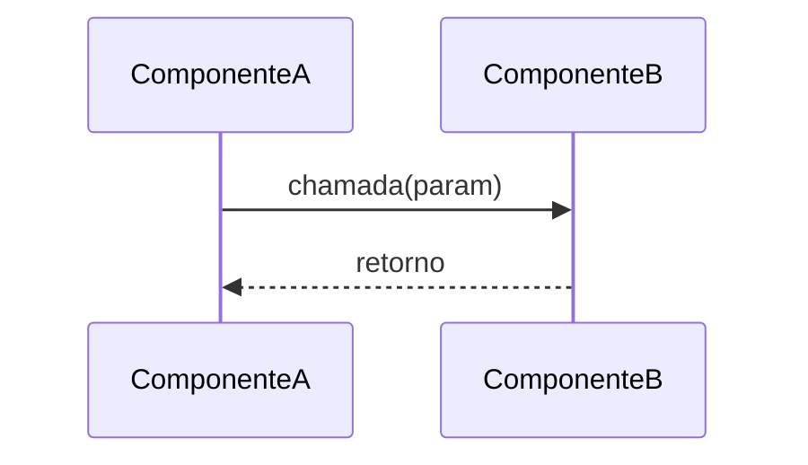

# SPEC NNN — [Título Curto da Especificação]

**ID:** SPEC_NNN
**Status:** Rascunho | Em Refinamento | Aprovada | Em Execução | Concluída
**Data:** AAAA-MM-DD
**Autor:** Time A (Refinamento)
**Executores:** Time B (Execução)
**Skill de validação:** `sdd-spec-driven-development`, `qa-review`

---

## 1. Título e Resumo

### 1.1 Nome da Funcionalidade

[Nome claro e conciso da funcionalidade ou módulo sendo especificado]

### 1.2 Resumo (High-Level Definition)

**O que é:** Descreva o que será construído em 2–3 frases.

**Por que estamos fazendo:** Motivação técnica ou de negócio — qual problema resolve.

**Valor de negócio:** Impacto mensurável esperado (ex.: reduz latência de sinal, elimina risco de posição órfã, aumenta cobertura de testes).

**Conexão com PRD/SPEC:** Referência explícita à seção do `PRD.md` e/ou `docs/SDD/SPEC.md` que origina esta demanda.

---

## 2. Objetivos e Escopo

### 2.1 Objetivos (o que será entregue)

- [ ] Objetivo 1 — resultado concreto e verificável
- [ ] Objetivo 2

### 2.2 Fora do Escopo (Non-Goals)

> Crucial para evitar scope creep. Seja explícito.

- **Não inclui:** Item A — motivo
- **Não inclui:** Item B — será tratado em SPEC_NNN+1

---

## 3. Referências

| Documento | Seção | Relevância |
|---|---|---|
| `PRD.md` | § N.N | Requisito de origem |
| `docs/SDD/SPEC.md` | § N.N | Contrato técnico impactado |
| `SPEC_NNN/SPEC.md` | — | Dependência ou pré-requisito |

---

## 4. Histórias de Usuário e Requisitos

### US-NNN-01: [Nome da História]

> Como **[papel]**, quero **[ação]** para **[benefício]**.

**Critérios de Aceitação (DoD desta história):**

```text
DADO   [contexto / estado inicial]
QUANDO [ação realizada]
ENTÃO  [resultado esperado e verificável]
```

- [ ] AC-01: Descrição do critério de aceitação
- [ ] AC-02: Descrição do critério de aceitação

---

### US-NNN-02: [Nome da História]

> Como **[papel]**, quero **[ação]** para **[benefício]**.

**Critérios de Aceitação:**

```text
DADO   [contexto]
QUANDO [ação]
ENTÃO  [resultado]
```

- [ ] AC-01:

---

## 5. Design e Arquitetura

### 5.1 Estrutura de Dados / Modelagem

```python
# Schema ou dataclass esperado
from dataclasses import dataclass

@dataclass
class NomeModelo:
    campo: Tipo  # descrição
```

Coleção MongoDB (se aplicável):

```json
{
  "collection": "nome_colecao",
  "indexes": ["campo_1", "campo_2"],
  "schema": {
    "campo": "tipo"
  }
}
```

### 5.2 Contratos de API / Interface Pública

```python
# Assinatura exata esperada
async def nome_metodo(param: Tipo) -> RetornoTipo:
    """Descrição do contrato."""
```

**Entradas:**

| Parâmetro | Tipo | Obrigatório | Descrição |
|---|---|---|---|
| `param` | `Tipo` | Sim | Descrição |

**Saída:**

| Retorno | Tipo | Descrição |
|---|---|---|
| Sucesso | `Tipo` | O que retorna em sucesso |
| Falha | `None` / exceção | Quando e por quê |

### 5.3 Fluxo de Dados / Sequência



---

## 6. Regras de Negócio e Restrições

### 6.1 Invariantes de Negócio

| ID | Invariante | Violação → Ação |
|---|---|---|
| INV-NNN-01 | Descrição da regra que nunca pode ser violada | Ação ao detectar violação |

### 6.2 Validações Obrigatórias

- `campo >= valor_minimo` — motivo
- `campo != None` antes de executar X

### 6.3 Limitações Técnicas

- Rate limit da Binance: N req/min para este endpoint
- Precisão numérica: usar `Decimal` para preços, `float` para quantidades internas

### 6.4 Padrões de Segurança

- Nunca logar `api_key`, `api_secret` ou valores de saldo
- Validar `symbol` contra lista de símbolos permitidos antes de executar ordem

---

## 7. Testes e Validação

### 7.1 Testes Unitários

| ID | Descrição | Cenário | Prioridade |
|---|---|---|---|
| TEST_NNN_01 | Cenário feliz — fluxo completo | Entrada válida → saída esperada | Alta |
| TEST_NNN_02 | Falha de pré-condição | Entrada inválida → `None` ou exceção | Alta |
| TEST_NNN_03 | Invariante violada | Dado que quebra regra → ação de mitigação | Alta |

### 7.2 Testes de Integração (Testnet)

| ID | Descrição | Pré-requisito |
|---|---|---|
| INT_NNN_01 | Fluxo completo ponta a ponta | Testnet ativa, credenciais configuradas |

### 7.3 Evidências Requeridas na PR

- [ ] Output de `pytest -v --cov=src --cov-report=term-missing` com todas as asserções passando
- [ ] Log de ao menos 1 ciclo completo no Testnet (se aplicável)
- [ ] Referência às seções de `SPEC.md` e `SPEC_NNN` impactadas no corpo da PR

---

## 8. Tratamento de Erros

| Erro / Condição | Causa | Ação do Sistema |
|---|---|---|
| `ErroTipo` | Descrição da causa | `retry×3` / fatal / retorna `None` |

---

## 9. Riscos e Mitigações

| Risco | Impacto | Mitigação |
|---|---|---|
| Descrição do risco | Alto / Médio / Baixo | Ação de mitigação concreta |

---

## 10. Definição de Pronto (DoD Global)

- [ ] SPEC aprovada pelo Time A
- [ ] Todas as histórias de usuário com critérios de aceitação verificados
- [ ] Implementação aderente a todos os contratos da seção 5
- [ ] Nenhuma invariante da seção 6.1 violada em nenhum cenário de teste
- [ ] `pytest` com 100% das asserções críticas passando
- [ ] Rastreabilidade PRD → SPEC.md → SPEC_NNN → Teste → Código comprovada na PR

---

## 11. Plano de Entrega

1. **Time B lê** `docs/SDD/SPEC.md` (seções impactadas) + esta SPEC_NNN
2. **Time B implementa** na ordem definida nas histórias de usuário
3. **Time B valida** com `qa-review` e, se aplicável, `signal-review` / `security-audit`
4. **PR criada** com evidências da seção 7.3
5. **Time A revisa** conformidade antes do merge

---

## Histórico

- **AAAA-MM-DD:** Criação da SPEC_NNN.
